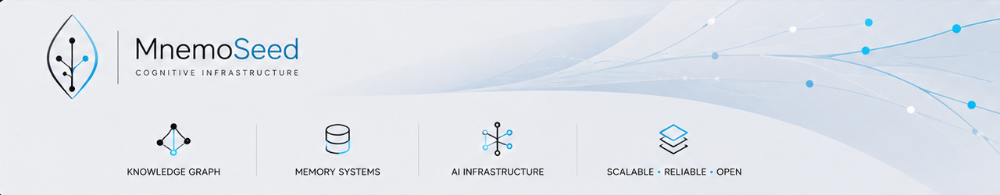

# 🌱 MnemoSeed Core Engine

> **The Brain-Inspired, Dual-Licensed Cognitive Memory & Persona Baseline for Autonomous AI Agents.**

[](#%EF%B8%8F-dual-licensing-protocol--commercial-defense)
[](#-core-architectural-pillars)
[](#-zero-knowledge-privacy-matrix)

**MnemoSeed Core** is the underlying intelligence and long-term reflection engine of the MnemoSeed ecosystem. While standard vector database wrappers treat AI memory as a chaotic, dead filing cabinet—causing severe context bloat and model-switching amnesia—MnemoSeed models human cognitive neuroscience to implant an evolving, selective, and unified "soul" that lives across varying LLM bodies (Claude, GPT, local models) and interfaces (Cursor, Cline).

This repository houses the core algorithmic stack responsible for emotional impact metrics, asynchronous dream-phase memory consolidation, cognitive grading protection, and zero-knowledge privacy encasing.

---

## 🧠 Core Architectural Pillars

### 1. Dynamic Dream Engine & Watermark Trigger
Humans do not compress long-term memories in real-time while performing tasks. MnemoSeed splits memory operations into two distinct neurological layers:
*   **The Hippocampus (Hot Memory Layer)**: A high-concurrency, zero-latency local memory cache that temporarily tracks raw user interaction strings.
*   **The Cerebral Cortex (Cold Memory Layer)**: A structured **Cognitive Graph** storing long-term experience weights, habits, and user pattern nodes.
*   **The Impact Evaluator**: Every incoming packet is scored locally by a deterministic, zero-LLM scorer (rules + curated lexicons + embedding heuristics — no model call, no tokens spent) across three vectors: *Emotional Intensity, Informational Novelty,* and *Causal Long-Chains*.
*   **Snapshot Isolation Sleep**: Once the accumulated scores cross the **Watermark Threshold (>=10.0)** and the agent registers 5 seconds of idle time, an asynchronous "Dreaming Thread" takes a read-only snapshot of the hot memory to run reflective synthesis. If a user interrupts mid-dream, the agent responds with 0 latency, appending new chats to the tail without blocking.

### 👥 2. Cognitive Grading Isolation (Anti-Contamination Protocol)
To support a decentralized future where multiple agents share the same baseline, MnemoSeed prevents "dumb models" from corrupting the insights generated by "smart models":
*   **One-Way Inheritance**: Tier 3 models (e.g., local consumer-grade edge LLMs) can read and inherit structural rules from the `Tier_1_Core_Graph` to accurately guide their actions.
*   **Write Protection Boundary**: Conversations run by low-tier models are synthesized exclusively into a segregated `Tier_3_Isolated_Graph`. High-end frontier models (Tier 1) never read low-tier noise directly; they only pull them when a Tier 1 model runs a "high-cognitive secondary reflection" over the historical raw logs, preserving the pristine quality of your core cognitive asset.

### 🎭 3. Anima-Memory Decoupling (De-biasing Filter)
AI agents wear different "souls" for different tasks (e.g., a sarcastic developer copilot vs. a rigorous corporate lawyer). MnemoSeed models this as the **anima**: an immutable temperament core (quantified trait dimensions), a plastic dye layer shaped by experience, and preferences stored as Bayesian posteriors anchored to that core — while speech style is re-derived at render time and **never stored**. The anima model ships as an **advanced module** (post-M1; the core pipeline runs anima-free by design): full spec in `docs/design/09` (English canonical; Chinese working tree at `docs/zh/`).
*   The memory base underneath stays **neutral**: during asynchronous dream consolidation, the de-biasing filter strips anima-rendered tone, role-play, and stylistic pollution from the chat logs, extracting only hard facts, structural knowledge, and verified user habits into the graph.
*   Dye layers and preferences learn **only from raw user input, never from agent output** — letting the soul vote on its own coloring would be a slow-drift self-lock.
*   Swap the anima and nothing leaks: zero style residue in the memory base, and the new anima re-dyes itself from the same neutral history in a background batch pass.

---

## 🔒 Zero-Knowledge Privacy Matrix

Enterprise engineers and high-net-worth creators refuse to host their raw lifelong memories on centralized cloud servers. MnemoSeed achieves institutional-grade trust through architectural topology:

1.  **Bring-Your-Own-Key (BYOK) Local Encryption**: Raw memories are encrypted client-side using local key derivation before syncing to the cloud storage bucket. The cloud stores only randomized ciphertext blobs.
2.  **Hardware TEE Confidential Computing (Commercial SaaS)**: Premium cloud reflection workloads execute entirely within isolated hardware-level secure enclaves (**AWS Nitro Enclaves**). Memory data is briefly decrypted only within the impenetrable silicon black-box, blinding even server root administrators and our own team from viewing user plaintexts.

---

## ⚖️ Dual-Licensing Protocol & Commercial Defense

MnemoSeed Core operates under a strict **Dual-Licensing Strategy** to foster developer innovation while securing enterprise commercialization avenues:

### 🟢 1. Non-Commercial / Individual Tier (AGPL-3.0 Rules)
Free and open-source forever for individual development, educational purposes, and hobbyist self-hosting. 
*   **The Attribution Clause**: Any public fork, modified version, or wrapper of MnemoSeed Core **must** remain entirely open-source under the identical license framework, and **must prominently display** the original branding: `"Powered by MnemoSeed"`.

### 🔴 2. Commercial / Closed-Source Tier (Licensing Required)
You **must** purchase a Commercial License if you intend to:
*   Integrate MnemoSeed Core inside a commercial proprietary application or closed-source enterprise software stack.
*   Offer hosted MnemoSeed multi-tenant cognitive databases to end-users for corporate profit without open-sourcing your platform's surrounding infrastructure.

*To obtain a proprietary commercial license or to request dedicated enterprise TEE Enclave cluster provisioning, reach out to our legal department at: `license@mnemoseed.com`*

---

## 🚀 Engine Deployment Guide

To spin up the core computation server locally:

```bash
# Clone the Core Engine
git clone https://github.com/MnemoSeed/mnemoseed.git
cd mnemoseed

# Install dependencies (uv manages the locked environment)
uv sync

# Launch the embedded single-process daemon (all drivers in-process)
uv run mnemoseed up
```

Or bring up the full stack (Postgres + pgvector + daemon) with `docker compose up`. Every service exposes a `/healthz` probe.

The MCP server ships inside this package as a thin stdio adapter (`uv run mnemoseed mcp`) — any MCP host (Cursor/Cline/Claude Code) attaches to it directly; host hooks talk to the daemon's localhost HTTP API.

---

## 🛠️ Development

MnemoSeed is developed **test-driven**:

1. Every task starts from the acceptance criteria in `docs/prd/`. Observable behaviors are extracted and written as **failing tests first** (red), then implemented to green, then refactored with the suite green.
2. Tests assert behavior through public surfaces (storage Protocols, CLI, HTTP endpoints) so refactors never require test rewrites.
3. The existing suite is a regression fence — it must stay green on every change.
4. Gate set before any commit: `uv run pytest -q`, `uv run ruff check src tests`, `uv run ruff format --check src tests`, `uv run mypy src`. All four run in CI on every PR.

```bash
uv sync                 # install locked deps
uv run pytest -q        # full suite (offline-safe; Postgres arms skip without MNEMOSEED_TEST_PG_DSN)
```
