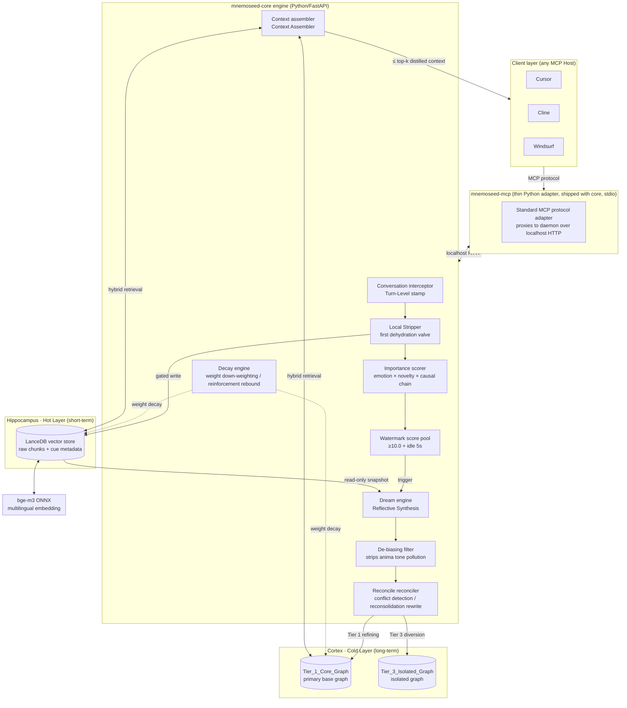
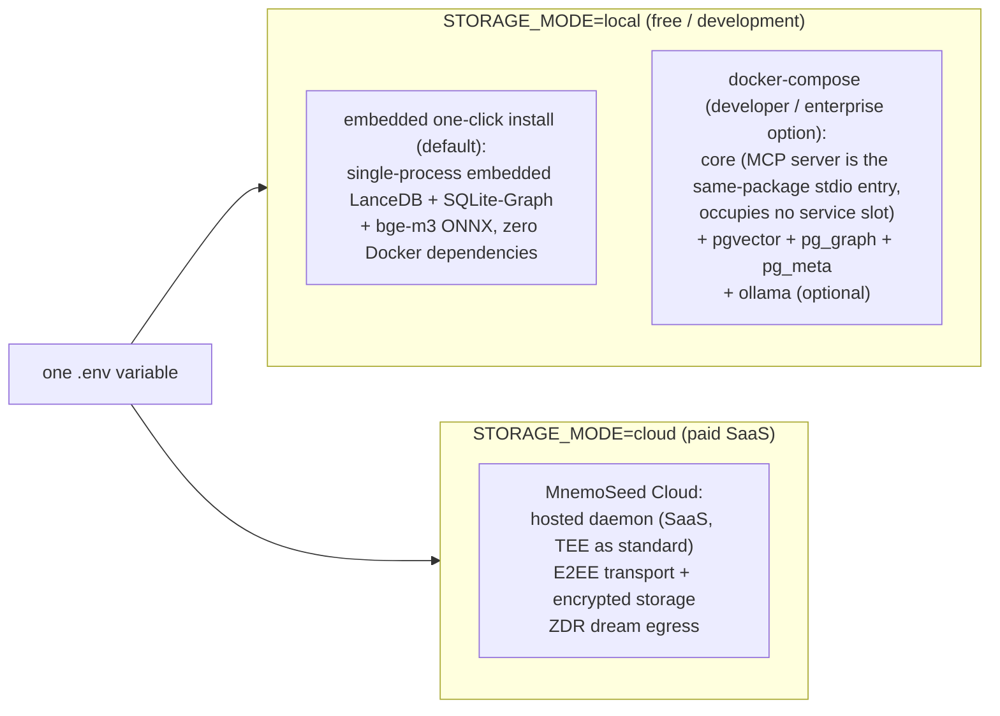

# 00 · Overview and Design Philosophy

> MnemoSeed Core Engine Design Document v4.0 Draft · 2026-08-08

---

## 1. One-Sentence Positioning

**MnemoSeed is a neutral third-party memory layer across models and clients:** it decouples the AI's "soul" (long-term experience, preferences, causal knowledge) from the "body" (a specific LLM, a specific IDE session), and lets any Agent inherit the same continuously evolving memory base across any models through the MCP protocol.

Brand declaration: *Decouple the AI Soul from the Model Body.*

---

## 2. Why Long Context Is Not Memory

The industry inertia of 2026 is "stuff all the history into the context window." This path collapses on three dimensions at the same time:

| Dimension | Failure mode | Corresponding biological fact |
|---|---|---|
| **Cost** | A user with six months of history costs more tokens on their first message than a new user spends in an entire week | The human brain does not replay a lifetime before making a decision |
| **Discriminability** | "I like coffee" and "client compliance red line" carry equal weight, because no grading happens at write time | The hippocampus relies on salience markers to decide what is worth encoding |
| **Updating** | After a fact changes (job change, decision overturned), full replay contains both the old and new contradictory versions, with no signal to tell which is current | The brain rewrites old memories through reconsolidation rather than stacking them on top |

**Conclusion: memory is not a bigger window; it is a separate architecture — deliberately deciding what is carried into the future and what is let go.**

---

## 3. Neuroscience Foundation Mapping Table (The Axiom Layer of This Design)

Every MnemoSeed subsystem is not an engineering shortcut but corresponds to an experimentally verified biological mechanism. This is the essential difference between us and Mem0-style "vector-append" products.

| Biological mechanism | Neuroscience basis | MnemoSeed engineering mapping |
|---|---|---|
| **Complementary Learning Systems** (McClelland 1995): the hippocampus quickly records episodes, the neocortex slowly sediments structured knowledge | Hippocampus vs. cortex division of labor | **Hybrid dual-store**: LanceDB vector pool (hippocampus / hot layer) + knowledge graph (cortex / cold layer) |
| **Sharp-Wave Ripples**: during NREM sleep the hippocampus replays daytime experiences to the cortex, completing systems consolidation | Sleep-phase memory consolidation | **Dream engine**: asynchronous reflective synthesis during idle time; raw conversation → experiential triples |
| **Synaptic Tagging & Capture** (Frey & Morris 1997): only salient events "tagged" by dopamine / norepinephrine convert to long-term potentiation (LTP) | Selective encoding | **Importance score pool**: three-vector scoring of emotion intensity × information novelty × causal-chain length; consolidation triggers only at Watermark ≥ 10 |
| **Encoding Specificity** (Tulving & Thomson 1973): retrieval success depends on the match between retrieval cues and the encoding context | Context-dependent memory | **Context-cue metadata**: every memory carries project/tool/time/emotion cues; retrieval weights by cue overlap |
| **Reconsolidation** (Nader 2000): a memory enters a labile window when retrieved, and can be rewritten before being re-consolidated | Memory plasticity | **Reconcile protocol**: memories hit by retrieval enter a writable window where new facts merge and rewrite, rather than old and new co-existing |
| **Active Forgetting / Synaptic Homeostasis Hypothesis** (SHY, Tononi & Cirelli): global synaptic scaling during sleep down-regulates weak connections, preserving the signal-to-noise ratio | Forgetting is a function, not a failure | **Decay engine**: weights of unreinforced memories decay monotonically; access reinforces them back up; soft delete rather than hard delete |
| **Source Monitoring** (prefrontal cortex): remembering "who said it, where it came from" is as important as remembering the content itself | Memory provenance | **Provenance field**: asserter / source / confidence metadata; never decays, can never be overwritten |
| **Emotional modulation of consolidation** (amygdala → hippocampus, norepinephrine pathway, McGaugh 2000): high-arousal events get consolidation priority — but the flashbulb paradox (Neisser & Harsch 1992) proves vivid ≠ accurate | Emotional modulation | **arousal (capped)** enters the score pool in the scoring model; it **never** raises provenance.confidence. See [01 §1.6](01-memory-pipeline.md) |

**Design axiom: whatever mechanism the human brain has proven over three hundred million years of evolution (selective encoding, sleep consolidation, active forgetting, reconsolidation, source monitoring), we engineer in its "shape"; whatever is full replay, indiscriminate appending, or never-forgetting, we reject outright.**

---

## 4. Design Principles

1. **Local-Cloud Symmetry** — the DB, vector buffer, and dream engine are all abstracted behind interfaces. One config (`STORAGE_MODE` preset: embedded/docker/custom) switches between fully local offline (embedded one-click or Docker) and a self-hosted server; the official SaaS is a daemon hosted by us (TEE as standard).
2. **Multilingual Native** — unified bge-m3 (ONNX) embedding; recall holds precision across mixed Chinese-English text, code interleaving, and dialect contexts.
3. **Capture is Rejection First** — the default action of the pipeline's first gate is "do not record." A system that captures indiscriminately is merely rebuilding the "full replay" problem it set out to solve.
4. **Complete Read, Split Write** — reflection reviews 100% of the complete scene to ensure no context break; write-back physically isolates by cognitive tier, low-tier noise never pollutes the primary base.
5. **Cost deadlock** — any incremental data sent to a high-end cloud model is clamped by engineering mechanisms within a dynamic hard budget cap (≤32k tokens, scaled by the pending backlog to be settled; a monthly token ledger backstops total cost; see [02 §6](02-dream-engine.md)).

---

## 5. Overall Architecture

### Deployment Topology (One-Click Switching)

---

## 6. One-Line Distinction from Competitors

- **Mem0 (the passive-append school)**: has Capture but no gate, no Reconcile and no Decay — it only grows, it never gets smarter.
- **Letta/MemGPT (the Agent OS school)**: memory management relies on the model's own Tool Calls; token costs grow linearly with the conversation.
- **Big-vendor native memory (the closed-loop school)**: OpenAI's memory will never feed Claude.
- **MnemoSeed**: the only neutral layer that turns "five-stage pipeline + cognitive grading isolation + privacy-first hosting" into a complete architecture, and specializes in **Agentic Tool-Use muscle memory** (sedimenting and inheriting habitual tool-call sequences).
