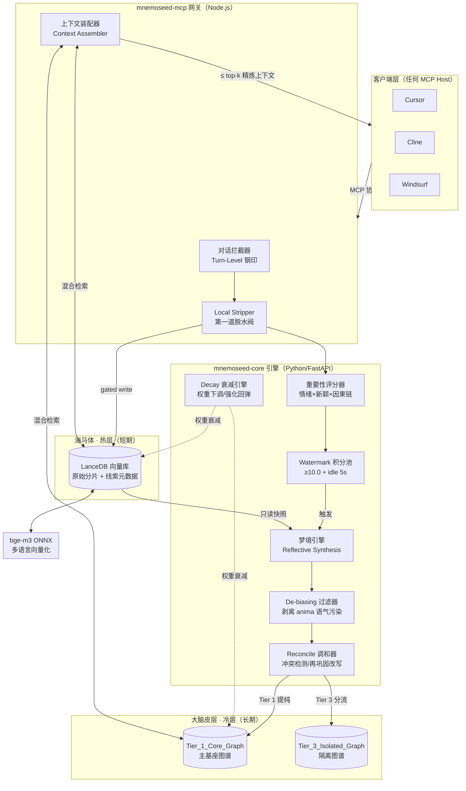
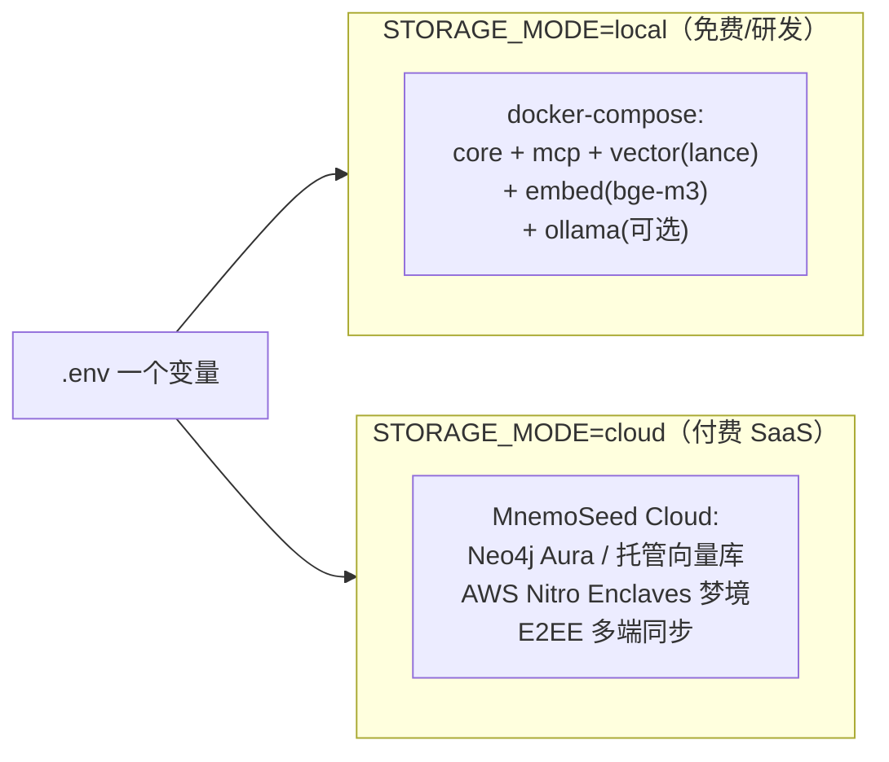

# 00 · 总览与设计哲学

> MnemoSeed 核心引擎设计文档 v4.0 草案 · 2026-08-08

---

## 1. 一句话定位

**MnemoSeed 是跨模型、跨客户端的中立第三方记忆层**：把 AI 的"灵魂"（长期经验、偏好、因果知识）从"躯体"（具体 LLM、具体 IDE 会话）中解耦，通过 MCP 协议让任何 Agent 在任何模型间继承同一套会持续演化的记忆基座。

品牌宣言：*Decouple the AI Soul from the Model Body.*

---

## 2. 为什么长上下文不是记忆

2026 年的行业惯性是"把历史全塞进 context window"。这条路在三个维度上同时崩塌：

| 维度 | 失败模式 | 对应的生物事实 |
|---|---|---|
| **成本** | 六个月历史的用户，第一条消息的 token 成本超过新用户一整周 | 人脑做决策前不会重播一生 |
| **判别力** | "我喜欢咖啡"和"客户合规红线"权重相同，因为写入时没有分级 | 海马体依赖突显性（salience）标记决定什么值得编码 |
| **更新** | 事实变更后（换工作、推翻决定），全量回放同时包含新旧两个矛盾版本，无信号判断哪个是当前的 | 人脑通过再巩固（reconsolidation）改写旧记忆，而不是叠加 |

**结论：记忆不是更大的窗口，是一套独立的架构——刻意决定什么被带入未来、什么被放下。**

---

## 3. 脑神经科学基础映射表（本设计的公理层）

MnemoSeed 的每个子系统都不是工程取巧，而是对应一个被实验验证的生物机制。这是我们与 Mem0 类"向量追加"产品的本质区别。

| 生物机制 | 神经科学出处 | MnemoSeed 工程映射 |
|---|---|---|
| **互补学习系统**（Complementary Learning Systems, McClelland 1995）：海马体快速记情节，新皮层慢速沉淀结构化知识 | 海马体 vs 大脑皮层分工 | **混合双库**：LanceDB 向量池（海马体/热层）+ 知识图谱（皮层/冷层） |
| **尖波涟漪回放**（Sharp-Wave Ripples）：NREM 睡眠期海马体向皮层回放白天经历，完成系统巩固 | 睡眠期记忆巩固 | **梦境引擎**：空闲时异步反思提炼，原始对话 → 经验三元组 |
| **突触标记与捕获**（Synaptic Tagging & Capture, Frey & Morris 1997）：只有被多巴胺/去甲肾上腺素"标记"的突显事件才会转化为长时程增强（LTP） | 选择性编码 | **重要性积分池**：情绪强度 × 信息新颖度 × 因果链长度三向量评分，WaterMark ≥ 10 才触发巩固 |
| **编码特异性原则**（Encoding Specificity, Tulving & Thomson 1973）：提取成功率取决于提取线索与编码时上下文的匹配度 | 情境依赖记忆 | **上下文线索元数据**：每条记忆携带项目/工具/时间/情绪线索，检索按线索重叠度加权 |
| **再巩固**（Reconsolidation, Nader 2000）：记忆被提取时会进入不稳定窗口，可被改写后重新固化 | 记忆可塑性 | **Reconcile 调和协议**：检索命中的记忆进入可写窗口，新事实合并改写，而非新旧并存 |
| **主动遗忘 / 突触稳态假说**（SHY, Tononi & Cirelli）：睡眠期全局突触缩放，弱连接被下调，保持信噪比 | 遗忘是功能而非故障 | **Decay 衰减引擎**：未强化记忆权重单调衰减，被访问则强化回弹，软删除而非硬删 |
| **来源监控**（Source Monitoring, 前额叶）：记住"谁说的、从哪来"与记住内容本身同等重要 | 记忆溯源 | **Provenance 字段**：断言者/来源/置信度元数据，永不衰减，不可被覆盖 |
| **情绪调制巩固**（杏仁核→海马体，去甲肾上腺素通路，McGaugh 2000）：高唤醒事件获得巩固优先权——但闪光灯悖论（Neisser & Harsch 1992）证明生动≠准确 | 情绪调制 | 评分模型中 **arousal 唤醒度**（截顶）进入积分池；**永不**抬高 provenance.confidence。详见 design/01 §1.6 |

**设计公理：凡是人脑用三亿年进化验证过的机制（选择性编码、睡眠巩固、主动遗忘、再巩固、来源监控），我们照其"形状"做工程化；凡是全量回放、无差别追加、永不遗忘，一律拒绝。**

---

## 4. 设计原则

1. **本地-云端对称（Local-Cloud Symmetry）**：DB、向量缓冲、梦境引擎全部抽象在接口后。改一个 `.env`（`STORAGE_MODE`）即可在"纯本地 Docker 离线"与"云端托管 SaaS/TEE"间零摩擦切换。
2. **多语言原生（Multilingual Native）**：统一 bge-m3（ONNX）向量化，中英混排、代码混杂、方言语境下召回不掉精度。
3. **捕获即拒绝（Capture is Rejection First）**：管线第一道闸门的默认动作是"不记"。无差别捕获的系统只是在重建它本想解决的"全量回放"问题。
4. **读全量、写隔离（Complete Read, Split Write）**：反思时看 100% 完整场景保证不断裂；写回时按认知层级物理隔离，低 Tier 噪音永不污染主基座。
5. **成本死锁**：任何一次发往云端高端模型的增量数据被工程机制死锁在 2k–5k tokens（详见 v3.1 白皮书"两道脱水阀"）。

---

## 5. 总体架构

### 部署拓扑（一键切换）

---

## 6. 与竞品的一句话区分

- **Mem0（被动追加派）**：有 Capture 无闸门，无 Reconcile 无 Decay——只会长大不会变聪明。
- **Letta/MemGPT（Agent OS 派）**：记忆管理靠模型自己 Tool Call，token 成本随对话线性膨胀。
- **大厂原生记忆（闭环派）**：OpenAI 的记忆永远不会喂给 Claude。
- **MnemoSeed**：唯一把"五阶段管线 + 认知分级隔离 + 零知识托管"做成完整架构的中立层，且专精 **Agentic Tool-Use 肌肉记忆**（工具调用习惯序列的沉淀与继承）。
