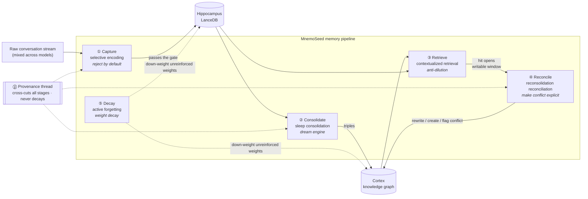
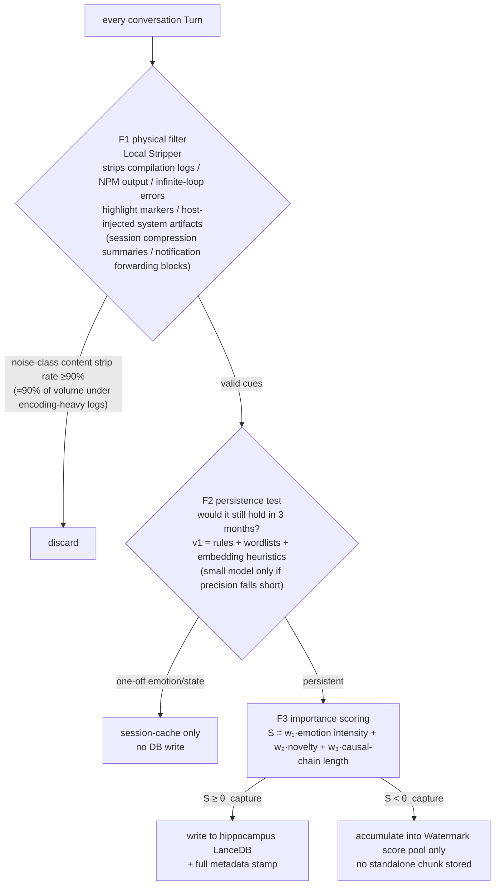
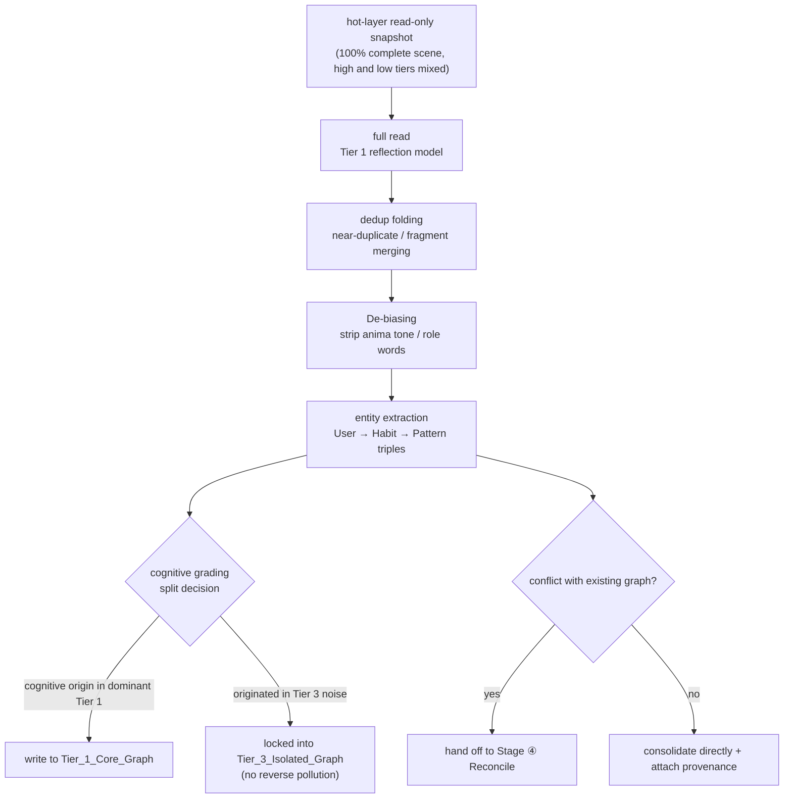
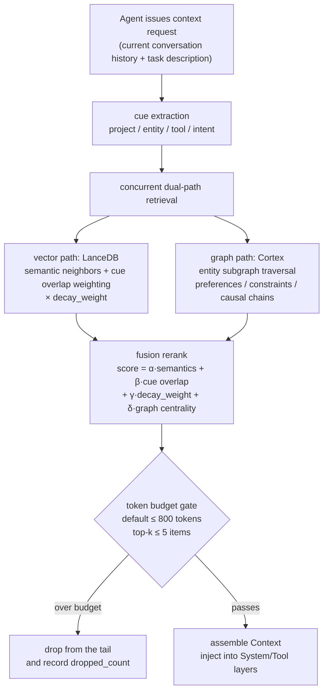
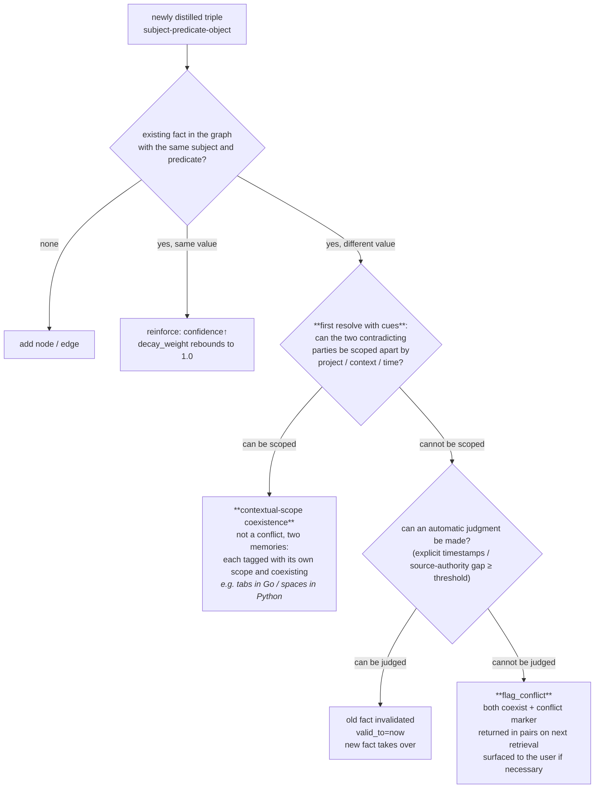
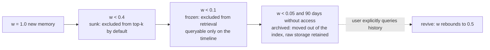

# 01 · Memory Pipeline: Five Stages + One Cross-Cutting Thread

> This document is the core new design in MnemoSeed v4.0. The framework is inspired by wast3's *Memory Engineering* (2026-08), but every stage is re-derived with a neuroscience mechanism as its axiom, and three extensions not present in the original are added for the "cross-model Agent memory" scenario (cognitive grading, the Provenance thread, reconsolidation-style reconciliation).

---

## 0. Pipeline Overview



**Why all five stages are indispensable** (the original's argument + our engineering validation):

- Retrieve without Decay → retrieval slows every month, signal-to-noise ratio drops monotonically
- Capture without Reconcile → the system accumulates self-contradictory "lies" about the user
- Consolidate without a Capture gate → the cortex graph is diluted by one-off noise
- Beyond the five stages, add **Provenance**: a memory store without provenance cannot defend itself in an audit and is poisonable

---

## 1. Stage ① Capture — Selective Encoding

**Neuroscience axiom**: Synaptic Tagging & Capture. Not every input deserves long-term potentiation; only synapses tagged by the salience system (VTA dopamine / locus coeruleus norepinephrine) are consolidated during subsequent protein synthesis.

**Engineering decision test (the three-month test)**:
> Will this information still be true AND useful three months from now?
> - "This bug is so annoying" → one-off; obsolete once the bug is fixed → **reject**
> - "In code review I like concise, no small talk" → persistent preference that should shape every subsequent interaction → **capture**

### Three-Stage Filter Funnel



### Turn-Level Metadata Stamp on Write

Every chunk written to the vector store is forced to carry:

```json
{
  "chunk_id": "uuid",
  "text": "原始有效文本 (raw valid text)",
  "cognitive_tier": 1,
  "model_id": "claude-sonnet-5",
  "anima_id": "default",
  "cues": {
    "project": "MnemoSeed",
    "host": "cursor",
    "task": "fix-ci-pipeline",
    "tools_used": ["gh", "docker"],
    "time_bucket": "2026-08-W32",
    "emotion_valence": -0.2
  },
  "provenance": {
    "asserted_by": "user",
    "source": "cursor-chat",
    "confidence": 1.0,
    "asserted_at": "2026-08-08T01:00:00Z"
  },
  "score": { "emotion": 2.1, "novelty": 3.4, "causal": 4.0, "total": 9.5 },
  "decay_weight": 1.0,
  "last_reinforced": "2026-08-08T01:00:00Z"
}
```

The `cues` field is the engineering realization of the **encoding specificity principle** (Tulving & Thomson 1973): retrieval success depends on the overlap between the retrieval situation and the encoding situation. Cues must be stored at encoding time, otherwise the Retrieve stage has nothing to match against. Beyond entities / projects / time, the stamp must record the **encoding context** (`host`: which host wrote it; `task`: the current task cue) — the retrieval side treats the "current context" as a weak cue in reranking (see §3 principle 4). The schema reserves these fields before the M0 freeze: nullable, but never absent.

### Encoding-Time Reinforcement (Hebbian Law, adapted from MemPalace's check_duplicate)

Before writing, run a near-duplicate semantic check on the chunk (similarity threshold 0.9). On hitting an existing memory, **no new chunk is produced**; instead `last_reinforced = now` and decay_weight rebounds. The neural basis is Hebb's law — repeatedly activated synapses are strengthened rather than copied into a new synapse. **Reinforcement happens at encoding time; it does not wait for a dream.**

### Red Line: anima and Preferences Never Participate in Capture (Capture Neutrality Axiom)

All F1–F3 scoring and filtering read **only the input content itself** and never read anima state or PREFERENCE nodes. Neural basis: attentional bias (MacLeod et al.) is a cognitive mechanism of anxiety/depression — a soul reviewing its own experiences is **pathology, not function**; the distortion that defense mechanisms impose on encoding is exactly what psychotherapy seeks to dismantle. If anima participated in capture, a cautious soul would systematically under-record adventurous attempts, and the memory would then "prove" that it was indeed cautious — a self-fulfilling prophecy loop. **Iron rule: anima only dyes retrieval and rendering; capture must be neutral; encoding precedes interpretation.**

---

## 1.5 Stage ⓪ The Dual-Channel Axiom (Fuzzy-Trace Theory)

Humans store verbatim and gist **in two parallel channels** (Brainerd & Reyna); extracting gist does not erase the original. This gives the dual-store architecture its definitive neurological naming:

- **Verbatim channel** = hippocampus vector store raw chunks: lossy operations (summarizing / distilling) are never allowed to happen here;
- **Gist channel** = cortex graph triples: they may be distilled, rewritten, decayed, but can always point back to the verbatim evidence scene via provenance.

---

## 1.6 Emotion and Memory: Theoretical Basis, Quantifiability, and Engineering Boundaries

> This section answers a question that must be answered honestly: is "emotion intensity" in the scoring model sufficiently solid, implementable, and quantifiably observable?
> Conclusion: **theoretically solid and quantifiable, but with clear boundaries — so emotion only enters consolidation priority, never truth adjudication.**

### The Theoretical Chain (every link has literature support; see [REFERENCES](../REFERENCES.md))

**① The driving axis is arousal, not valence.**
Kensinger & Corkin (2003) showed that the memory enhancement of emotional words is driven independently by arousal, with two separated pathways: the arousal pathway (amygdala-dependent, automatic) and the valence pathway (prefrontal strategic rehearsal). Engineering implication: the main scoring axis uses arousal; valence is demoted to metadata.

**② Emotion modulates consolidation strength, not content selection.**
McGaugh's (2000, *Science*) amygdala modulation theory: emotional arousal → stress hormones (norepinephrine / cortisol) → amygdala → modulates hippocampal consolidation strength. Emotion does not decide "what to remember"; it decides "how firmly to remember". → **It is only natural that the arousal score enters Capture scoring and dream consolidation priority.**

**③ Inverted-U curve: extreme arousal is actually harmful.**
Yerkes-Dodson (1908): moderate arousal is optimal; extreme arousal impairs performance (trauma-level arousal can damage hippocampal function). Engineering implication: arousal enters the formula with a **saturating cap** — no linear amplification.

**④ The flashbulb paradox: vivid ≠ accurate.**
Brown & Kulik (1977) proposed flashbulb memories; Neisser & Harsch (1992) proved with Challenger data that people's memories of highly emotional events carry **extremely high subjective confidence, but their objective accuracy is no better than that of everyday memories**. → **Red line: the emotion score must never raise provenance.confidence.** Emotion affects "whether it should be consolidated", not "whether it is true".

**⑤ High arousal narrows attention: strong at the center, weak at the periphery.**
Easterbrook (1959) cue-utilization narrowing + Christianson (1992) weapon-focus effect: the core details of high-arousal events are remembered well, while peripheral context is largely lost. → Engineering implication: high-arousal chunks have low peripheral information coverage during dream synthesis; they should be marked `peripheral_gaps=true`, and synthesis should actively fill in context from neighboring chunks.

**⑥ Mood-congruent retrieval.**
Bower (1981): material consistent with the current mood is more readily retrieved. → valence is stored as a retrieval cue (`cues.emotion_valence`), enabling mood-match weighting during retrieval.

### Quantifiable Scheme

- **Theoretical basis**: Russell's (1980) circumplex model of affect (valence × arousal, two dimensions); the SAM nine-point scale (Bradley & Lang 1994) as the manual annotation baseline; PANAS (Watson et al. 1988) as the positive/negative valence measurement instrument.
- **Automatic text quantification**: the NRC VAD lexicon (Mohammad 2018, manual valence/arousal/dominance scores for 20,000 English words). Lexicon coverage is insufficient for mixed Chinese-English + code scenarios → long term, an edge small-model regression outputs 2-D V/A scores, calibrated against NRC VAD and corresponding Chinese-language resources. **v1 implementation (finalized in [PRD-01](../prd/PRD-01-capture.md))**: start with lexicon word-lookup regression + embedding-distance heuristics, without introducing a small model; reinforce with a model only if measured precision on the benchmark annotation set falls short.
- **The corrected scoring formula**:

```text
S = w₁·min(arousal, θ_cap) + w₂·novelty + w₃·causal_chain
valence → stored in cues only, never in S
arousal → never written into provenance.confidence
```

### Honest Boundaries (limits that must be written into the documentation)

Textual emotion inference has limited precision in contexts of **sarcasm, technical complaints, and mixed Chinese-English** ("this damn bug is finally fixed" — negative valence high arousal or positive valence high arousal? A lexicon would misjudge). Therefore: w₁ starts conservative (recommended w₁ ≤ w₂, w₃); emotion never touches truth fields for the entire life of the record; after the dynamic λ self-calibration loop (§5) goes live, use the "actual reuse rate of high-arousal memories" to calibrate w₁ backward.

---

## 2. Stage ② Consolidate — Sleep Consolidation

**Neuroscience axiom**: Complementary Learning Systems + sharp-wave ripple replay. Episodes the hippocampus recorded quickly during the day are "replayed" to the neocortex during NREM sleep; the cortex slowly integrates decontextualized structured knowledge. Ten mentions of the same fact fold into one high-confidence entry rather than ten redundant records competing for retrieval space.

The engineering implementation is the **dream engine**; see [02-dream-engine](02-dream-engine.md). This section only defines the semantic contract of the consolidation stage:



**Semantic contract**: Consolidate's output is not a "summary" but **structured triples with confidence and source**. Summaries lose updatability; triples do not.

---

## 3. Stage ③ Retrieve — Contextualized Retrieval (Anti-Dilution)

**Neuroscience axiom**: encoding specificity + pattern completion. The hippocampus reconstructs a complete memory from partial cues; retrieval quality depends on cue matching, not on total inventory.

**Core precept: retrieving 20 barely-relevant memories is equivalent to burying the 2 truly important ones in noise. The retrieval system's job is restraint.**



**Six anti-dilution principles**:
1. **Hard budget**: every injected memory context has a token cap; excess is dropped from the tail — never "stuff it all in and deal with it later".
2. **Decay participates in ranking**: `decay_weight` enters the rerank formula directly, so old unreinforced memories naturally sink to the bottom — Decay takes effect on the retrieval side, not by deleting the database.
3. **Conflicts returned in pairs**: if retrieval hits memories carrying `conflict_flag`, both conflicting parties must be returned together and marked, letting the model handle the conflict explicitly rather than whichever loads first by chance.
4. **Weak context cues**: at retrieval, the current encoding context (host / project / time-band) participates in reranking as a weakly-weighted cue — the retrieval-side fulfillment of encoding specificity (counterpart to the §1 stamp `cues`).
5. **Diversity and exploration quota (anti-monoculture)**: retrieval-decay is a positive feedback loop — recalled memories get reinforced and become easier to recall again; unrecalled ones keep decaying (corresponding to retrieval-induced forgetting, Anderson 1994: retrieval actively suppresses competing memories). Left alone, a few high-frequency memories would dominate recall and diversity would die. **Fix**: add a diversity constraint to reranking (within-class dedup, MMR-style) + a small exploration quota (every N retrievals, let one low-weight high-uncertainty memory play), as the system's "immune system".
6. **Honest empty (metamemory)**: when no qualified candidate exists, return the explicit "I have no relevant memory" semantics, never pad with low-quality stand-ins — letting the host model distinguish "forgot" from "never had it", preventing hallucinated familiarity. Together with `dropped_count`, retrieval results must be able to self-report coverage.

---

## 4. Stage ④ Reconcile — Reconsolidation Reconciliation

**Neuroscience axiom**: Reconsolidation. After being retrieved, a memory enters a labile window during which new information can rewrite it, after which it re-consolidates. The brain does not hold "old and new side by side"; rather, "the old is updated as it is recalled".

This is the most important extension relative to X's original: in the original, Reconcile happened only on the write side; we split it into **write-side conflict detection** and **retrieval-side reconsolidation rewrite**, two sub-protocols.

### 4a. Write-Side Conflict Detection (triggered at Consolidate)



**The basis of the third branch — context-dependent memory** (Godden & Baddeley 1975): memories are inherently bound to the retrieval context; a globally-unique "fact" is an engineering illusion. Two seemingly contradictory memories may both hold in different contexts, so first try to scope them apart with cues, and only enter the adjudication flow when they cannot be separated. (In response to N01ennn's admonition: "never auto-merge contradictions — both may have been right in different contexts.")

**Red-line rule: the system never silently picks a side when genuinely uncertain.** A silent pick means a guaranteed future of confidently acting on wrong facts. Surfacing ambiguity is slower than guessing, but it is the dividing line between a "trustworthy memory system" and "a system the user must repeatedly double-check".

### Conversational Rendering of Conflict Confirmation (anima delivery responsibility)

When `flag_conflict` surfaces, the core engine only outputs a **structured conflict object**:

```json
{
  "type": "conflict_confirmation",
  "subject": "user.code_style",
  "predicate": "indent_prefix",
  "old": {"value": "加前缀 (add the prefix)", "asserted_at": "2026-08-01", "provenance": {...}},
  "new": {"value": "别加前缀 (don't add the prefix)", "asserted_at": "2026-08-08", "provenance": {...}}
}
```

**Wording is not the engine's business; it belongs to anima delivery** — for the same conflict object, a cautious anima asks with room to maneuver, a direct anima cuts to the chase, like a normal conversation rather than a system popup ("You were still saying you'd add the prefix last Friday; changed your mind today? Want me to update the memory thoroughly?"). The engine guarantees factual accuracy; anima delivers the tone — the way of speaking is a function of temperament, not a prewritten template (see [09](09-anima-and-preferences.md) for the anima model; when anima is absent, fall back to outputting the structured conflict object directly).

### 4b. Retrieval-Side Reconsolidation Rewrite (triggered after a Retrieve hit)

```mermaid
sequenceDiagram
    participant A as Agent
    participant R as Retrieve engine
    participant G as Cortex graph
    A->>R: context request
    R->>G: hit memory M
    G-->>R: return M (mark labile window open)
    R-->>A: inject M
    Note over A,G: conversation in progress; user gives new information<br/>"I stopped using Neovim last week and switched back to VSCode"
    A->>R: new fact N (contradicts M)
    R->>G: reconsolidation write:<br/>M.valid_to=now, N takes over the same slot,<br/>provenance appends the rewrite chain
    Note over G: the old fact is not deleted,<br/>it becomes a historical version (queryable on the timeline)
```

The old fact enters the **historical version chain** rather than being physically deleted — a requirement of the Provenance thread and the foundation of the "user timeline replay" feature.

---

## 5. Stage ⑤ Decay — Active Forgetting

**Neuroscience axiom**: the synaptic homeostasis hypothesis (SHY). During sleep, global synaptic strength is scaled down proportionally; weak connections fall below the noise floor while strong ones survive — forgetting is an active function that preserves signal-to-noise ratio. A never-forgetting memory store is, one year later, equivalent to an unsearchable landfill.

### The Decay Model

```text
decay_weight(t) = base_confidence × exp(-λ_eff × days_since(last_reinforced))
λ_eff = λ_base × (1 + κ × interference_load)
  interference_load = number of neighboring memories highly similar to this one (mutual occlusion)

λ_base by layer:
  λ_fact       = 0.01   (hard facts: decay half-life ≈ 69 days)
  λ_preference = 0.005  (preferences: live longer, ≈ 139 days)
  λ_episode    = 0.03   (episodic fragments: ≈ 23 days)
```

**Basis for the interference term (interference theory, Wixted 2004)**: the mainstream conclusion of modern memory science is that forgetting is driven mainly by **interference** — similar memories compete with and occlude each other — rather than by the mere passage of time. A pure time curve cannot explain why "unique experiences are remembered best". Engineering translation: the more similar neighbors, the larger the effective λ; unique memories are naturally decay-resistant.

**Reinforcement rebound (with spacing-effect cooldown)**: every time a memory is hit by Retrieve and actually used, `last_reinforced = now`, and the weight returns to `min(1.0, w + reinforcement_bonus)` — but **repeated recall within a short time window yields diminishing returns** (rebound halves, then halves again, within the cooldown window): the spacing effect (Cepeda 2006 meta-analysis) proves that distributed review is far superior to massed review, and the same number of concentrated activations should not count as equivalent reinforcement. This also foils the speculation of "repeatedly pumping up one memory's weight". Additionally, near-duplicate hits at capture (§1 Hebbian encoding reinforcement) also trigger rebound (equally subject to the cooldown).

**Deep-Sleep Sweep**: a batch decay cycle on a weekly basis (corresponding to SHY's sleep-phase global synaptic scaling) — all unreinforced nodes are uniformly down-weighted by λ while archive migration is performed. Coordinated with real-time rebound: real-time reinforcement, periodic sweep.

**Dynamic λ self-calibration (reserved)**: the λ initial values are hand-set (table above), but the architecture reserves a self-calibration loop — dynamically adjusting each layer's λ based on "the actual retrieval hit rate / utility feedback of memories after decay". If a class of memory keeps being explicitly revived after sinking to the bottom, that means λ is too large, and it slows down automatically. Corresponding biological fact: the forgetting rate itself is regulated by retrieval feedback; it is not a constant.

**Source-invalidation down-weighting (adapted from MemPalace sync)**: memories whose `provenance.source` goes stale (the referenced session is deleted / the source file disappears) are automatically down-weighted further — memory lives and dies with its source; this is the physical implementation of source monitoring.

**Soft fading, not hard deletion**:


**Exceptions (never decay)**: the `provenance` field, user-explicitly-pinned memories, and constraint-class memories tagged `compliance/safety`.

---

## 6. Stage ⓟ Provenance — The Cross-Cutting Thread

> Source: a contribution by Nick DeBarmore in X's comments — "every fact must carry who asserted it, from what source, and that field must never decay. Without it, a memory store can be poisoned and cannot defend itself in an audit. In regulated environments, the memory layer is not a cache; it is the system of record." We adopt it and upgrade it into the thread that cross-cuts all five stages.

### Schema

```json
"provenance": {
  "asserted_by": "user | agent:<model_id> | system",
  "source": "cursor-chat | cline | manual-pin | import",
  "source_ref": "session_uuid/turn_range",
  "confidence": 0.0,
  "asserted_at": "ISO8601",
  "history": [
    {"event": "created", "at": "...", "by": "..."},
    {"event": "reconsolidated", "at": "...", "by": "...", "supersedes": "uuid"}
  ]
}
```

### Rules

1. **Never decays, never overwrites**: rewrites only append to `history`; the old version chain is fully preserved.
2. **Confidence participates in adjudication**: when Reconcile auto-adjudicates, the source-authority gap is one of the criteria (explicit user statements > Tier 1 model inference > Tier 3 model inference).
3. **Poisoning protection**: new facts from low-confidence sources cannot displace high-confidence old facts; they can only trigger flag_conflict.
4. **Audit interface**: any memory can answer "who said this, when, from where, and how many times it was rewritten".

---

## 7. Preference Dynamics (split out as an advanced module; see design/09)

> Preference dynamics and the anima model now have their own document: [09-anima-and-preferences](09-anima-and-preferences.md) §3 — **an advanced feature, outside the M1 first-release scope**.
> This pipeline's dependency points are only two, both contracts under the "anima optional" premise: ① the Capture red line (§1: anima/preferences never participate in capture scoring) — an engine red line that exists independently of the anima module; ② the Decay layering (§5: `λ_preference`) — reserved in the schema; when anima is absent, this layer degrades to ordinary preference-entry decay.

---

## 8. List of Differences Between the Pipeline and the Existing Whitepaper

| Existing design (v3.x) | v4.0 change | Reason |
|---|---|---|
| Importance score pool only "triggers dreams" | Split into dual duties: Capture gate + trigger | X's article: capture is first a rejection system; v3.x's Stripper only strips logs without judging persistence |
| Retrieval "fishes out relevant memories" | Adds a hard token budget + top-k ≤ 5 + conflicts returned in pairs | Anti-dilution: 20 barely-relevant items = burying 2 critical ones |
| No conflict handling | Reconcile dual sub-protocols (write-side detection + retrieval-side reconsolidation rewrite) | Facts change; a silent pick = collapsed trust |
| No forgetting mechanism | Decay attrition + reinforcement rebound + soft archiving | Never forgetting ⇒ unsearchable a year later |
| No provenance | Provenance cross-cutting thread, never decays | Auditable + poisoning protection |
