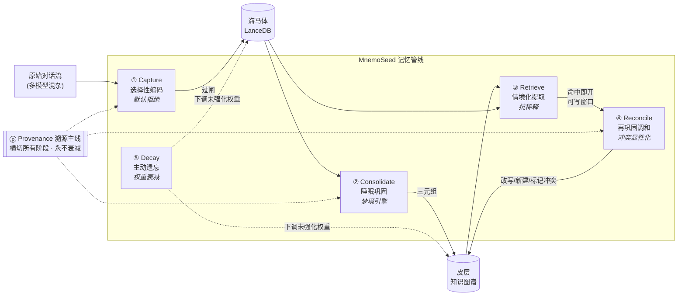
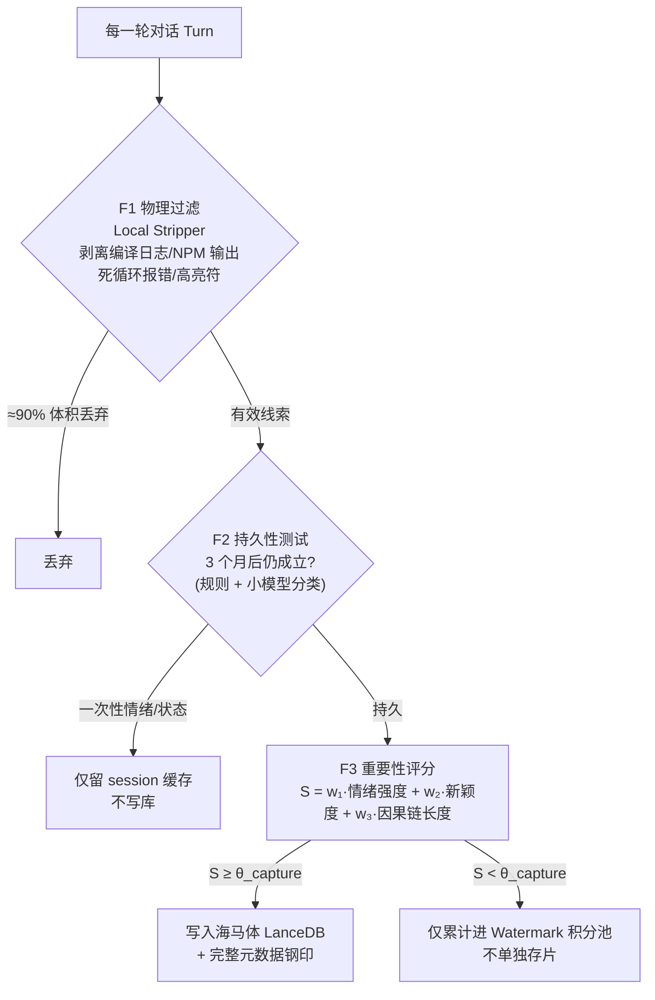
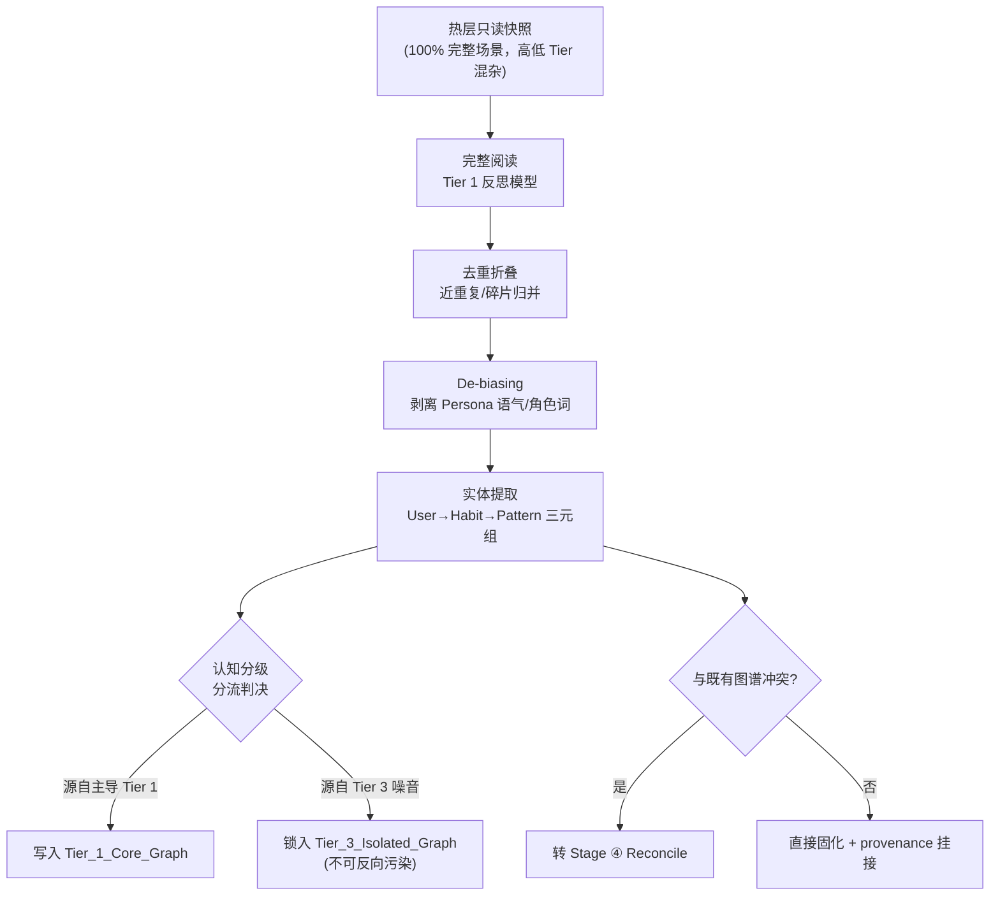
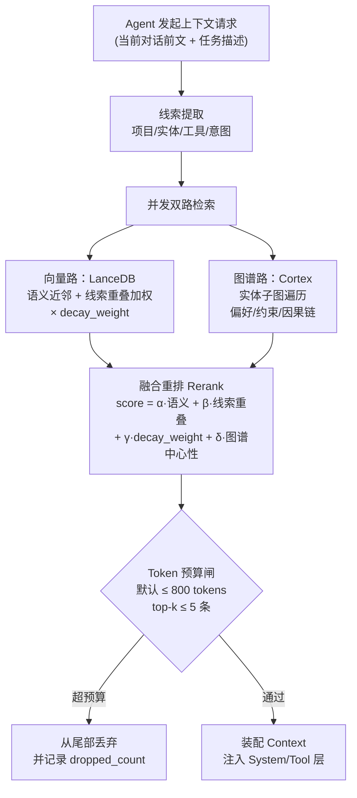
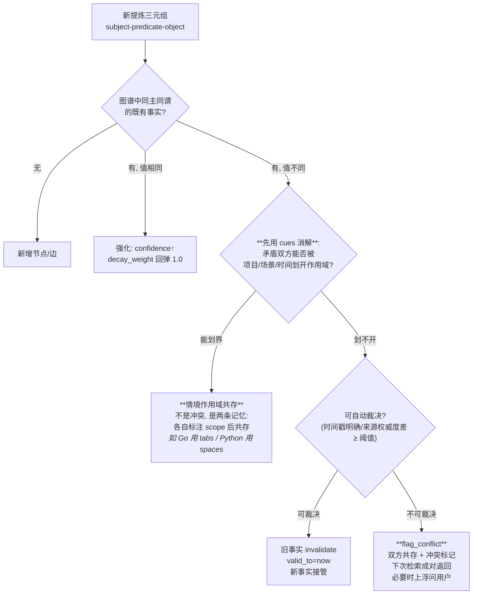
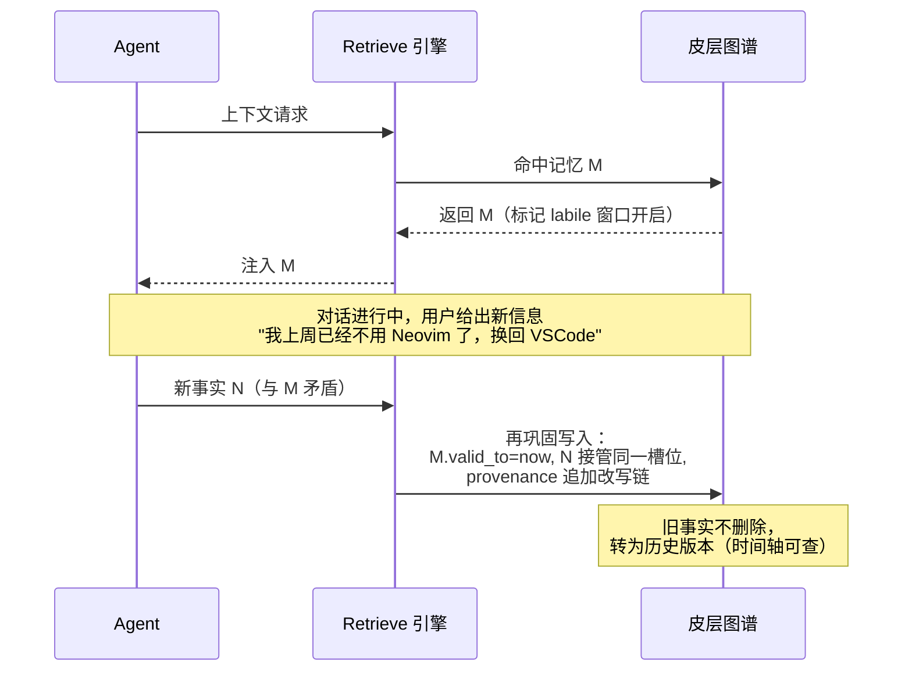
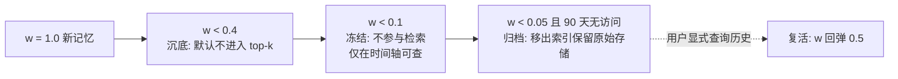

# 01 · 记忆管线：五阶段 + 一条横切主线

> 本文档是 MnemoSeed v4.0 的核心新增设计。框架受 wast3《Memory Engineering》(2026-08) 启发，但每一阶段均以脑神经科学机制为公理重新推导，并针对"跨模型 Agent 记忆"场景做了三处原文没有的扩展（认知分级、Provenance 主线、再巩固式调和）。

---

## 0. 管线总览



**为什么五个阶段缺一不可**（原文论证 + 我们的工程验证）：

- 有 Retrieve 无 Decay → 检索每月变慢，信噪比单调下降
- 有 Capture 无 Reconcile → 系统积累关于用户的自相矛盾的"谎言"
- 有 Consolidate 无 Capture 闸门 → 皮层图谱被一次性噪音稀释
- 五阶段之外再加 **Provenance**：没有溯源的记忆库在审计面前无法自辩，且可被投毒（poisonable）

---

## 1. Stage ① Capture —— 选择性编码

**神经科学公理**：突触标记与捕获（Synaptic Tagging & Capture）。并非所有输入都配获得长时程增强；只有被突显性系统（VTA 多巴胺 / 蓝斑去甲肾上腺素）打上标记的突触才会在后续蛋白合成中被固化。

**工程判定测试（三个月测试）**：
> 这条信息三个月后仍然为真且有用吗？
> - "这个 bug 好烦" → 一次性，bug 修完即过期 → **拒收**
> - "我 code review 喜欢简洁、别寒暄" → 持久偏好，应塑造此后每次交互 → **捕获**

### 三级过滤漏斗



### 写入时的元数据钢印（Turn-Level Metadata）

每条写入向量库的分片强制携带：

```json
{
  "chunk_id": "uuid",
  "text": "原始有效文本",
  "cognitive_tier": 1,
  "model_id": "claude-sonnet-5",
  "persona_id": "default",
  "cues": {
    "project": "MnemoSeed",
    "tools_used": ["gh", "docker"],
    "time_bucket": "2026-08-W32",
    "emotion_valence": -0.2
  },
  "provenance": {
    "asserted_by": "user",
    "source": "cursor-chat",
    "confidence": 1.0,
    "asserted_at": "2026-08-08T01:00:00Z"
  },
  "score": { "emotion": 2.1, "novelty": 3.4, "causal": 4.0, "total": 9.5 },
  "decay_weight": 1.0,
  "last_reinforced": "2026-08-08T01:00:00Z"
}
```

`cues` 字段是**编码特异性原则**的落地：提取线索必须在编码时就存好，否则 Retrieve 阶段无从匹配。

### 编码时强化（赫布定律，借自 MemPalace 的 check_duplicate）

写入前先对该分片做近重复语义检查（相似度阈值 0.9）：命中已有记忆时**不产生新分片**，而是 `last_reinforced = now`、decay_weight 回弹。神经依据是赫布定律——重复激活的突触被强化，而不是复制一个新突触。**强化发生在编码时，不等做梦。**

---

## 1.5 Stage ⓪ 双通道公理（Fuzzy-Trace Theory）

人对逐字（verbatim）与要义（gist）是**双通道并行存储**（Brainerd & Reyna），要义提取不擦除原文。这给了双库架构最终的神经学命名：

- **Verbatim 通道** = 海马体向量库原始分片：有损操作（摘要/提炼）永远不允许发生在这里；
- **Gist 通道** = 皮层图谱三元组：可以提炼、改写、衰减，但永远能通过 provenance 指回 verbatim 证据现场。

---

## 1.6 情绪与记忆：理论依据、可量化性与工程边界

> 本节回答一个必须诚实回答的问题：评分模型里的"情绪强度"是否足够坚实、可实行、可量化观测？
> 结论：**理论坚实、可量化，但有明确边界——所以情绪只进巩固优先级，永不进真实性裁决。**

### 理论链条（每条都有文献支撑，见 [REFERENCES](../REFERENCES.md)）

**① 驱动轴是唤醒度（arousal），不是效价（valence）。**
Kensinger & Corkin (2003) 证明情绪词的记忆增强由 arousal 独立驱动，且存在两条分离通路：arousal 通路（杏仁核依赖、自动化）与 valence 通路（前额叶策略性复述）。工程含义：评分的主轴用 arousal，valence 降级为元数据。

**② 情绪调制的是巩固强度，不是内容选择。**
McGaugh (2000, *Science*) 的杏仁核调制理论：情绪唤醒 → 应激激素（去甲肾上腺素/皮质醇）→ 杏仁核 → 调制海马体巩固强度。情绪不决定"记什么"，决定"记多牢"。→ **arousal 分进入 Capture 评分与梦境巩固优先级，天经地义。**

**③ 倒 U 曲线，极端唤醒反而有害。**
Yerkes-Dodson (1908)：中等唤醒最优，极端唤醒损伤表现（创伤级唤醒会损伤海马体功能）。工程含义：arousal 进公式时带**饱和截顶**，不做线性放大。

**④ 闪光灯悖论：生动 ≠ 准确。**
Brown & Kulik (1977) 提出闪光灯记忆；Neisser & Harsch (1992) 用挑战者号数据证明：人们对高情绪事件的记忆**主观自信极高，但客观准确度并不比日常记忆好**。→ **红线：情绪分永远不得抬高 provenance.confidence。** 情绪影响"该不该巩固"，不影响"是不是真的"。

**⑤ 高唤醒收窄注意力，中心强、周边弱。**
Easterbrook (1959) cue-utilization 收窄 + Christianson (1992) 武器聚焦效应：高唤醒事件的核心细节记得牢，周边上下文丢失多。→ 工程含义：高 arousal 分片在梦境提炼时周边信息覆盖率低，应标记 `peripheral_gaps=true`，提炼时主动从邻近分片补齐上下文。

**⑥ 心境一致性检索。**
Bower (1981)：与当前心境一致的材料更易被提取。→ valence 存为检索 cue（`cues.emotion_valence`），检索时可做心境匹配加权。

### 可量化方案

- **理论基础**：Russell (1980) 环形情感模型（valence × arousal 二维）；SAM 九点量表（Bradley & Lang 1994）为人工标注基准；PANAS（Watson et al. 1988）为正负效价测量工具。
- **文本自动量化**：NRC VAD 词表（Mohammad 2018，20,000 英文词的 valence/arousal/dominance 人工评分）。中英混排+代码场景词表覆盖不足 → 用边缘小模型回归输出 V/A 二维分，以 NRC VAD 及中文对应资源做校准。
- **修正后的评分公式**：

```text
S = w₁·min(arousal, θ_cap) + w₂·novelty + w₃·causal_chain
valence → 仅存入 cues，不进 S
arousal → 永远不得写入 provenance.confidence
```

### 诚实边界（必须写进文档的限制）

文本情绪推断在**讽刺、技术抱怨、中英混杂**语境下精度有限（"这破 bug 终于修了"是负效价高唤醒还是正效价高唤醒？词表会判错）。因此：w₁ 初值保守（建议 w₁ ≤ w₂, w₃），emotion 全程不碰真实性字段，动态 λ 自校准回路（§5）上线后用"高 arousal 记忆的实际复用率"反向校准 w₁。

---

## 2. Stage ② Consolidate —— 睡眠巩固

**神经科学公理**：互补学习系统 + 尖波涟漪回放。白天海马体快速记下的情节，在 NREM 睡眠期被"回放"给新皮层，皮层慢速整合出去情境化的结构化知识；同一事实的十次提及折叠为一条高置信条目，而非十条冗余记录争夺检索空间。

工程实现即**梦境引擎**，详见 [02-梦境引擎](02-梦境引擎.md)。本节只定义巩固阶段的语义契约：



**语义契约**：Consolidate 的输出不是"摘要"，而是**带置信度与来源的结构化三元组**。摘要会丢失可更新性；三元组不会。

---

## 3. Stage ③ Retrieve —— 情境化提取（抗稀释）

**神经科学公理**：编码特异性 + 模式完成（pattern completion）。海马体用部分线索重建完整记忆；提取质量取决于线索匹配，而不是库存总量。

**核心戒律：取出 20 条勉强相关的记忆，等于把真正重要的 2 条埋进噪音。检索系统的本职是克制。**



**抗稀释三原则**：
1. **硬预算**：每次注入的记忆上下文有 token 上限，超出即丢尾部，绝不"都塞进去再说"。
2. **衰减参与排序**：`decay_weight` 直接进入 rerank 公式，旧而未强化的记忆自然沉底——Decay 在提取侧生效，不靠删库。
3. **冲突成对返回**：若检索命中存在 `conflict_flag` 的记忆，必须把冲突双方一起返回并标注，让模型显性处理，而不是随机先加载哪条算哪条。

---

## 4. Stage ④ Reconcile —— 再巩固调和

**神经科学公理**：再巩固（Reconsolidation）。记忆被提取后进入不稳定（labile）窗口，此时新信息可以改写它，随后重新固化。人脑不是"新旧并存"，而是"旧的在被想起时被更新"。

这是相对 X 原文最重要的扩展：原文的 Reconcile 只发生在写入侧，我们把它拆成**写入侧冲突检测**与**提取侧再巩固改写**两个子协议。

### 4a. 写入侧冲突检测（Consolidate 时触发）



**第三分支的依据——情境依赖记忆**（context-dependent memory, Godden & Baddeley 1975）：记忆本来就绑定提取情境，全局唯一的"事实"是工程幻觉。两条表面矛盾的记忆可能在不同上下文里都成立，先尝试用 cues 划界，划不开才进入裁决流程。（回应 N01ennn 的告诫："never auto-merge contradictions — both may have been right in different contexts."）

**红线规则：系统在真正不确定时绝不沉默地选边。** 沉默选边 = 迟早自信地按错误事实行动。暴露歧义比猜测慢，但这是"可信记忆系统"和"需要用户反复复核的系统"之间的分水岭。

### 冲突确认的对话渲染（Persona 层职责）

`flag_conflict` 上浮时，核心引擎只输出**结构化冲突对象**：

```json
{
  "type": "conflict_confirmation",
  "subject": "user.code_style",
  "predicate": "indent_prefix",
  "old": {"value": "加前缀", "asserted_at": "2026-08-01", "provenance": {...}},
  "new": {"value": "别加前缀", "asserted_at": "2026-08-08", "provenance": {...}}
}
```

**措辞不归引擎管，归 Persona 层渲染**——同一冲突对象，傲娇助理和严谨法务用各自的语气问出来，像正常对话而不是系统弹窗（"诶，你上周五还说要加前缀的，今天改主意了？要不要我把记忆彻底更新掉？"）。引擎保证事实准确，面具保证语气拟人。这与"一套记忆基座，千面面具"的解耦原则一致。

### 4b. 提取侧再巩固改写（Retrieve 命中后触发）



旧事实进入**历史版本链**而非物理删除——这是 Provenance 主线的要求，也是"用户时间轴回放"功能的基础。

---

## 5. Stage ⑤ Decay —— 主动遗忘

**神经科学公理**：突触稳态假说（SHY）。睡眠期全局突触强度被等比下调，弱连接跌到噪声线下，强连接保留——遗忘是维持信噪比的主动功能。永不遗忘的记忆库一年后等价于一座不可搜索的垃圾填埋场。

### 衰减模型

```text
decay_weight(t) = base_confidence × exp(-λ × days_since(last_reinforced))

λ 分层：
  λ_fact     = 0.01   (硬事实：衰减半衰期 ≈ 69 天)
  λ_preference = 0.005 (偏好：更长寿，≈ 139 天)
  λ_episode  = 0.03   (情节碎片：≈ 23 天)
```

**强化回弹**：记忆每次被 Retrieve 命中并实际使用，`last_reinforced = now`，权重回到 `min(1.0, w + reinforcement_bonus)`——对应"间隔效应"（spacing effect）：被反复提取的记忆巩固加深。此外，捕获时的近重复命中（§1 赫布编码强化）同样触发回弹。

**深度睡眠清扫（Deep-Sleep Sweep）**：以周为单位的批量衰减周期（对应 SHY 的睡眠期全局突触缩放）——所有未被强化节点统一按 λ 下调，同时执行归档迁移。与实时回弹配合：实时强化、周期清扫。

**动态 λ 自校准（预留）**：λ 初值手工设定（上表），但架构预留自校准回路——按"衰减后记忆的实际检索命中率/效用反馈"动态调节各层 λ。若某类记忆沉底后仍频繁被显式复活，说明 λ 偏大，自动放缓。对应生物事实：遗忘速率本身受提取反馈调节，不是常数。

**源失效降权（借自 MemPalace sync）**：`provenance.source` 失效（引用的 session 被删除/源文件消失）的记忆自动额外降权——记忆与来源共存亡，这是来源监控的物理实现。

**软衰落，非硬删除**：


**例外（永不衰减）**：`provenance` 字段、用户显式 pin 的记忆、`compliance/safety` 标签的约束类记忆。

---

## 6. Stage ⓟ Provenance —— 横切主线

> 来源：X 评论区 Nick DeBarmore 的补充——"每条事实必须携带谁断言、来自什么来源，且该字段永不衰减。没有它，记忆库可被投毒、在审计前无法自辩。在受监管环境里，记忆层不是缓存，是 system of record。"我们采纳并升级为横切全部五阶段的主线。

### Schema

```json
"provenance": {
  "asserted_by": "user | agent:<model_id> | system",
  "source": "cursor-chat | cline | manual-pin | import",
  "source_ref": "session_uuid/turn_range",
  "confidence": 0.0,
  "asserted_at": "ISO8601",
  "history": [
    {"event": "created", "at": "...", "by": "..."},
    {"event": "reconsolidated", "at": "...", "by": "...", "supersedes": "uuid"}
  ]
}
```

### 规则

1. **永不衰减、永不覆盖**：改写只能追加 `history`，旧版本链完整保留。
2. **置信度参与裁决**：Reconcile 自动裁决时，来源权威度差是判据之一（user 显式陈述 > Tier 1 模型推断 > Tier 3 模型推断）。
3. **投毒防护**：低置信来源的新事实无法顶掉高置信旧事实，只能触发 flag_conflict。
4. **审计接口**：任何记忆可回答"这条是谁在什么时候从哪来的、被改写几次"。

---

## 7. 管线与既有白皮书的差异清单

| 既有设计（v3.x） | v4.0 变化 | 原因 |
|---|---|---|
| 重要性积分池只做"触发梦境" | 拆成 Capture 闸门 + 触发器双职责 | X 文章：捕获首先是拒绝系统；v3.x 的 Stripper 只剥日志不判持久性 |
| 检索"捞出相关记忆" | 加 token 硬预算 + top-k ≤ 5 + 冲突成对返回 | 抗稀释：20 条勉强相关 = 埋葬 2 条关键 |
| 无冲突处理 | Reconcile 双子协议（写入检测 + 提取侧再巩固改写） | 事实会变；沉默选边 = 信任崩塌 |
| 无遗忘机制 | Decay 衰减 + 强化回弹 + 软归档 | 永不遗忘 ⇒ 一年后不可搜索 |
| 无溯源 | Provenance 横切主线，永不衰减 | 可审计 + 防投毒 |
