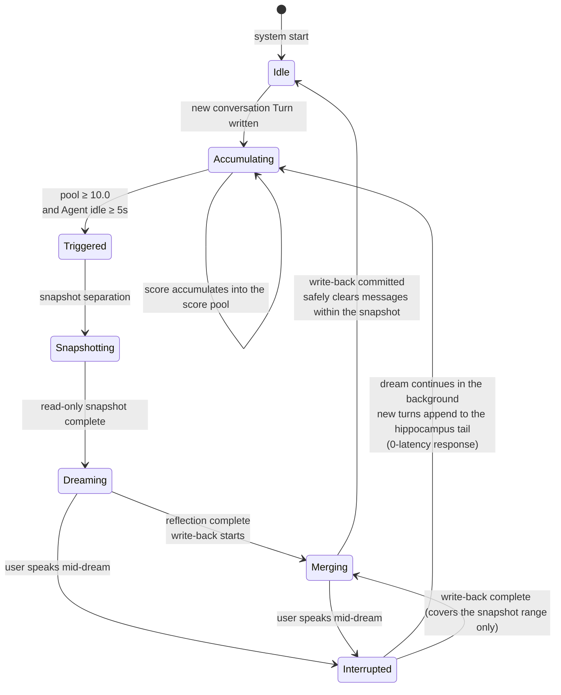
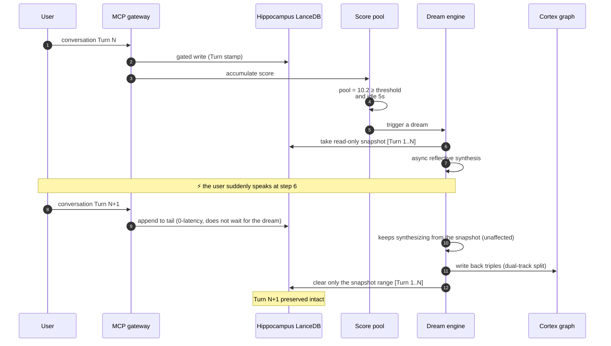
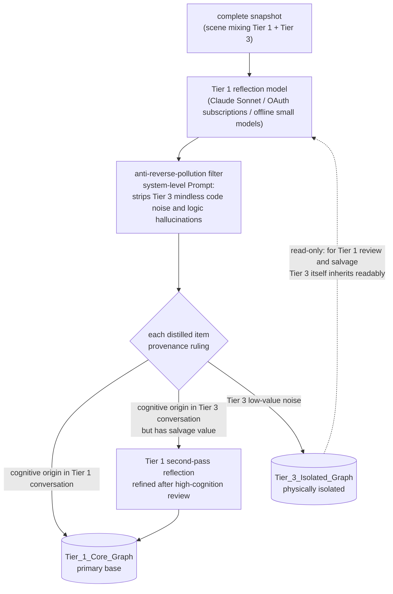
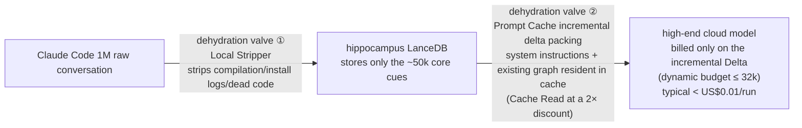
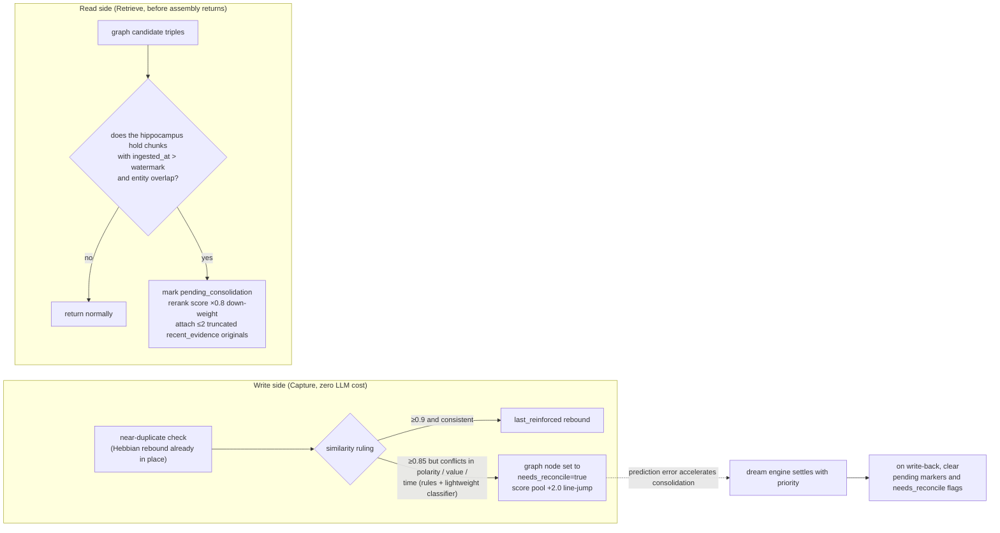

# 02 · Dream Engine

> Dual-track, round-scheduled dream refinement engine — the engineering implementation of the Consolidate stage.
> Corresponding biological mechanism: NREM-sleep sharp-wave ripple replay + systems consolidation.

---

## 1. Design Rationale

Programmers switch models frequently within a single conversation (Claude → GPT-mini → local models). Tier 1 models produce the essence; Tier 3 models produce logical garbage. The following must all be guaranteed at once:

1. **Read 100% complete** — the reflection model sees the full arc of events, high and low tiers mixed, never with broken context;
2. **Write physical isolation** — distillations of low-cognition products are locked into the isolated graph, never reverse-polluting the primary base;
3. **Cost deadlock** — incremental data sent to the cloud in a single dream has a hard cap (default 32k tokens, dynamic budget; see §6), and a monthly token ledger backstops total cost;
4. **Zero-delay interruption** — the user can wake the system at any time; dreaming runs async in the background; neither blocks the other.

---

## 2. The Trigger State Machine



**Key invariants**:
- The snapshot is a **read-only copy**; the hot layer continues to accept normal appends during the dream;
- Write-back only touches entries within the snapshot range (bounded by `turn_range`); conversation produced during the interruption is unaffected;
- "Never lose a word": the clear operation only removes snapshot content that has been confirmed as consolidated into the graph;
- The score pool is **persisted per profile as a separate row** (MetaStore `profile_score_pool`); after a daemon restart, the balance and watermark fully recover — trigger semantics are not lost on restart (see [PRD-08](../prd/PRD-08-m0-foundation.md) appendices A.3/B.3).

---

## 3. Full Sequence (Including Interruption)



---

## 4. Dual-Track Split Write (De-biasing Split Write)



**One-Way Inheritance**:
- Tier 3 models **may read** `Tier_1_Core_Graph` to guide behavior (senior employee experience, downward-compatible);
- Tier 3 models' output is **never written directly** to the primary base; it only enters the isolation zone;
- The only upward channel for isolation-zone content: a Tier 1 model performs "high-cognition second-pass reflection" on the raw logs.

---

## 5. De-biasing Protocol (anima Decoupling)

The dream engine attaches De-biasing control directives during reflective merging, forcing the synthesis model to:

1. Perform Entity Extraction and output standard triples `User → Habits → Patterns`;
2. Strip all emotive vocabulary, tone words, and role-play settings (verbal tics performed by the anima are not the user's facts);
3. **No storage of speaking style** — the anima's tone is a derivative performed from the temperament core at render time (see [09](09-anima-and-preferences.md) §2); there is no "style side-table": the base stores only neutral information; switching anima leaves zero residue.

**Two defense rules**:
- **The dye layer accepts only the user's original input** (anti slow-drift self-lock): evidence for updating the anima dye layer and preferences comes only from what the user says and does, **never from agent output** — agent output has already been rendered by the anima, so adopting it is letting the soul vote on its own dyeing;
- **De-biasing quality goes into CI**: the "memory neutrality" promise rests entirely on this one stripping filter — a single point of failure. Equipped with an eval harness (dyed-sample strip-rate metric) that regresses with the pipeline; a drop in strip rate fails the build.

---

## 6. Two Dehydration Valves (Cost Deadlock, inherited from v3.1)



**Rules**:
- Never "accumulate a large volume of conversation and process it all in one pass";
- Each dream sends only the **incremental Delta** within the 5-minute idle window;
- The existing graph and system instructions stay resident in the cloud cache via Prompt Cache;
- Routing strategy: long-context deep-sleep reflection → Kimi K3 (Fireworks, `accounts/fireworks/models/kimi-k3`, $3.00/M input, $0.30/M cache read, $15.00/M output, 1040k context); short increments (within the dynamic budget) → DeepSeek V4 Flash 0731 (Fireworks, `accounts/fireworks/models/deepseek-v4-flash-0731`, $0.14/M input, $0.028/M cache read, $0.28/M output, 1M context; this model produces verbose output, so the calling side must lock low reasoning effort). Access is **OAuth / user-supplied API key by default** — reusing the user's existing subscriptions (Codex and Grok local OAuth login state, both ToS-allowed; Anthropic subscriptions are not reused; Chinese users may pick CLI providers such as MiniMax/Kimi, with the data-egress concern made explicit at selection time) or OpenAI-compatible endpoints such as Fireworks; a local 70B is impractical for the vast majority of users and is not the default. **Role model**: the dream engine has exactly two roles (`deep_reflection` / `short_increment`, PRD-02 FR-2.14); the default routing is the two per-role defaults above; fully-offline operation is not a separate third track — it is **both roles pointed at Ollama** (with an explicit warning: synthesis quality is lower than cloud large models).
- **Keys separated by role**: the two roles each have their own key environment variable (`MNEMOSEED_DEEP_REFLECTION_API_KEY` / `MNEMOSEED_SHORT_INCREMENT_API_KEY`), falling back to the shared `FIREWORKS_API_KEY` when unset — single-provider users set only one key; multi-provider users override per role (the `[dream.llm.<role>]` table in config.toml can swap driver / endpoint / model as a whole group).
- **Budget definition (dynamic Delta budget)**: the budget is not a fixed value; before each dream, local deterministic logic directly measures the pending backlog to be settled and decides —

  ```text
  budget = clamp(total tokens of pending chunks to settle, 5k, 32k)
  ```

  - **Why direct measurement rather than feedback control**: the backlog is fully observable locally (unlike TCP congestion control, which can only infer the bottleneck from packet loss), so no AIMD-style feedback loop is needed — no oscillation, no persistent state, fully reproducible behavior;
  - **Theoretical motivation**: the Borbély two-process model (R48) — the score pool IS Process S sleep pressure; "dream length" should scale with sleep debt rather than being pinned by an alarm clock; budget expansion during the backlog period corresponds to REM rebound (R50, overcompensation after deprivation) — paying back debt, not waste;
  - **Steady-state check (Little's Law, R49)**: if the long-term arrival rate exceeds settling capacity, any finite budget leads to unbounded backlog — so when the backlog stays > 32k, the single-dream budget is NOT enlarged; instead, **guaranteed settling**: multiple consecutive dreams drain it on a fixed cadence (each still ≤ 32k), and the backlog trend is exposed in the console;
  - **Two-layer cost deadlock**: a single-run hard cap of 32k (DeepSeek V4 Flash 0731 input cost ≈ US$0.0045/run) + a **monthly token ledger** (default US$5/month-equivalent quota, adjustable in console; after exceeding in the current month, it degrades to "capture only, no consolidation", auto-recovering next month) — the per-run cap governs single transactions, the monthly ledger governs the total;
  - **Observability**: the budget value of each dream, the overflow backlog, and monthly ledger consumption are all exposed via memory.status / console ([PRD-07](../prd/PRD-07-console.md)) — no silent metrics.

---

## 7. Failure and Degradation Strategy

| Failure | Behavior |
|---|---|
| Dream model call fails | Keep the snapshot; retry 3 times with exponential backoff; if still failing, persist the snapshot to disk for the next merge — **does not block** new conversation |
| Dream model endpoint unavailable (OAuth expired / API unpaid / Ollama offline) | Degrade to "Capture only, no Consolidate" mode; the graph pauses its growth while the vector layer keeps working normally |
| Cloud TEE unreachable | The client holds a pending-sync queue; after recovery, replay in provenance time order |
| Score-pool overflow (overlong session without idle) | Reaching the hard cap (default 50.0) forcibly triggers a "lucid dream": a micro-consolidation inserted in the gap of the next user message |

## 8. Manual First, Then Automatic (development discipline, adapted from N01ennn Step 13)

> "Before you schedule anything, run it once. If the output genuinely changes a decision, it earns a schedule."

Ship the `mnemoseed dream --once` manual-consolidation CLI: during M1 all dreams are triggered manually first, and humans review synthesis quality (any hallucinated associations, whether the triples are clean, whether the routing is correct); only after quality passes is the automatic trigger turned on. **A system that hallucinates nonexistent associations across three notes will only train users to ignore it.**

---

## 9. Freshness Guard

**Problem**: dreams are asynchronous (score pool + idle trigger). Between two consolidations, undigested new chunks accumulate in the hippocampus, and they may contradict or update existing cortex triples. If retrieval trusts only the cortex, it will serve "last week's stale conclusion" to the user as fact — while the counter-evidence is already sitting in the hippocampus. (This gap was discovered by internal competitive research; the solution is not copied from competitors but derived directly from CLS.)

**Neuroscience basis**:
- In Complementary Learning Systems, **traces of recent events remain in the hippocampus, and for recent information the hippocampus takes precedence over the cortex** (McClelland 1995, R1) — on the read side, "recent unconsolidated evidence has the right to present itself" is native CLS behavior, not a patch;
- The trigger precondition for reconsolidation is **prediction error**: when an old memory is retrieved and meets new information inconsistent with expectations, only then does the old trace enter a labile state awaiting update (Nader 2000, R5) — contradiction itself is a legitimate trigger signal for accelerated consolidation.



**Rules**:
1. The read-side check is a cheap LanceDB metadata filter (requires the stamp to carry the `entities` field; see [01 §1](01-memory-pipeline.md) and [PRD-01](../prd/PRD-01-capture.md) FR-1.6 supplement);
2. Pending-consolidation content is **down-weighted + marked, never hidden** — old and new are presented together, and the choice is left to the model and the user; anima renders it into natural language ("what I remember is X, though there's a recent undigested new record mentioning Y");
3. `memory.status` exposes the pending_consolidation count and the needs_reconcile queue length; `dream --once` outputs the pending settlement list;
4. Dream write-back only clears markers within this snapshot's `turn_range` scope (consistent with the §2 invariants).

---

## 10. Two Derived Effects of Consolidation (Free Features from Sleep)

**① Emotional desensitization (overnight therapy, Walker & van der Helm 2009)**: sleep consolidation preserves content while fading the emotional charge — the neural mechanism behind "time heals". Engineering translation: once an EPISODE is consolidated into the graph, its chunk's `emotion` intensity decays at an accelerated λ (the gist lives on forever, the sting gradually fades), while unconsolidated chunks keep their original charge. Narrative effect: "it does not just remember your breakdown; it slowly puts it down for you."

**② Schema-accelerated assimilation (Tse et al. 2007, *Science*)**: an existing schema accelerates cortical consolidation of isomorphic new information. Engineering translation: distillations highly isomorphic with the existing graph (entities already present, relation patterns matching) → take the fast track and consolidate directly; misfits → need more independent evidence to pass (weighted queuing in the score pool). This is simultaneously a natural anti-noise gate: the more outlandish the claim, the heavier the burden of proof.

**③ anima re-dye (advanced module)**: triggered when switching anima (see [09](09-anima-and-preferences.md) §4; outside the M1 first-release scope) — the new anima core batch-processes and re-digests the profile's existing memories, growing its own dye layer and preferences. Executed by the dream engine, async and non-blocking; the old anima's dye layer is fully preserved (still there if you switch back; lossless switching).

---

## 11. Promotion Quality Gate

**The problem**: consolidation is reconstructive and systematically introduces distortion (Bartlett 1932; Loftus misinformation effect) — the dream engine's "distillation" is the machine version of reconstruction. Strong storage + wrong distillation = preserving the lie more durably. **No distilled output enters the core graph automatically without passing the quality gate.** (See REFERENCES for the full lineage: synaptic tagging only serves as the input-side selection analogy; the gate's legitimacy comes from the reconstruction-distortion literature plus CLS interleaved learning against catastrophic interference.)

**Principle**: all three checks are deterministic/cheap, and **self-grading by the producing model is forbidden** (self-grading = no gate).

### Three pre-promotion checks (run per triple at write-back)

1. **Groundedness**: every triple must carry source-chunk pointers (provenance), and its entities must actually overlap the source chunk text. Distilling entities/relations absent from the source = hallucination → straight to quarantine. Blocks the dominant "hallucinated association" failure mode;
2. **Conflict check**: contradicting the existing graph → not promoted; goes through the existing flag_conflict channel (§4 / PRD-04);
3. **Near-duplicate**: near-dup of an existing node → reinforce the old node instead of creating a new one (reuses the capture-side Hebbian path).

### Post-promotion: long-run precision feedback

4. **Promotion precision**: rolling rate of promoted entries later "corrected by the user / flagged conflicting" (user correction is a **first-class negative signal**, see design/01 §5 and PRD-04 FR-4.10); if precision drops below threshold → the gate auto-tightens (raise the groundedness overlap threshold); sustained health never loosens it (one-way ratchet).

### Quarantine semantics

- Quarantined entries are a `promotion_status` attribute on graph nodes (`pending / promoted / quarantined / scrapped`) — **no new store** (reuse the core graph; duplicating the Tier-3 isolated-graph concept would be a new SPOF);
- Quarantined entries stay out of retrieval and warm-up injection; the console offers per-item manual promote/scrap (PRD-07);
- TTL applies: unreviewed entries auto-`scrapped` (version chain, never physically deleted — the append-only red line holds);
- **Rollback semantics**: a promoted entry can only be reverse-versioned (a new revision marked `revoked` + `valid_to`), never physically rolled back — provenance append-only and timeline replay (NFR-4.3) hold; rollback applies to claims/gists only; the verbatim evidence layer cannot be revoked (legal erasure is the only physical-delete path, design/08 §2.4).

### Relationship to existing discipline

Manual-before-auto (§8) is unchanged: in M1 all dreams are human-reviewed, and the gate runs in **shadow mode** (advisory labels, no blocking). Its agreement rate with human judgment is the measured trustworthiness of the gate itself; auto-promotion unlocks only after that passes.
