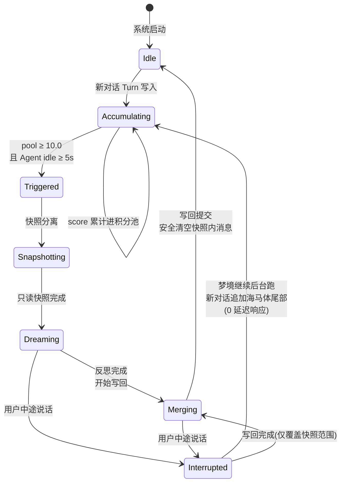
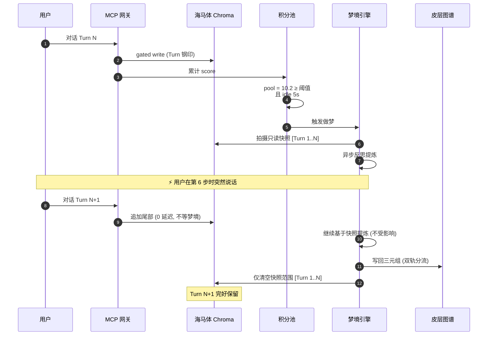
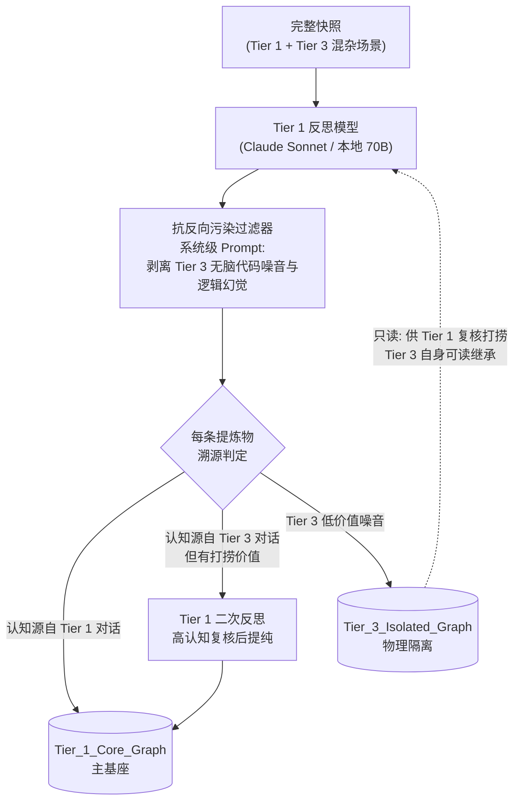
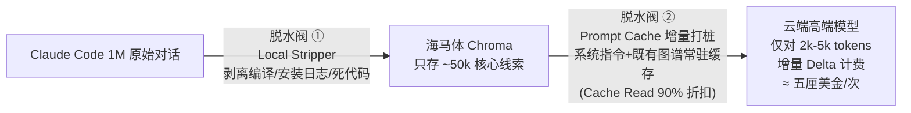

# 02 · 梦境引擎（Dream Engine）

> 双轨制轮次级梦境提炼引擎 —— Consolidate 阶段的工程实现。
> 对应生物机制：NREM 睡眠期尖波涟漪回放 + 系统巩固（systems consolidation）。

---

## 1. 设计原因

程序员在一场对话里高频换模型（Claude → GPT-mini → 本地模型）。Tier 1 模型产出精华，Tier 3 模型产生逻辑垃圾。必须同时保证：

1. **读（Read）100% 完整**——反思模型看到全场来龙去脉，高低 Tier 混杂，绝不上下文断裂；
2. **写（Write）物理隔离**——低认知产物的提炼物锁死在隔离图谱，永不反向污染主基座；
3. **成本死锁**——单次梦境送往云端的增量数据 ≤ 2k–5k tokens（两道脱水阀）；
4. **0 延迟中断**——用户随时唤醒，做梦后台异步，互不阻塞。

---

## 2. 触发状态机

**关键不变量**：
- 快照是**只读副本**，梦境期间热层正常接受追加；
- 写回只触碰快照范围内的条目（按 `turn_range` 界定），中断期间新产生的对话不受影响；
- "绝不丢字"：清空操作仅移除已确认固化进图谱的快照内容。

---

## 3. 完整时序（含中断）

---

## 4. 双轨分流写入（De-biasing Split Write）

**单向继承（One-Way Inheritance）**：
- Tier 3 模型**可读** `Tier_1_Core_Graph` 指导行为（老员工经验向下兼容）；
- Tier 3 模型的产出**绝不直接写入**主基座，只进隔离区；
- 隔离区内容唯一的上升通道：Tier 1 模型对原始日志做"高认知二次反思"。

---

## 5. De-biasing Protocol（人格面具解耦）

梦境引擎在反思合并时外挂 De-biasing 控制指令，强迫提炼模型：

1. 执行实体提取（Entity Extraction），输出标准三元组 `User → Habits → Patterns`；
2. 剥离所有情绪化词汇、语气词、角色扮演设定（傲娇助理的口癖不是用户的事实）；
3. Persona 相关风格存入独立的 `persona_style` 侧表，**不进入**经验基座——实现"一套记忆基座，千面面具自由装卸"。

---

## 6. 两道脱水阀（成本死锁，继承 v3.1）

**规则**：
- 绝不"累积大量对话一次性全量处理"；
- 每次梦境只发送 5 分钟空闲窗口内的**增量 Delta**；
- 既有图谱与系统指令通过 Prompt Cache 长期驻留云端缓存；
- 路由策略（2026-08 起）：长背景深睡眠反思 → Claude 5 Sonnet；< 5k tokens 短增量 → GPT-5.6 Terra（$2.00/M input）；本地免费轨 → Ollama + Llama-3.3-70B。

---

## 7. 失败与降级策略

| 故障 | 行为 |
|---|---|
| 梦境模型调用失败 | 快照保留，指数退避重试 3 次；仍失败则快照落盘待下次合并，**不阻塞**新对话 |
| 本地免费轨 Ollama 不可用 | 降级为"仅 Capture 不 Consolidate"模式，图谱暂停生长，向量层照常工作 |
| 云端 TEE 不可达 | 客户端持有待同步队列，恢复后按 provenance 时间序重放 |
| 积分池溢出（超长 session 无 idle） | 达到硬上限（默认 50.0）强制触发"清醒梦"：下一条用户消息的间隙插入微巩固 |

## 8. 先手动，再自动（开发纪律，借自 N01ennn Step 13）

> "Before you schedule anything, run it once. If the output genuinely changes a decision, it earns a schedule."

提供 `mnemoseed dream --once` 手动巩固 CLI：M1 阶段所有梦境先手动触发，人工审查提炼质量（有没有幻觉关联、三元组是否纯净、分流是否正确），质量达标后才打开自动触发器。**一个在三份笔记上幻觉出不存在的关联的系统，只会训练用户忽略它。**
