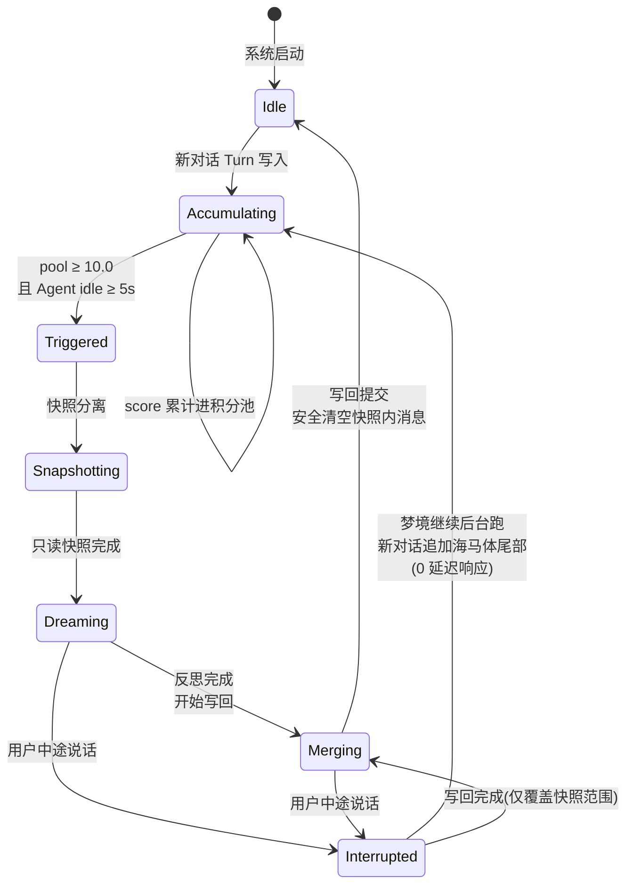
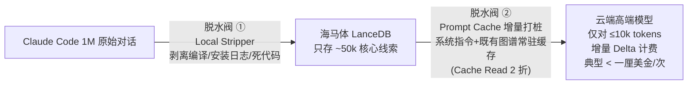
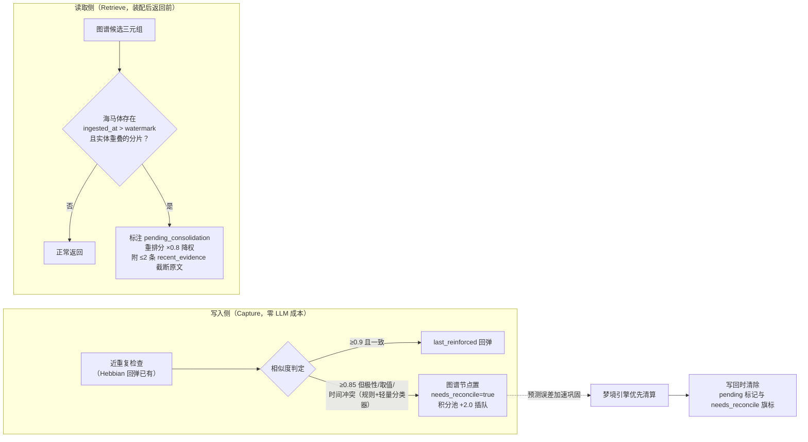

# 02 · 梦境引擎（Dream Engine）

> 双轨制轮次级梦境提炼引擎 —— Consolidate 阶段的工程实现。
> 对应生物机制：NREM 睡眠期尖波涟漪回放 + 系统巩固（systems consolidation）。

---

## 1. 设计原因

程序员在一场对话里高频换模型（Claude → GPT-mini → 本地模型）。Tier 1 模型产出精华，Tier 3 模型产生逻辑垃圾。必须同时保证：

1. **读（Read）100% 完整**——反思模型看到全场来龙去脉，高低 Tier 混杂，绝不上下文断裂；
2. **写（Write）物理隔离**——低认知产物的提炼物锁死在隔离图谱，永不反向污染主基座；
3. **成本死锁**——单次梦境送往云端的增量数据 ≤ 10k tokens（两道脱水阀）；
4. **0 延迟中断**——用户随时唤醒，做梦后台异步，互不阻塞。

---

## 2. 触发状态机

**关键不变量**：
- 快照是**只读副本**，梦境期间热层正常接受追加；
- 写回只触碰快照范围内的条目（按 `turn_range` 界定），中断期间新产生的对话不受影响；
- "绝不丢字"：清空操作仅移除已确认固化进图谱的快照内容；
- 积分池**按 profile 分行持久化**（MetaStore `profile_score_pool`），daemon 重启后余额与 watermark 全量恢复——触发语义不因重启丢失（详见 PRD-08 附录 A.3/B.3）。

---

## 3. 完整时序（含中断）

---

## 4. 双轨分流写入（De-biasing Split Write）

**单向继承（One-Way Inheritance）**：
- Tier 3 模型**可读** `Tier_1_Core_Graph` 指导行为（老员工经验向下兼容）；
- Tier 3 模型的产出**绝不直接写入**主基座，只进隔离区；
- 隔离区内容唯一的上升通道：Tier 1 模型对原始日志做"高认知二次反思"。

---

## 5. De-biasing Protocol（anima 解耦）

梦境引擎在反思合并时外挂 De-biasing 控制指令，强迫提炼模型：

1. 执行实体提取（Entity Extraction），输出标准三元组 `User → Habits → Patterns`；
2. 剥离所有情绪化词汇、语气词、角色扮演设定（anima 演绎出的口癖不是用户的事实）；
3. **说话方式不存储**——anima 的语气是渲染时从性格核心演绎的派生物（见 [04 §2](04-隔离解耦与隐私.md)），不存在任何"风格侧表"：基座只存中性资讯，换 anima 零残留。

**两条防护规则**：
- **染层只认用户原始输入**（防慢漂移自锁）：anima 染层与偏好的更新证据只取自用户说的话和做的事，**永不采纳 agent 输出**——agent 输出已被 anima 渲染过，采纳它等于让灵魂给自己的染色投票；
- **De-biasing 质量进 CI**："记忆中性"承诺全押在这一道剥除过滤上，属单点故障面。配 eval harness（染色样本剥除率指标），随流水线回归，剥除率退化即构建失败。

---

## 6. 两道脱水阀（成本死锁，继承 v3.1）

**规则**：
- 绝不"累积大量对话一次性全量处理"；
- 每次梦境只发送 5 分钟空闲窗口内的**增量 Delta**；
- 既有图谱与系统指令通过 Prompt Cache 长期驻留云端缓存；
- 路由策略：长背景深睡眠反思 → Kimi K3（Fireworks，$3.00/M input、$0.30/M cache read、$15.00/M output，1040k 上下文）；≤10k tokens 短增量 → DeepSeek V4 Flash（Fireworks，$0.14/M input、$0.028/M cache read、$0.28/M output，1M 上下文；该模型输出冗长，调用侧需锁低 reasoning effort）。**接入方式默认 OAuth / 自带 API key**——复用用户已有订阅（Codex/ChatGPT OAuth；中国用户可选 MiniMax/Kimi 等 CLI 服务商，选择时明示数据出境顾虑）或 Fireworks 等 OpenAI 兼容端点；本地 70B 对绝大多数用户不现实，不作默认。全离线高级轨 → Ollama + ≤14B 量化模型（明确警告：提炼质量低于云端大模型）。

---

## 7. 失败与降级策略

| 故障 | 行为 |
|---|---|
| 梦境模型调用失败 | 快照保留，指数退避重试 3 次；仍失败则快照落盘待下次合并，**不阻塞**新对话 |
| 梦境模型端点不可用（OAuth 过期 / API 欠费 / Ollama 离线） | 降级为"仅 Capture 不 Consolidate"模式，图谱暂停生长，向量层照常工作 |
| 云端 TEE 不可达 | 客户端持有待同步队列，恢复后按 provenance 时间序重放 |
| 积分池溢出（超长 session 无 idle） | 达到硬上限（默认 50.0）强制触发"清醒梦"：下一条用户消息的间隙插入微巩固 |

## 8. 先手动，再自动（开发纪律，借自 N01ennn Step 13）

> "Before you schedule anything, run it once. If the output genuinely changes a decision, it earns a schedule."

提供 `mnemoseed dream --once` 手动巩固 CLI：M1 阶段所有梦境先手动触发，人工审查提炼质量（有没有幻觉关联、三元组是否纯净、分流是否正确），质量达标后才打开自动触发器。**一个在三份笔记上幻觉出不存在的关联的系统，只会训练用户忽略它。**

---

## 9. 清醒间隙护栏（Freshness Guard）

**问题**：梦境是异步的（积分池 + idle 触发）。两次巩固之间，海马体里积累了未消化的新分片，它们可能与皮层已有三元组矛盾或将其更新。检索若只信皮层，就会把"上周的旧结论"当事实端给用户——而反证其实已躺在海马体里。（本缺口由竞品调研发现，见 marketing/竞品调研-2026-08 §9 C6；解法不从竞品抄，从 CLS 直接推导。）

**神经科学依据**：
- 互补学习系统中，**近期事件的痕迹留在海马体，对新近信息海马体优先于皮层**（McClelland 1995, R1）——读取侧"新近未巩固证据有权出场"是 CLS 的原生行为，不是补丁；
- 再巩固的触发前提是**预测误差**（prediction error）：旧记忆被提取时遇到与预期不符的新信息，旧痕迹才进入不稳定态等待更新（Nader 2000, R5）——矛盾本身就是加速巩固的合法触发信号。

**规则**：
1. 读取侧检查是廉价的 LanceDB metadata 过滤（要求钢印含 `entities` 字段，见 design/01 §1 与 PRD-01 FR-1.6 补充）；
2. 待巩固内容**降权 + 标注，绝不隐藏**——新旧并呈，选择权交给模型和用户；anima 演绎成自然语言（"我记得的是 X，不过最近有还没消化的新记录提到 Y"）；
3. `memory.status` 暴露 pending_consolidation 计数与 needs_reconcile 队列长度；`dream --once` 输出待清算清单；
4. 梦境写回只清除本次快照 `turn_range` 覆盖范围内的标记（与 §2 不变量一致）。

---

## 10. 巩固的两个衍生效应（睡眠白送的功能）

**① 情绪脱敏（overnight therapy, Walker & van der Helm 2009）**：睡眠巩固保留内容、消退情绪电荷——"时间会治愈"的神经机制。工程落地：EPISODE 被巩固进图谱后，其分片的 `emotion` 强度按加速 λ 衰减（gist 永存，刺痛渐消），未巩固分片保持原电荷。叙事效果："它不只记住你的崩溃，还替你慢慢放下。"

**② 图式加速同化（Tse et al. 2007, *Science*）**：已有图式会加速同构新信息的皮层巩固。工程落地：提炼物与现有图谱高度同构（实体已存在、关系模式匹配）→ 走快速通道直接固化；格格不入者 → 需要更多独立证据才放行（积分池加权排队）。这同时是天然的防噪闸门：越离奇的说法，举证责任越重。

**③ anima 重染色（re-dye）**：换 anima 时触发（见 [04 §2](04-隔离解耦与隐私.md)）——新 anima 核心以批处理方式重新消化 profile 既有记忆，长出它自己的染层与喜好。梦境引擎执行，异步不阻塞；旧 anima 的染层完整保留（换回来还在，无损切换）。
