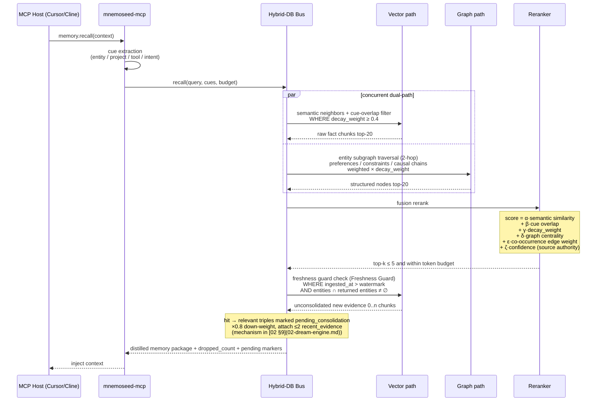
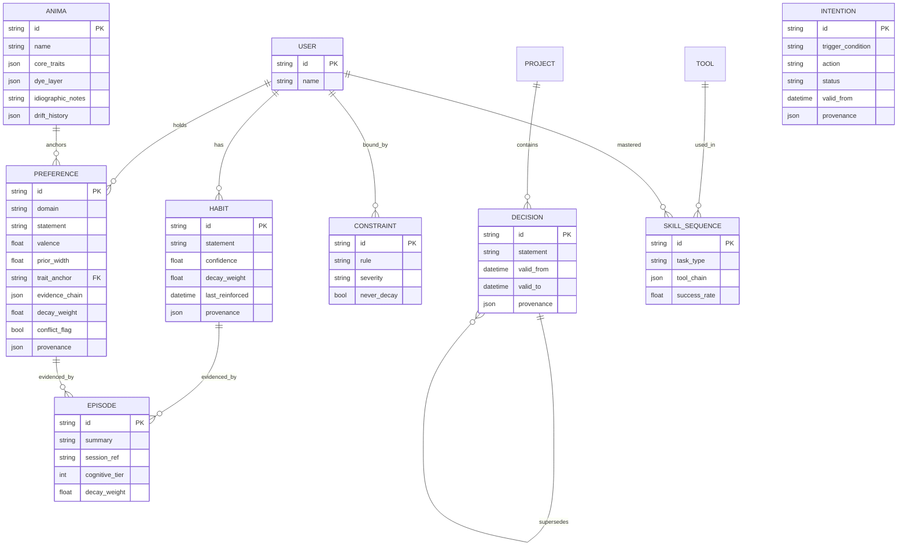

# 03 · Hybrid Dual-Store Storage and Retrieval

> Corresponding biological mechanism: Complementary Learning Systems (CLS) — the hippocampus does fast fuzzy matching; the cortex sediments abstract causality.
> A graph database alone is too rigid; a vector store alone is too bloated (token explosion, things slipping through the cracks).

---

## 1. Storage Layer: Ports & Adapters Pluggable Architecture (2026-08-08 upgrade, finalized by Jinhao)

The storage layer is upgraded from "local/cloud either-or" to **interfaces + a driver registry**: four port interfaces are defined, each backed by a driver registry; the user picks a driver per layer in config.toml.

| Port interface | Responsibility | Default driver (embedded) | Alternative drivers (examples; implemented gradually / by the community after M0) |
|---|---|---|---|
| `VectorStore` | Vector storage/access + metadata filtering | **LanceDB embedded** | pgvector / Chroma / Qdrant / Milvus |
| `GraphStore` | Graph nodes / edges / version chains | **SQLite-Graph** (embedded, zero dependencies; Kùzu evaluated as an alternative around M3) | Neo4j / Memgraph / Postgres+AGE |
| `MetaStore` | Config, score pool, watermark, audit | SQLite | Postgres |
| `Embedder` | Embedding | **bge-m3 (ONNX runtime, ~543MiB int8-quantized as measured, MIT license)** | embeddinggemma-300m (the gemma_local driver is kept; users must accept the Gemma ToU themselves) / any OpenAI-compatible embedding API / Ollama |

**Default-stack selection record (finalized by Jinhao on 2026-08-08)**:
- **LanceDB**: purely embedded single-file, Rust kernel, columnar + metadata filtering + native hybrid-retrieval support, light dependencies; Chroma's dependency chain is too heavy and conflicts with TTFM<3min, so it is kept as a backup driver;
- **bge-m3**: MIT license with zero copyleft obligations, publicly downloadable on HF (not gated), strong on both Chinese and English among 100+ languages, 8192-token context, and emits dense+sparse in one pass (a free bonus hybrid-retrieval channel). embeddinggemma-300m is slightly better performing (MTEB Multilingual v2 61.15, official figures) but has three product-level vetoes: HF gated download kills TTFM, the Gemma ToU §3.1 license-copyleft obligation, and §3.2 Google reserving remote-restriction usage rights — contradicting the "you own your memories" narrative;
- **SQLite-Graph**: the current query patterns (1-2 hop expansion + version-chain backtracking) are within SQLite's reach; re-evaluate once real-scale data such as Kùzu exists;
- **Distribution**: `uv tool install mnemoseed` is the primary path; the Node ecosystem keeps `npx mnemoseed` as a thin-shell alternative (an install-bootstrap shell only, launching the Python entry; the MCP server itself is a Python implementation, with no Node-side gateway).

**Two design points**:

1. **Capability flags**: backends are not equal — Freshness Guard depends on metadata time filtering, and dream snapshots depend on MVCC/snapshots. Each driver declares its capability set; the daemon validates at startup, and missing capabilities take **explicitly-marked degraded paths** (e.g., for backends without snapshots, the dream falls back to `turn_range` logical isolation with a warning); never fail silently;
2. **preset + per-layer override**: `embedded` (fully embedded, zero dependencies; the personal default) / `docker` (compose full stack) / `custom` (geek per-layer self-selection). The original `STORAGE_MODE` environment variable is preserved as the preset shortcut.

**M0 scope discipline (finalized by Jinhao)**: fix the interfaces; implement only **two drivers per interface first — the embedded default + a Postgres-family one**. The second driver exists to empirically prove the interface's portability, preventing the interface from being captured by the first implementation; the remaining drivers are open to community contribution.

**The cloud topology is unchanged**: when cloud-hosted, each layer points to managed Postgres (pgvector + pg_graph) / an embedding API / dream routing inside the TEE (valid `STORAGE_MODE` values today: embedded/docker/custom; a cloud preset is reserved).

**Division of responsibilities**:
- **Hippocampus (VectorStore)**: stores recent raw conversation chunks at high frequency in real time; zero-latency fuzzy recall of "hard fact details and code scenes".
- **Cortex (GraphStore)**: stores the long-term causality, entity habits, and technical-architecture weighted nodes distilled by the dream engine after unmasking and denoising.

---

## 2. Hybrid Retrieval



**Retrieval discipline (anti-dilution)**:
1. Default token budget 800, top-k ≤ 5;
2. Memories with `decay_weight < 0.4` do not enter the candidate pool (decay takes effect on the retrieval side);
3. When `conflict_flag` is hit, both conflicting parties are returned **in pairs** and marked;
4. Every retrieval returns `dropped_count`; the drops are not silent — for debugging and parameter tuning;
5. **Pending-consolidation content is down-weighted ×0.8 + marked `pending_consolidation` + new evidence presented together**, never silently trusting only the cortex (Freshness Guard, [02 §9](02-dream-engine.md));
6. Supports the `as_of` time-point query parameter: replays "the facts in effect at that time" against the provenance version chain (bitemporality, adapted from Zep's bitemporal model, natively supported by our version chain);
7. **Diversity and exploration quota**: reranking adds within-class dedup (MMR-style), and every N retrievals one low-weight high-uncertainty memory is let through — breaking the "recall → reinforce → recall again" positive feedback loop (retrieval-induced forgetting, Anderson 1994), preventing memory monoculture (mechanism argument in [01 §3](01-memory-pipeline.md) principle 5);
8. **Honest empty**: when no qualified candidate exists, return the explicit "no relevant memory" semantics, never pad (metamemory; [01 §3](01-memory-pipeline.md) principle 6);
9. **Weak context cues**: the current host / project / time-band enters reranking as a weakly-weighted cue (the encoding-specificity retrieval side; [01 §3](01-memory-pipeline.md) principle 4).

**Co-occurrence edges (spreading activation, adapted from MemPalace hallways)**: when two memories are activated together in the same session, the co-occurrence edge weight between them is +1. At retrieval it serves as the secondary rerank signal ε·co-occurrence edge weight — pure vector similarity cannot capture "often thought of together". Neural basis: spreading activation (Collins & Loftus 1975) — thinking of one concept activates neighboring concepts.

---

## 3. Cortex Graph Schema (Core Node Types)



**Agentic Tool-Use muscle memory** (the differentiator): the `SKILL_SEQUENCE` node records "task type → tool-call chain → success rate", letting a new model inherit a veteran's operational proficiency in one click (e.g., "the standard action sequence for deploying this repo").

**Three node types added on 2026-08-08**:

- **ANIMA** (the soul; advanced module, not in the M1 first release; full model in [09 §6](09-anima-and-preferences.md)): `core_traits` = quantified trait dimensions (mean + width per dimension; immutable core; `drift_history` records the version chain); `dye_layer` = the acquired dye layer (surface offset of core × experience); `idiographic_notes` = plaintext persona summary (periodically rewritten by the dream engine from dimensions + evidence, for warm-up injection). PREFERENCE attaches to an ANIMA dimension via `trait_anchor` to take a prior. Schema fields are reserved; they stay empty when anima is absent.
- **PREFERENCE extension** (preference dynamics; advanced module, mechanism in [09 §3](09-anima-and-preferences.md)): `valence` (continuous like↔dislike, replacing boolean), `prior_width` (uncertainty, governing the learning rate), `trait_anchor` (prior source), `evidence_chain` (update history: event pointers + type — behavior / statement / emotional co-occurrence / exposure + the anima in office at the time). Preference drift follows the version chain, never deleted (the historical self).
- **INTENTION** (prospective memory): "remember to do X when the time comes" — `trigger_condition` (time/event condition) + `action` + `status` (pending / fired / cancelled). Memory systems usually have only retrospective memory; INTENTION supplies the other half. Trigger evaluation is executed by the daemon scheduler.

---

## 4. Dual-Store Consistency Rules

| Scenario | Rule |
|---|---|
| The same fact exists in both layers | The graph wins (the cortex is consolidated); the vector layer is that fact's "evidence scene" |
| After the dream clears its snapshot | The corresponding chunks in the vector store are marked `consolidated=true` and decay accelerated (λ × 3); evidentiary value diminishes |
| A graph node is rewritten by Reconcile | The associated vector chunks are retained; provenance.history appends a pointer |
| Retrieval results contradict each other | Never silently pick one; go through flag_conflict paired return |

---

## 5. Docker Compose Ecosystem (issue #5: split by purpose)

```yaml
# Schematic — the full file is in the mnemoseed/core repo root docker-compose.yml
# Default (`docker compose up`) = ONE container running the embedded stack,
# zero UX difference from local `mnemoseed up`.
services:
  core:              # Python/FastAPI core engine; the MCP server is the same-package stdio entry, pulled up by the host as needed, occupying no compose service slot
                     # MNEMOSEED_HOME=/data (persistent volume); an empty volume resolves the embedded preset

# Developer/enterprise Postgres family (`docker compose --profile pg up`):
#   vector (pgvector) + pg (postgres, hosts the cortex graph + meta) + embed (dev embedding sidecar)
# Optional offline dream model: `docker compose --profile ollama up`
# Cloud/VPS: `docker compose -f docker-compose.cloud.yml up -d` (TLS at a reverse proxy, see design/10)
```
