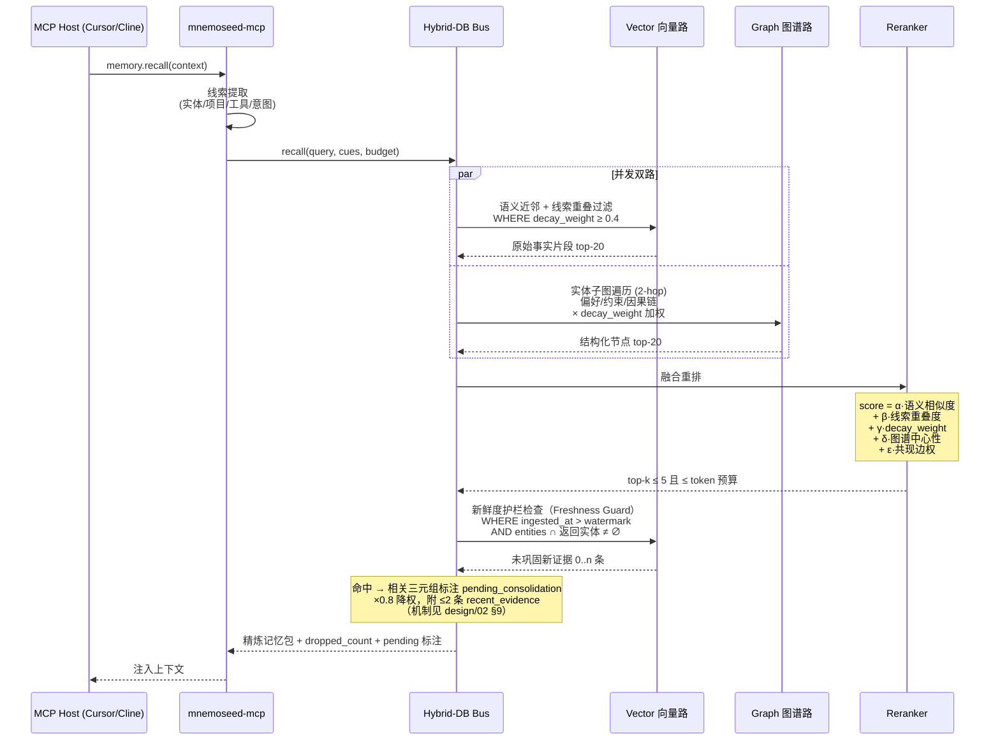
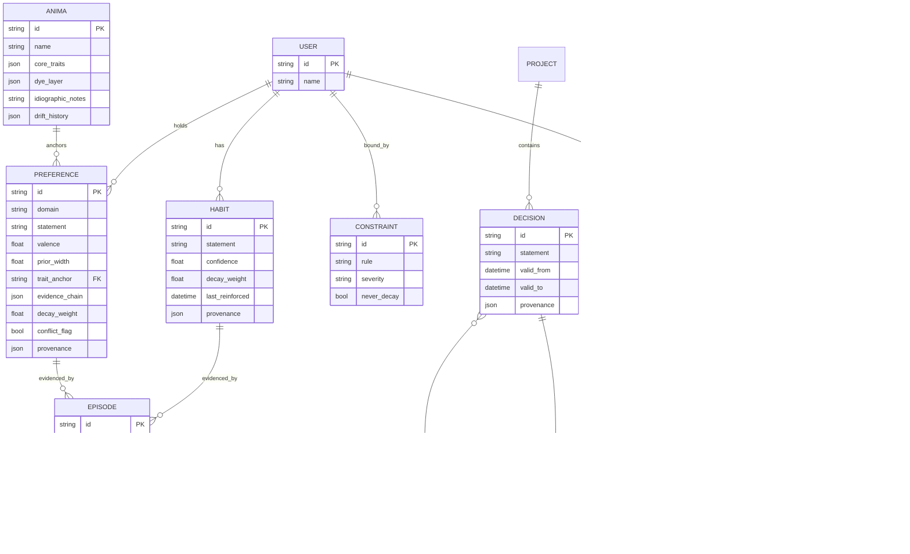

# 03 · 混合双库存储与检索

> 对应生物机制：互补学习系统（CLS）——海马体快速模糊匹配，大脑皮层沉淀抽象因果。
> 光用图数据库太死板，光用向量库太臃肿（token 暴涨、丢三落四）。

---

## 1. 存储层：Ports & Adapters 可插拔架构（2026-08-08 升级，锦豪定稿）

存储层从"local/cloud 二选一"升级为**接口 + 驱动注册表**：定义四个端口接口，每个接口挂驱动注册表，用户在 config.toml 里按层选驱动。

| 端口接口 | 职责 | 默认驱动（embedded） | 备选驱动（示例，M0 后逐步/社区实现） |
|---|---|---|---|
| `VectorStore` | 向量存取 + metadata 过滤 | **LanceDB 内嵌** | pgvector / Chroma / Qdrant / Milvus |
| `GraphStore` | 图谱节点/边/版本链 | **SQLite-Graph**（内嵌零依赖；M3 前后评估 Kùzu 备选） | Neo4j / Memgraph / Postgres+AGE |
| `MetaStore` | 配置、积分池、watermark、审计 | SQLite | Postgres |
| `Embedder` | 向量化 | **bge-m3（ONNX 运行时，~543MiB int8 量化实测，MIT 许可）** | embeddinggemma-300m（gemma_local 驱动保留，用户需自行接受 Gemma ToU）/ 任意 OpenAI 兼容 embedding API / Ollama |

**默认栈选型记录（2026-08-08 锦豪拍板）**：
- **LanceDB**：纯内嵌单文件、Rust 内核、列式 + metadata 过滤 + 混合检索原生支持、依赖轻；Chroma 依赖链过重与 TTFM<3min 冲突，保留为备选驱动；
- **bge-m3**：MIT 许可零传导义务、HF 公开下载（不 gated）、100+ 语言中英双强、8192 tokens 上下文、同时产出 dense+sparse（白送混合检索一路）。embeddinggemma-300m 效能略优（MTEB Multilingual v2 61.15，官方数据）但有三项产品级否决：HF gated 下载杀 TTFM、Gemma ToU §3.1 许可传导义务、§3.2 Google 保留远程限制使用权——与"你拥有你的记忆"叙事矛盾；
- **SQLite-Graph**：当前查询模式（1-2 hop 扩散 + 版本链回溯）SQLite 足够，Kùzu 等真实规模数据出来再评估；
- **分发**：`uv tool install mnemoseed` 为主路径，Node 生态留 `npx mnemoseed` 薄壳备选（仅安装引导壳，调起 Python 入口；MCP server 本身为 Python 实现，无 Node 侧网关）。

**两个设计要点**：

1. **能力声明（capability flags）**：后端不平等——Freshness Guard 依赖 metadata 时间过滤、梦境快照依赖 MVCC/快照。每个驱动声明能力集，daemon 启动校验，缺能力走**明示的降级行为**（如快照不可用的后端，梦境改用 turn_range 逻辑隔离并警告），绝不静默出错；
2. **preset + 逐层覆盖**：`embedded`（全内嵌零依赖，个人默认）/ `docker`（compose 全家桶）/ `custom`（极客逐层自选）。原 `STORAGE_MODE` 环境变量保留为 preset 快捷方式。

**M0 范围纪律（锦豪拍板）**：接口定好，每个接口先只实现**内嵌默认 + Postgres 系两个驱动**——第二个驱动用于实证接口可移植性，防止接口被第一实现绑架；其余驱动开放社区贡献。

**云端拓扑不变**：`STORAGE_MODE=cloud` preset 下各层指向托管集群 / Neo4j Aura / embedding API / Nitro Enclaves 梦境路由。

**职责分工**：
- **海马体（VectorStore）**：实时高频存储最近原始对话分片，0 延迟模糊召回"绝对事实细节与代码现场"。
- **皮层（GraphStore）**：存储梦境引擎去面具、去噪音后提炼的长期因果、实体习惯、技术架构权重节点。

---

## 2. 混合检索引擎（Hybrid Retrieval）



**检索纪律（抗稀释）**：
1. 默认 token 预算 800，top-k ≤ 5；
2. `decay_weight < 0.4` 的记忆不进入候选池（衰减在检索侧生效）；
3. 命中 `conflict_flag` 时冲突双方**成对返回**并标注；
4. 每次检索返回 `dropped_count`，被丢弃不是静默的——供调试与调参；
5. **待巩固内容降权 ×0.8 + `pending_consolidation` 标注 + 新证据并呈**，绝不静默只信皮层（Freshness Guard，design/02 §9）；
6. 支持 `as_of` 时间点查询参数：按 provenance 版本链回放"当时生效的事实"（双时态，借自 Zep 的双时态模型，由我们的版本链原生支持）；
7. **多样性与探索配额**：重排加同类去重（MMR 式），且每 N 次检索放行一条低权高不确定记忆——打断"召回→强化→再召回"的正反馈环（retrieval-induced forgetting, Anderson 1994），防记忆 monoculture（机制论证见 design/01 §3 原则 5）；
8. **诚实的空**：无合格候选返回显式"无相关记忆"语义，绝不凑数（metamemory，design/01 §3 原则 6）；
9. **情境弱线索**：当前 host/project/time-band 作为弱加权线索进重排（编码特异性检索侧，design/01 §3 原则 4）。

**共现边（扩散激活，借自 MemPalace hallways）**：两条记忆在同一 session 被共同激活，则其间共现边权 +1。检索时作为重排的次级信号 ε·共现边权——纯向量相似度抓不到"经常一起被想起"。神经依据：扩散激活（spreading activation, Collins & Loftus 1975）——想起一个概念会激活邻近概念。

---

## 3. 皮层图谱 Schema（核心节点类型）



**Agentic Tool-Use 肌肉记忆**（差异化卖点）：`SKILL_SEQUENCE` 节点记录"任务类型 → 工具调用链 → 成功率"，让新模型一键继承老员工的操作熟练度（例如"部署这个 repo 的标准动作序列"）。

**三个 2026-08-08 新增节点类型**：

- **ANIMA**（灵魂，进阶模块，不在 M1 首发；模型全文见 [09 §6](09-anima与偏好动力学.md)）：`core_traits` = 量化特质维度（每维 mean + width，immutable 核心，drift_history 记版本链）；`dye_layer` = 后天染层（核心 × 经验的表面偏移）；`idiographic_notes` = 明文人格摘要（由梦境引擎定期从维度+证据重写，暖场注入用）。PREFERENCE 经 `trait_anchor` 挂到 ANIMA 维度上取先验。schema 字段预留，anima 缺席时留空。
- **PREFERENCE 扩展**（偏好动力学，进阶模块，机制见 [09 §3](09-anima与偏好动力学.md)）：`valence`（喜欢↔厌恶连续值，替代布尔）、`prior_width`（不确定性，决定学习率）、`trait_anchor`（先验来源）、`evidence_chain`（更新历史：事件指针 + 类型——行为/陈述/情绪共现/曝光 + 当时在任的 anima）。偏好漂移走版本链，永不删除（历史自我）。
- **INTENTION**（前瞻记忆，prospective memory）："到时要记得做 X"——`trigger_condition`（时间/事件条件）+ `action` + `status`（pending/fired/cancelled）。记忆系统通常只有 retrospective；INTENTION 补上另一半。触发评估由 daemon 调度器执行。

---

## 4. 双库一致性规则

| 场景 | 规则 |
|---|---|
| 同一事实同时存在于两层 | 图谱为准（皮层是经过巩固的）；向量层是该事实的"证据现场" |
| 梦境清空快照后 | 向量库中对应分片标记 `consolidated=true` 并加速衰减（λ × 3），证据价值递减 |
| 图谱节点被 Reconcile 改写 | 关联向量分片保留，provenance.history 追加指针 |
| 检索结果自相矛盾 | 不得静默二选一，走 flag_conflict 成对返回 |

---

## 5. Docker Compose 本地生态（继承 PRD v3.0 模块四）

```yaml
# 示意 —— 完整文件见 mnemoseed/core 仓库根目录 docker-compose.yml
services:
  mnemoseed-core:    # Python/FastAPI 核心引擎（图谱 + 梦境状态机）；MCP server 为同包 stdio 入口，由宿主按需拉起，不占 compose 服务位
  mnemoseed-vector:  # 向量库（docker preset 可换 pgvector），挂载本地持久化卷
  mnemoseed-embed:   # bge-m3 向量化（ONNX，CPU 可跑，GPU 可选）
  ollama:            # 可选：离线梦境提炼（高级轨）
```
