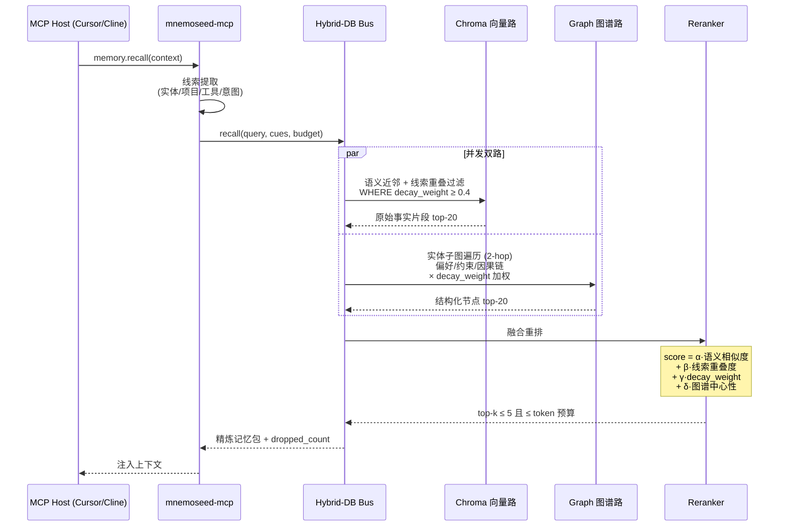
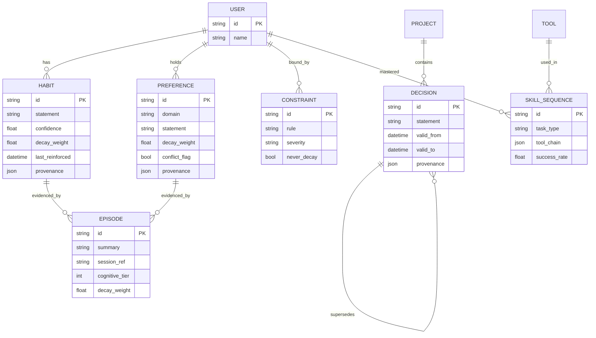

# 03 · 混合双库存储与检索

> 对应生物机制：互补学习系统（CLS）——海马体快速模糊匹配，大脑皮层沉淀抽象因果。
> 光用图数据库太死板，光用向量库太臃肿（token 暴涨、丢三落四）。

---

## 1. STORAGE_MODE 路由矩阵

系统通过一个环境变量一键路由全部存储后端：

| 层 | `STORAGE_MODE=local`（研发/免费） | `STORAGE_MODE=cloud`（付费/企业） |
|---|---|---|
| 海马体（向量） | Docker 嵌入式 Chroma 容器 | 托管向量集群 |
| 皮层（图谱） | SQLite-Graph / NetworkX / 本地 Neo4j 容器 | Neo4j Aura / 企业内网图集群 |
| Embedding | 本地 embedding-gemma 容器（GPU 加速） | embedding-gemma API |
| 梦境反思 | Ollama（Llama-3.3-70B，本地加密服务器） | AWS Nitro Enclaves 内 Claude 5 Sonnet / GPT-5.6 Terra |

**职责分工**：
- **海马体（Chroma）**：实时高频存储最近原始对话分片，0 延迟模糊召回"绝对事实细节与代码现场"。
- **皮层（Graph）**：存储梦境引擎去面具、去噪音后提炼的长期因果、实体习惯、技术架构权重节点。

---

## 2. 混合检索引擎（Hybrid Retrieval）



**检索纪律（抗稀释）**：
1. 默认 token 预算 800，top-k ≤ 5；
2. `decay_weight < 0.4` 的记忆不进入候选池（衰减在检索侧生效）；
3. 命中 `conflict_flag` 时冲突双方**成对返回**并标注；
4. 每次检索返回 `dropped_count`，被丢弃不是静默的——供调试与调参。

**共现边（扩散激活，借自 MemPalace hallways）**：两条记忆在同一 session 被共同激活，则其间共现边权 +1。检索时作为重排的次级信号 ε·共现边权——纯向量相似度抓不到"经常一起被想起"。神经依据：扩散激活（spreading activation, Collins & Loftus 1975）——想起一个概念会激活邻近概念。

---

## 3. 皮层图谱 Schema（核心节点类型）



**Agentic Tool-Use 肌肉记忆**（差异化卖点）：`SKILL_SEQUENCE` 节点记录"任务类型 → 工具调用链 → 成功率"，让新模型一键继承老员工的操作熟练度（例如"部署这个 repo 的标准动作序列"）。

---

## 4. 双库一致性规则

| 场景 | 规则 |
|---|---|
| 同一事实同时存在于两层 | 图谱为准（皮层是经过巩固的）；向量层是该事实的"证据现场" |
| 梦境清空快照后 | Chroma 中对应分片标记 `consolidated=true` 并加速衰减（λ × 3），证据价值递减 |
| 图谱节点被 Reconcile 改写 | 关联 Chroma 分片保留，provenance.history 追加指针 |
| 检索结果自相矛盾 | 不得静默二选一，走 flag_conflict 成对返回 |

---

## 5. Docker Compose 本地生态（继承 PRD v3.0 模块四）

```yaml
# 示意 —— 完整文件见 mnemoseed/core 仓库根目录 docker-compose.yml
services:
  mnemoseed-core:    # Python/FastAPI 核心引擎（图谱 + 梦境状态机）
  mnemoseed-mcp:     # Node.js MCP 网关，对外标准 MCP 端口
  mnemoseed-chroma:  # 向量库，挂载本地持久化卷
  embedding-gemma:   # 多语言向量化（GPU 可选）
  ollama:            # 可选：本地免费梦境提炼
```
