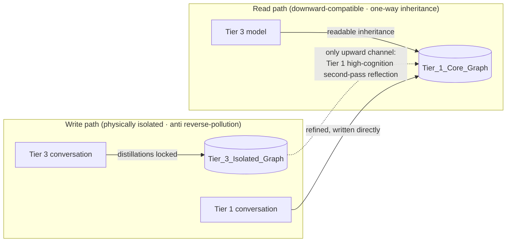
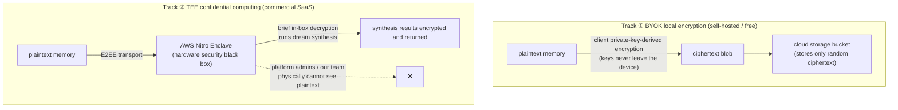

# 04 · Cognitive Grading Isolation and Zero-Knowledge Privacy

---

## 1. Cognitive Grading Isolation

**Problem**: in the multi-model era, hallucinations from "dumb models" pollute the experience assets accumulated by "smart models".

**Model tiers** (examples; configurable in `.env`):

| Tier | Representatives | Permissions |
|---|---|---|
| Tier 1 | Claude 5 Sonnet, GPT-5.6, local open-source models (offline track) | Read the full store; distillations write to the primary base |
| Tier 2 | Mid-range models | Read the full store; distillations enter the pending-review queue |
| Tier 3 | Lightweight on-device models (GPT-mini class, local small models) | Read the full store; distillations write **only** to the isolated graph |

**The stamp is the precondition for isolation**: every write must be stamped with `cognitive_tier` + `model_id` at the capture entry (daemon `/ingest`), unalterable afterwards (entering provenance.history).

---

## 2. The Anima Model (split out as an advanced module; see design/09)

> The Anima soul model and preference dynamics now have their own document: [09-anima-and-preferences](09-anima-and-preferences.md) — an **advanced feature, outside the M1 first-release scope**.
> This section retains the only coupling point with the rest of this document: the zero-knowledge matrix and isolation mechanisms apply equally to ANIMA/PREFERENCE nodes (both the ANIMA node's `idiographic_notes` plaintext summary and PREFERENCE's `evidence_chain` fall within the scope of "no-plaintext cloud persistence").

---

## 3. Zero-Knowledge Privacy Matrix

**Problem**: memory contains users' deepest preferences, trade secrets, and emotional assets. Without physical-grade isolation, cloud memory cannot earn the trust of enterprise and high-net-worth users.

**The dual-track model**:

**Trust-boundary rules**:
1. No cloud component persists plaintext;
2. Enclave attestation (remote attestation) opens a verification interface to the client — the user can cryptographically verify that "the code being run is untampered MnemoSeed";
3. Provenance fields are likewise stored encrypted; auditing is completed locally on the client.

---

## 4. Compliance Baseline

- Access through official enterprise channels only (AWS Bedrock / Google Vertex AI); API intermediaries without DPA commitments (such as OpenRouter) are rejected — eliminating the man-in-the-middle exposure surface;
- Select only model endpoints supporting **ZDR (Zero-Data-Retention)**;
- Target compliance: GDPR / CCPA / Malaysia PDPA.
