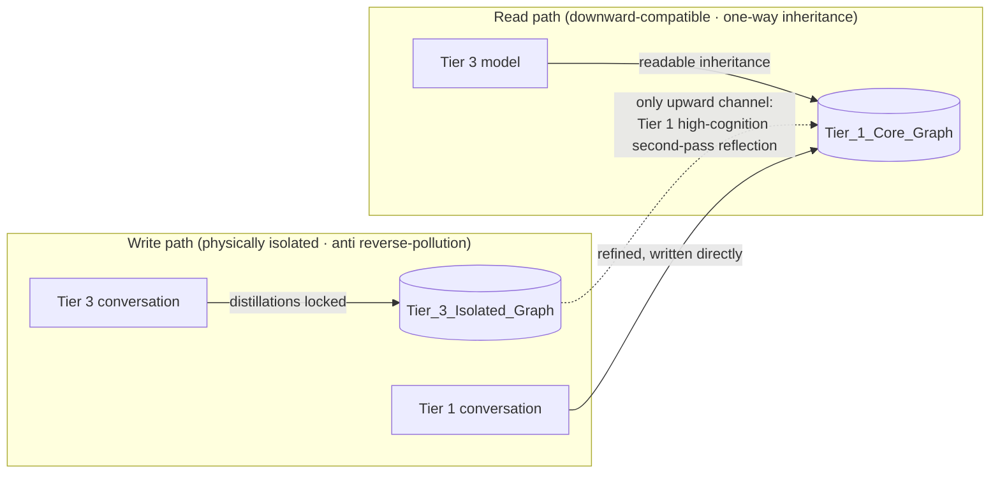
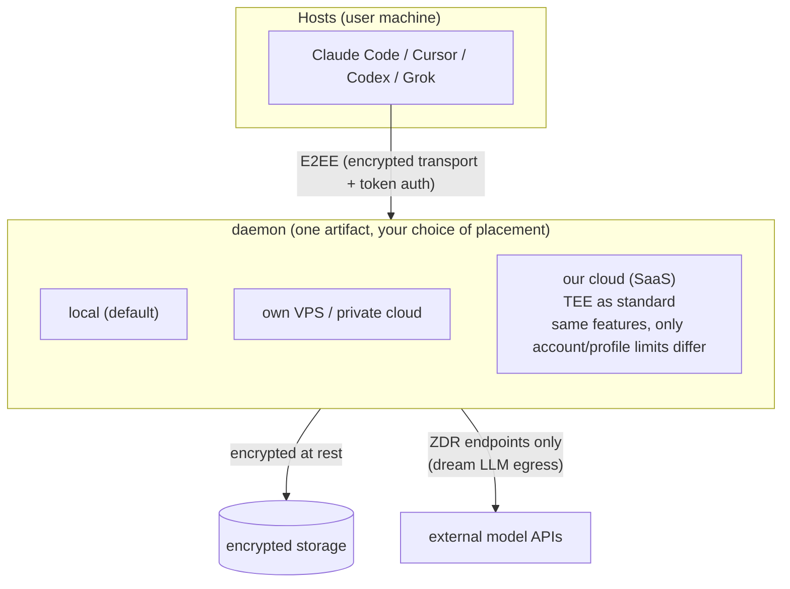

# 04 · Cognitive Grading Isolation and Privacy

---

## 1. Cognitive Grading Isolation

**Problem**: in the multi-model era, hallucinations from "dumb models" pollute the experience assets accumulated by "smart models".

**Model tiers** (examples; configurable in `.env`):

| Tier | Representatives | Permissions |
|---|---|---|
| Tier 1 | Claude 5 Sonnet, GPT-5.6, local open-source models (e.g. Ollama) | Read the full store; distillations write to the primary base |
| Tier 2 | Mid-range models | Read the full store; distillations enter the pending-review queue |
| Tier 3 | Lightweight on-device models (GPT-mini class, local small models) | Read the full store; distillations write **only** to the isolated graph |

**The stamp is the precondition for isolation**: every write must be stamped with `cognitive_tier` + `model_id` at the capture entry (daemon `/ingest`), unalterable afterwards (entering provenance.history).

---

## 2. The Anima Model (split out as an advanced module; see design/09)

> The Anima soul model and preference dynamics now have their own document: [09-anima-and-preferences](09-anima-and-preferences.md) — an **advanced feature, outside the M1 first-release scope**.
> This section retains the only coupling point with the rest of this document: the encrypted-at-rest and isolation mechanisms apply equally to ANIMA/PREFERENCE nodes (both the ANIMA node's `idiographic_notes` plaintext summary and PREFERENCE's `evidence_chain` fall within the scope of "ciphertext on disk").

---

## 3. Privacy Architecture

**Problem**: memory contains users' deepest preferences, trade secrets, and emotional assets. Without physical-grade isolation, cloud memory cannot earn the trust of enterprise and high-net-worth users.

**Deployment topology (core mental model)**: the daemon is a single artifact. **Self-hosted (free tier)**: individual users pick and manage their own environment (local machine / own VPS). **Official SaaS**: the daemon is hosted by us and **runs inside a TEE (Nitro Enclave) as standard**. In both shapes, **E2EE transport + encrypted at-rest storage are built into the app**, independent of whether the runtime is a TEE. **Hosts (user machines) only carry thin tools: MCP / hooks.**

**Trust-boundary rules**:
1. **E2EE transport**: host tools ↔ daemon is encrypted end to end with token auth (identity model in design/06), regardless of deployment location;
2. **Encrypted at rest**: the daemon's persistence layer (chunks / graph / provenance) is ciphertext on disk; keys are derived and managed daemon-side, user-held when self-hosted;
3. **Isolation has two stories**: self-hosted users arrange their own environment (TEE or not is their call; the app's E2EE/at-rest encryption is unaffected either way); **the official SaaS runs in a TEE as standard** — a baseline promise of the service, not an optional tier;
4. **Dream LLM egress**: consolidation must call external APIs, so plaintext inevitably leaves the daemon — therefore only **ZDR (Zero-Data-Retention)** endpoints are used. The official SaaS uses TEE + ZDR API services (the specific provider is an operational detail, not an architectural commitment); self-hosted users pick their own model endpoints and the docs recommend ZDR.

---

## 4. Compliance Baseline

- Access through official enterprise channels only (AWS Bedrock / Google Vertex AI); API intermediaries without DPA commitments (such as OpenRouter) are rejected — eliminating the man-in-the-middle exposure surface;
- Select only model endpoints supporting **ZDR (Zero-Data-Retention)**;
- Target compliance: GDPR / CCPA / Malaysia PDPA.
