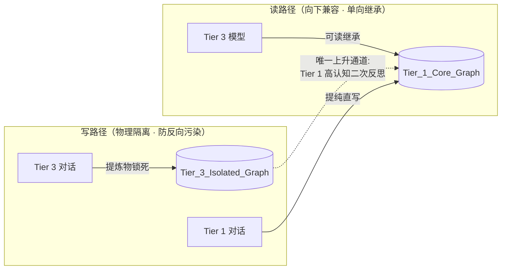
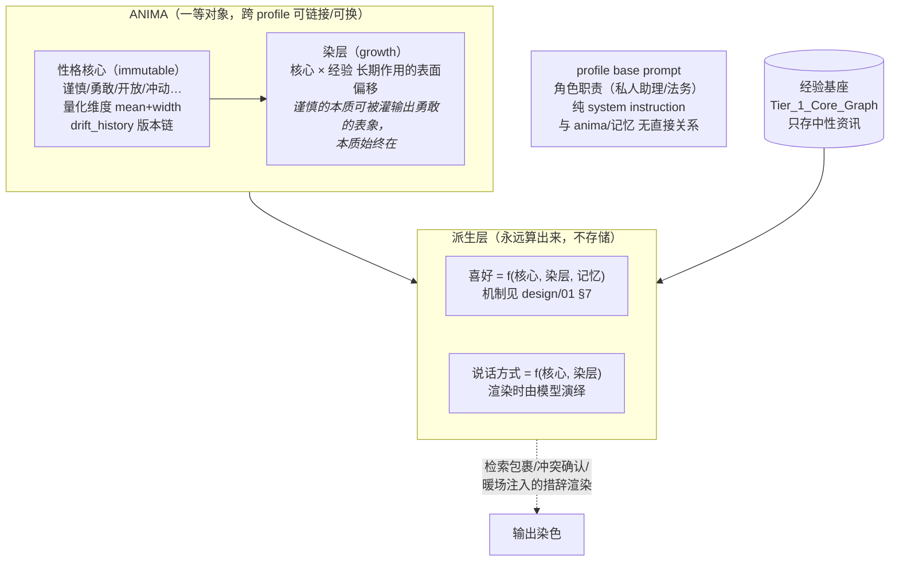
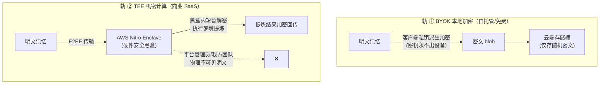

# 04 · 认知分级隔离、Anima 解耦与零知识隐私

---

## 1. 认知分级隔离（Cognitive Grading Isolation）

**问题**：多模型混用时代，"笨模型"的幻觉会污染"聪明模型"积累的经验资产。

**模型分层**（示例，可在 `.env` 配置）：

| Tier | 代表 | 权限 |
|---|---|---|
| Tier 1 | Claude 5 Sonnet、GPT-5.6、本地开源模型（离线轨） | 读全库；提炼物写主基座 |
| Tier 2 | 中端模型 | 读全库；提炼物进待复核队列 |
| Tier 3 | 轻量端侧模型（GPT-mini 类、本地小模型） | 读全库；提炼物**只写**隔离图谱 |

**钢印是隔离的前提**：每条写入必须在 MCP 拦截时打上 `cognitive_tier` + `model_id`，事后不可篡改（进入 provenance.history）。

---

## 2. Anima 模型：灵魂与经验基座解耦

> 命名取荣格原义：persona 是"面具"（社交外壳），anima 才是"内在灵魂"。我们要的是后者。
> 理论骨架：McAdams & Pals (2006) 三层人格架构 + Cloninger 气质/性格双成分 + Markus & Wurf (1987) working self-concept。

**问题**：用户给不同 Agent 躯体配不同 System Prompt。语气与人设词若沉淀进记忆，换灵魂即污染；而"说话方式""处事倾向"若写成预置模板，又僵硬失真——真实的语言风格是性格的自然流露，不是条文。

### 2.1 结构：三层一体

- **性格核心**：天生、几乎不变。白话创建（"一个谨慎但好奇心重的工程师"）→ 模型理解并量化为特质维度（mean + width），生成 anima 模板；**核心不可被事件改写**（Cloninger：temperament 不变），只保留极慢的人生阶段漂移记录；
- **染层**：后天可塑（Cloninger：character 可塑）。长期经验灌输让谨慎者表现出勇敢的**表象**，核心不动；染层跟着 anima 实例走；
- **喜好与说话方式**：永远是派生物，不独立存储——这是"换 anima 无冲突"的关键（见 2.3）；
- **角色职责 ≠ anima**："你现在是法务"是 profile 的 base prompt，与灵魂无关，互不引用。

### 2.2 多自我与无损切换

人本来就有多个自我、按情境激活（working self-concept；frame switching, Hong et al. 2000）——"勇敢的销售转岗做工程师，换个谨慎的灵魂"是人的日常，不是异常。

**切换语义**：
1. anima 是一等对象：核心模板可复用，实例跨 profile 链接/换绑；
2. **换 anima 不动记忆**（换镜头不换胶片）；染层留在旧 anima 实例上，换回来还在；
3. 新 anima 上任后由梦境引擎**重染色**（re-dye）：用新核心重新消化 profile 既有记忆，长出它自己的染层与喜好（Bartlett 重构记忆：换身份的人不重写过去，用新自我图式重新解读过去）；
4. 每条偏好/染层更新记 provenance：当时在任的 anima——"我当销售那阵子的口味"永远可查。

### 2.3 防自锁两条铁律（与 design/01/02 交叉引用）

1. **anima 不参与捕获评分**（design/01 §1 红线）——灵魂不审查自己的经验；
2. **染层只认用户原始输入**（design/02 §5）——不采纳 agent 渲染过的输出当证据。

### 2.4 可视化与管理（六边形雷达）

Console 中 anima 以**特质雷达图**呈现：每轴一个特质维度，顶点位置 = mean，轴上误差带 = width（不确定性）。规则：

- 轴数由 schema 决定，**UI 不锁死六轴**（Big Five 是五轴，加气质维度即六轴，可扩展）；
- 白话描述 → 模型生成的量化是**解读不是心理测量**——宽度必须可视（防 Barnum 效应式伪造精确，Forer 1949），允许用户手动微调；
- 染层偏移以叠加层显示（核心实线 + 当前表现虚线），漂移历史走时间轴回放；
- 换 anima = 切换雷达卡片，历史实例可回看。

---

## 3. 零知识隐私矩阵

**问题**：记忆包含用户最深度的偏好、商业机密、情感资产。云端记忆若无物理级隔离，B 端与高净值用户无法建立信任。

**双轨模式**：

**信任边界规则**：
1. 云端任何组件不持久化明文；
2. Enclave attestation（远程证明）向客户端开放验证接口——用户可密码学验证"跑的是未篡改的 MnemoSeed 代码"；
3. Provenance 字段同样加密存储，审计在客户端本地完成。

---

## 4. 合规基线

- 官方企业渠道接入（AWS Bedrock / Google Vertex AI），拒绝无 DPA 承诺的 API 中介（如 OpenRouter）——杜绝中间人泄露面；
- 仅选用支持 **ZDR（Zero-Data-Retention）** 的模型端点；
- 目标合规：GDPR / CCPA / 马来西亚 PDPA。
