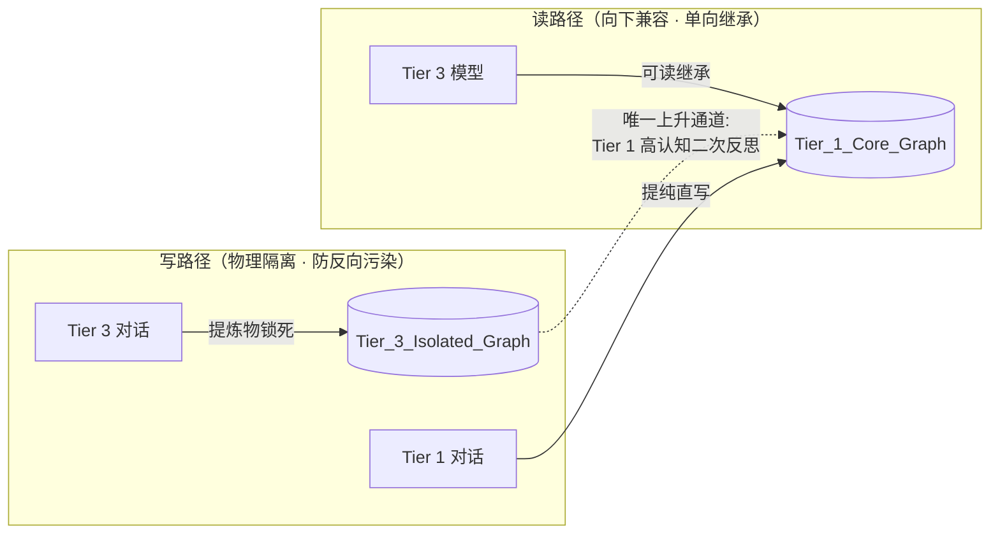
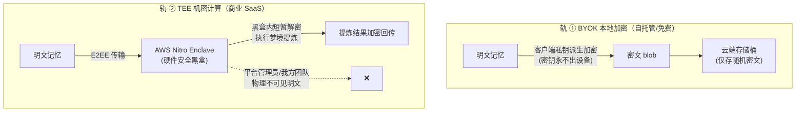

# 04 · 认知分级隔离与零知识隐私

---

## 1. 认知分级隔离（Cognitive Grading Isolation）

**问题**：多模型混用时代，"笨模型"的幻觉会污染"聪明模型"积累的经验资产。

**模型分层**（示例，可在 `.env` 配置）：

| Tier | 代表 | 权限 |
|---|---|---|
| Tier 1 | Claude 5 Sonnet、GPT-5.6、本地开源模型（离线轨） | 读全库；提炼物写主基座 |
| Tier 2 | 中端模型 | 读全库；提炼物进待复核队列 |
| Tier 3 | 轻量端侧模型（GPT-mini 类、本地小模型） | 读全库；提炼物**只写**隔离图谱 |

**钢印是隔离的前提**：每条写入必须在捕获入口（daemon `/ingest`）打上 `cognitive_tier` + `model_id`，事后不可篡改（进入 provenance.history）。

---

## 2. Anima 模型（已拆分为进阶模块，见 design/09）

> Anima 灵魂模型与偏好动力学已独立成篇：[09-anima与偏好动力学](09-anima与偏好动力学.md)——**进阶功能，不在 M1 首发范围**。
> 本节保留与本文其余部分的唯一耦合点：零知识矩阵与隔离机制对 ANIMA/PREFERENCE 节点同样生效（ANIMA 节点的 `idiographic_notes` 明文摘要、PREFERENCE 的 `evidence_chain` 均属于"云端零明文持久化"的覆盖范围）。

---

## 3. 零知识隐私矩阵

**问题**：记忆包含用户最深度的偏好、商业机密、情感资产。云端记忆若无物理级隔离，B 端与高净值用户无法建立信任。

**双轨模式**：

**信任边界规则**：
1. 云端任何组件不持久化明文；
2. Enclave attestation（远程证明）向客户端开放验证接口——用户可密码学验证"跑的是未篡改的 MnemoSeed 代码"；
3. Provenance 字段同样加密存储，审计在客户端本地完成。

---

## 4. 合规基线

- 官方企业渠道接入（AWS Bedrock / Google Vertex AI），拒绝无 DPA 承诺的 API 中介（如 OpenRouter）——杜绝中间人泄露面；
- 仅选用支持 **ZDR（Zero-Data-Retention）** 的模型端点；
- 目标合规：GDPR / CCPA / 马来西亚 PDPA。
