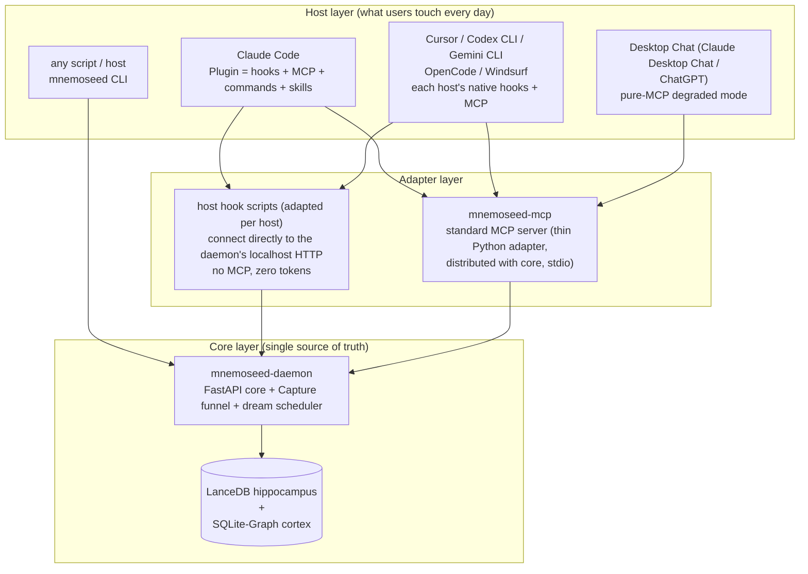
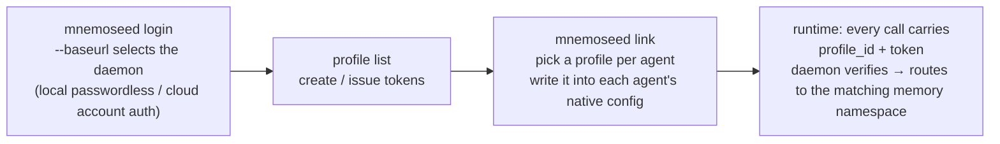
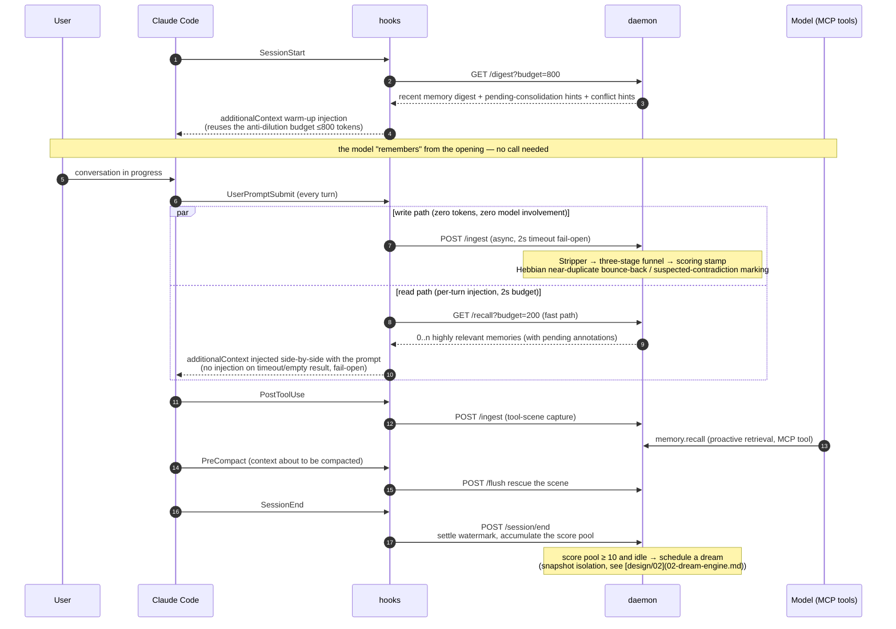

# 06 · Host Integration & Installation Experience (Adapter Architecture & Onboarding)

> Problem solved: the complete path from a user "hearing about MnemoSeed" to "the agent remembering me for the first time".
> Design principles: **Time-to-First-Memory < 3 minutes**; single-command install; zero-account startup; uninstall leaves no residue.

---

## 1. Why Neither Pure MCP Nor Pure Plugin

### Three Structural Shortcomings of Pure MCP

1. **Capture is passive** — MCP tools are invoked at the model's initiative. If the model forgets to call `memory.store`, the memory is missed. **A memory system's reliability cannot rest on the self-discipline of the served party** (a restaurant's bookkeeping should not rely on the guests speaking up).
2. **No lifecycle mount points** — the MCP protocol itself knows nothing about host events like SessionStart / SessionEnd / context compaction. Warm-up injection, session settlement, and rescuing the scene before compaction have nowhere to attach.
3. **The capture path burns tokens** — every tool call passes through the model context. High-frequency capture should be a zero-token background action.

### The Shortcomings of a Pure Plugin

The reality of 2026 is that hook systems have gone mainstream across developer tools — Claude Code (33 events), Cursor (full native set + a Claude Code hooks compatibility layer), Codex CLI (stable since v0.124, event naming aligned with the Claude Code ecosystem), Gemini CLI (11 events + extension packaging), OpenCode (JS/TS plugin events), Windsurf Cascade (12 hooks) all have them. But **each host's event semantics, injection capabilities, and config formats differ** (see §2 for details), so a plugin route requires per-host adaptation and remains helpless for hook-less desktop Chat hosts (Claude Desktop Chat, ChatGPT) — a plugin cannot cover all hosts.

### Conclusion: Three-Layer Architecture



- **The daemon is the core**: data, scoring, and dream scheduling all live in this one process. No matter how the host changes, the memory does not move.
- **MCP is the universal interface**: any MCP Host integrates with zero changes, covering the whole ecosystem.
- **The plugin is the experience enhancement**: on hosts with hook systems, it upgrades "passively waiting to be called" into "driven automatically by the host". **The plugin bundles and registers the same MCP server internally — the two are not an either/or, but two driving paths for the same interface.**

**Neuroscience mapping**: hooks are the **reflex arc** — the host's nervous system fires automatically, without consciousness (the model); MCP is the **language pathway** — conscious asking and stating. Memory encoding travels the reflex arc (automatic, high-frequency, zero cost); deep retrieval travels the language pathway (intentional, low-frequency, precise).

---

## 2. Host Capability Matrix & Integration Forms (verified against official docs, 2026-08)

> Methodology: read each host's official documentation directly, not third-party retellings. Source register at the end of this section.
> Tiers: **Tier 1 full-fledged** (has hooks — deterministic capture + automatic injection, the M1 acceptance target) / **Tier 2 best-effort** (pure MCP, driven by model self-discipline, not part of M1 acceptance).

### 2.1 Tier 1 Host Matrix

| Host | Hook events | Per-turn injection | Capture hook points | Distribution form |
|---|---|---|---|---|
| **Claude Code** | full set of 33 events (SessionStart/UserPromptSubmit/PreToolUse/PostToolUse/PreCompact/PostCompact/Stop/SessionEnd/SubagentStart/Stop…) | ✅ UserPromptSubmit `additionalContext` (side-by-side with the prompt, as a system-reminder); SessionStart capped at 10,000 characters, overflow passed via a written-to-disk path | UserPromptSubmit (30s timeout, we use 2s fail-open) + PostToolUse + Stop (`last_assistant_message` gives the full text directly, consecutive-block cap of 8) | **Plugin**: a single package carrying hooks + MCP server + commands + skills at once; two-step marketplace install (`marketplace add` → `plugin install`) |
| **Cursor** | full native set: sessionStart/sessionEnd/preToolUse (can rewrite the input args with `updated_input`)/postToolUse (can inject `additional_context` after tool results)/afterAgentResponse (**gives the full assistant text directly**)/stop/preCompact/subagentStart/Stop/beforeShellExecution/beforeMCPExecution… | ⚠️ Partial: sessionStart can inject `additional_context` (fire-and-forget; official docs state no character cap); **beforeSubmitPrompt can only block, cannot rewrite or append the prompt** — per-turn injection unavailable | afterAgentResponse (full-text deterministic capture) + postToolUse; **natively compatible with Claude Code hooks config** (reads `.claude/settings.json` directly, event names auto-mapped) — our CC plugin gets a free ride on part of it in Cursor | `.cursor/hooks.json` (project-level, committable) + `.cursor/rules/*.mdc` (`alwaysApply: true`, resident every session) + MCP |
| **Codex CLI** | SessionStart (source: startup/resume/clear/compact)/SessionEnd/UserPromptSubmit/PreToolUse (permissionDecision + updatedInput)/PostToolUse/PreCompact/PostCompact/Stop/SubagentStart/Stop (event naming aligned with the Claude Code ecosystem) | ✅ additionalContext (default 2,500-token cap; overflow spills to disk) | UserPromptSubmit + PostToolUse; SessionEnd reads `transcript_path` (rollout.jsonl) for settlement | `~/.codex/hooks.json` or inline in config.toml + AGENTS.md (three-level merge, 32KiB cap, always-in-context) + MCP (**`instructions` field officially confirmed as injected**). **Note: non-managed hooks require the user to review trust via `/hooks` (by hash) — the installer must guide this step** |
| **Gemini CLI** | 11 events: SessionStart (additionalContext as the first history turn)/**BeforeAgent (injects context every turn)**/BeforeTool (can rewrite tool_input)/AfterTool (can replace results)… | ✅ **BeforeAgent per-turn injection** — tied with Claude Code for the strongest per-turn read path | BeforeAgent/AfterTool/SessionEnd | **Extension**: a single package carrying MCP server + GEMINI.md context + hooks + commands + skills — a distribution silver bullet isomorphic to the CC plugin |
| **OpenCode** | session.created/idle/compacted/error, tool.execute.before/after (can rewrite tool parameters), experimental.session.compacting (can inject context) | ⚠️ No per-turn prompt-injection primitive; warm-up via session.created + injection via compacting | tool.execute.after (deterministic capture) + session.idle (settlement trigger) | JS/TS plugin (`.opencode/plugins/` or `~/.config/opencode/plugins/`) + AGENTS.md (natively supported, CLAUDE.md as fallback) + MCP |
| **Windsurf (→Devin Desktop)** | 12 Cascade hooks: pre_user_prompt/post_cascade_response_with_transcript (**gives the full transcript**)/pre/post_mcp_tool_use…, exit code 2 can block | ⚠️ Injection relies on rules (always_on triggers); hooks lean toward interception and observation | post_cascade_response_with_transcript (transcript-level capture) | hooks config with three-level merge + rules + MCP (mcp_config.json, 100-tool cap). ⚠️ **The product is in its post-Cognition-acquisition transition period**: the new default agent (Devin Local) is a separate hook/MCP configuration system, and the docs have moved to docs.devin.ai — integration is built but labeled "API stability risk" |

### 2.2 Tier 2 Host Matrix (pure MCP, desktop Chat scenarios)

| Host | Capability boundary | Integration form | Barriers |
|---|---|---|---|
| **Claude Desktop Chat** | no hooks, no custom system prompt; only MCP tools/resources/prompts | **`.mcpb` desktop extension** (officially promoted: zip+manifest one-click install, bundled Node runtime, local stdio resident, per-user) | ① memory reads/writes rely 100% on the model consciously calling tools; ② whether the MCP `instructions` field is consumed in the Chat UI has **no official statement — pending post-release verification**; ③ enterprises can force-delete extensions via allowlist and turn off local MCP entirely with `isLocalDevMcpEnabled`; ④ must coexist on a dual track with Claude's native Memory |
| **Claude Desktop Code tab** | = the full Claude Code engine (hooks/plugin/MCP all present) | Same as Tier 1 Claude Code | None — full-fledged for desktop coding scenarios |
| **ChatGPT (product surface)** | **supports only remote MCP (streamable HTTP); local stdio does not work**; write-type tools require manual user confirmation on every call | hosted HTTP endpoint or the official Secure MCP Tunnel (local makes only outbound 443) | ① data must leave the machine (in tension with the "you own your memory" narrative); ② manual confirmation of writes = automatic capture is crippled; ③ Plus/Pro permission wording is inconsistent across official docs; ④ coexists on a dual track with ChatGPT Memory, and the official Memory absorbs connector data |
| **Codex (desktop app mode / IDE)** | shares `~/.codex/config.toml` with the Codex CLI, **supports local stdio** | Same as Tier 1 Codex CLI | None — full-fledged for developer scenarios |

### 2.3 Usable Levers for the Desktop Chat Degraded Mode (all done, but all "soft")

1. **Tool description engineering** — the model reads tool descriptions every time; write the `memory.recall` description as a strong steer ("must be called first before answering anything touching the user's preferences / project context"), significantly raising the trigger rate (mem0's main play on desktop);
2. **The MCP `instructions` field** — server-level behavioral instructions (confirmed consumed by Claude Code and Codex; Claude Desktop Chat pending post-release verification, on the backlog verification list);
3. **MCP Resources** — memory exposed as `memory://` resources (precedent from the official memory server, with update notifications), user-referenceable with @;
4. **MCP Apps** — render a memory visualization UI ("what was just stored"), raising trust and the willingness to trigger manually;
5. **`.mcpb` packaging** — solves the install experience (not the automation of use).

**The ceiling is hard**: a hook-less Chat UI has no deterministic mechanism guaranteeing "every turn of conversation is captured"; all of the above levers can only raise the probability, never to 100%. **Therefore Tier 2 is kept out of the M1 acceptance criteria**, and only gets MCP server conveniences (`.mcpb` packaging + description engineering).

### 2.4 Key Design of the MCP-only Degraded Mode (the universal floor)

The MCP protocol lets a server carry an **`instructions` field** in its initialize response — a block of behavioral guidance auto-delivered to the model along with the connection (Claude Code truncates at 2KB; Codex recommends the first 512 characters be self-contained — **write the guidance copy to a hard cap of 512 characters**). The daemon uses it to send:

> "This session is connected to persistent memory. At the start, call `memory.recall` to obtain recent context; when you encounter a preference, decision, or constraint stated by the user, call `memory.remember`; when unsure whether a memory is still current, call `memory.audit`."

Paired with the server-side **idempotent dedup** of `memory.remember` (Hebbian near-duplicate bounce-back; repeated remembers do not create new chunks), both runaway directions — "over-conscientious model" and "not-conscientious-enough model" — are caught. The degraded mode is weaker than hooks, but semantic correctness is unchanged — this is the lower bound of the price of universality.

### 2.5 Per-Host Memory Mode Comparison (write path / read path)

| Host | Write (capture) | Read (injection) |
|---|---|---|
| Claude Code | UserPromptSubmit + PostToolUse → daemon `/ingest` (zero tokens); Stop pads the tail | SessionStart warm-up ≤800 tokens; **per-turn injection on UserPromptSubmit** (daemon returns highly relevant memories within 2s; on timeout, no injection, fail-open); MCP `memory.recall` proactive retrieval as fallback |
| Cursor | afterAgentResponse (full text) + postToolUse → `/ingest` | sessionStart warm-up injection; **per-turn injection unavailable** (beforeSubmitPrompt cannot rewrite) → reading relies on warm-up + persistent rules hints + MCP recall |
| Codex CLI | UserPromptSubmit + PostToolUse → `/ingest`; SessionEnd reads the transcript for settlement | SessionStart warm-up; per-turn injection via UserPromptSubmit additionalContext (within the 2,500-token cap); AGENTS.md persistent guidance |
| Gemini CLI | AfterTool + Stop → `/ingest` | SessionStart warm-up + **BeforeAgent per-turn injection**; GEMINI.md persistent guidance |
| OpenCode | tool.execute.after → `/ingest`; session.idle triggers settlement | session.created warm-up; no per-turn injection primitive → AGENTS.md + MCP recall |
| Windsurf | post_cascade_response_with_transcript → `/ingest` | rules always_on persistent hints + MCP recall |
| Tier 2 desktop | the model consciously calls `memory.remember` (idempotent dedup as fallback) | the model consciously calls `memory.recall` + instructions/description guidance |

**Design point**: per-turn injection is the deterministic answer to "keeping using memory throughout a session"; today only three hosts support it — Claude Code (UserPromptSubmit), Codex CLI (UserPromptSubmit), Gemini CLI (BeforeAgent). These three set the ceiling of "smoothness"; the remaining hosts approximate it with a combination of warm-up + persistent guidance + proactive MCP retrieval.

> **Research sources**: code.claude.com/docs/en/hooks, /en/plugins-reference, /en/mcp, /en/settings, /en/sub-agents; cursor.com/docs/hooks, /docs/reference/third-party-hooks, /docs/rules, /docs/mcp, /docs/cloud-agent; learn.chatgpt.com/docs/hooks.md, /docs/extend/mcp, /docs/config-file/config-reference.md, /docs/agent-configuration/agents-md.md; Gemini CLI / OpenCode / Windsurf(Devin) official docs; desktop part: modelcontextprotocol.io, anthropic.com/engineering/desktop-extensions, support.claude.com, developers.openai.com, help.openai.com (read directly on 2026-08-08).

---

## 2.6 Profile Identity Model: Credentials Carried Explicitly (finalized by Jinhao, 2026-08-08)

**Principle: explicit credentials > runtime inference. The daemon only verifies; it never guesses.**



**Resolution priority (three levels, no registry, no guessing)**:
1. **Request-level explicit override** (tool parameter / `MNEMOSEED_PROFILE` env var) — an escape hatch for temporarily switching identity;
2. **`profile_id + token` in the agent's own config** — the primary path, written by `link` at the moment of install/integration;
3. **default profile** — the fallback; the daemon logs a note that "this agent has no identity configured".

**Key properties**:
- **The host UI always shows exactly one `mnemoseed` MCP entry** — profile identity is carried inside that entry as env vars (`MNEMOSEED_PROFILE_ID` + `MNEMOSEED_TOKEN`); 5–10 profiles do not become 5–10 toggles;
- **Per-agent injection on multi-agent platforms**: in OpenClaw/Hermes each agent has its own config file, each carrying its own profile_id — agents with different functions land in different memories;
- Claude Code: user scope attaches to personal; the project repo's project scope attaches to work; subagents inherit the parent session's connection → automatically the same identity (separate bodies, not separate minds); isolation edge cases go through priority ①;
- **The same identity model for local and cloud**: `login --baseurl` decides which daemon the identity faces; kicking an agent on the cloud = revoking its token, profile data stays intact;
- **Observable**: `mnemoseed whoami` proves identity in any agent environment (profile / daemon / token validity); `mnemoseed status` reads back all host configs to generate the binding registry — the management view always equals the actual state; there is no second source of truth;
- Cloud tokens can later be stored in the OS keychain (put a `keychain:` reference in the config), implemented in M3; the interface is reserved for now.

**Layered disconnect semantics** (finalized): disable (remove the entry) / switch identity (rewrite profile_id via link) / cloud revoke token / uninstall (roll everything back + void tokens) — **none of these touch data**; deletion is a separate verb (`--purge` / `profile delete`, with second confirmation).

---

## 2.7 Account Layer (User) & First-Registration Flow (finalized by Jinhao, 2026-08-08)

The full hierarchy of the identity model: **User (account) → Profiles → agent tokens**.

### Local First Registration (n8n-style setup wizard)

```mermaid
sequenceDiagram
    participant U as User
    participant C as Console
    participant D as daemon
    U->>D: mnemoseed init done, daemon first start
    D-->>D: detects: no owner account → enters setup state<br/>(all memory APIs return 503 + setup guidance; only /console/setup works)
    U->>C: open console → auto-redirected to /setup
    C->>U: create owner account (username + password, argon2 hash)
    U->>C: submit
    C->>D: POST /setup (allowed exactly once; the endpoint stays permanently closed afterward)
    D-->>C: setup complete → normal state
    Note over U,D: everything afterward goes through the normal login/link flow
```

### Single-User / Multi-User Authorization Boundaries

| Form | Number of users | Registration method |
|---|---|---|
| **Open-source local edition (AGPL)** | **hard-limited to 1** (owner) | local setup wizard (username + password) |
| **Official cloud (hosted by us)** | multi-user natively supported | email registration + **Google sign-up** (OAuth bound to the official domain) |
| **Commercial License (self-hosted)** | per license seats | local account system + self-configurable Google OAuth client |

- **The open-source edition is hard-limited to a single user**: the console's user-management page shows only the owner; the "add user" button is locked with the activation path noted — this is one of the commercial gates of the AGPL dual track;
- **License activation**: `mnemoseed license activate <file>` or upload via console — a license is an Ed25519-signed, offline-verifiable file containing entitlements (`multi_user: true`, `seats: N`, validity period); the daemon verifies the signature locally with an embedded public key, **no network required**;
- **License expiry behavior**: 30-day grace period → multi-user login is then disabled, but **the owner and all data remain fully usable** — an expired license must never hold user data hostage;
- Local owner forgot password: physically holding the machine is the highest authority; `mnemoseed auth reset` (CLI, must run on the machine) resets it.

---

## 3. Installation Flow (Time-to-First-Memory < 3 minutes)

```bash
npx mnemoseed@latest init        # or curl -fsSL mnemoseed.ai/install | bash
```

```mermaid
sequenceDiagram
    autonumber
    participant I as installer
    participant H as installed hosts
    participant D as daemon
    I->>H: ① probe hosts<br/>scan ~/.claude.json, ~/.cursor/, ~/.codex/,<br/>~/.gemini/, ~/.config/opencode/
    Note over I: list discovered hosts, ask the user which to integrate
    I->>I: ② storage form selection<br/>default embedded (both databases embedded in one process, zero Docker)<br/>optional docker compose full stack
    I->>I: ③ download bge-m3 ONNX embedding model (~543MiB, int8 quantized, as measured)<br/>(resumable download, size pre-declared)
    I->>D: ④ login to local daemon (passwordless confirm)<br/>→ create/select profile → issue token
    I->>D: ⑤ dream-model config wizard<br/>① OAuth subscription reuse (Codex/ChatGPT; Chinese users may<br/>choose MiniMax/Kimi, with an explicit data-leaving-the-country notice)<br/>② bring your own API key (OpenAI-compatible endpoint, e.g. Fireworks)<br/>③ advanced offline track Ollama (≤14B, quality warning)<br/>only written to config.toml after a live connectivity test passes
    I->>H: ⑥ link: pick a profile per host/agent<br/>write MCP registration + profile_id/token (env)<br/>back up the original config + diff preview + per-item confirmation before writing
    I->>H: ⑦ Claude Code detected → guide plugin install<br/>(marketplace add + install, executed as one command)<br/>Codex detected → guide /hooks trust review<br/>(non-managed hooks silently not executed if not trusted)
    I->>D: ⑧ start the daemon (if not already running)
    I->>D: ⑨ mnemoseed doctor self-check
    Note over D: daemon alive / port / embedding loaded<br/>/ round-trip store-test / each host's registration active
    Note over I: all green → "Done. The next time you're in a meeting,<br/>it'll already be there."<br/>any step fails → give a one-line fix command
```

**Iron rules**:
- **Zero-account startup** — fully usable locally; cloud sync is a later explicit action via `mnemoseed cloud login`;
- **Backup + diff preview + confirmation before touching any user config** — the people installing a memory system fear most that a tool messes with their environment;
- **embedded mode by default** — do not let Docker become a barrier for individual users (docker compose is kept for developers and enterprises).

**Uninstall**: `mnemoseed uninstall` deregisters host by host (restore from backup or strip precisely), stops the daemon, keeps the data directory by default and states its path, and only `--purge` deletes data. **The uninstall experience is part of trust.**

---

## 4. The Complete Lifecycle of One Session (in the Claude Code plugin form)



**User-side slash commands** (bundled with the plugin): `/memory status`, `/dream once`, `/forget`, `/recall <query>` — mechanisms exposed as explicit actions, consistent with the "manual first, automate later" discipline ([design/02 §8](02-dream-engine.md)).

---

## 5. CLI at a Glance (the lowest common denominator across hosts)

| Command | Purpose |
|---|---|
| `mnemoseed init` | install wizard (§3) |
| `mnemoseed doctor` | self-check checklist + round-trip test |
| `mnemoseed status` | memory scale / score pool / pending-consolidation count / conflict queue |
| `mnemoseed login [--baseurl …]` | identity entry: select daemon, authenticate, list profiles |
| `mnemoseed link` / `unlink` | bind/unbind a profile per agent (writes into the agent's native config) |
| `mnemoseed whoami` | which profile / daemon / token state the current environment hits |
| `mnemoseed console` | open the management console ([design/07](07-console.md)) |
| `mnemoseed recall "<query>"` | command-line retrieval (usable from scripts / any host) |
| `mnemoseed remember "<fact>"` | command-line explicit memorization |
| `mnemoseed dream --once` | manual consolidation (M1 discipline) |
| `mnemoseed export` | single-file self-contained export (incl. index snapshot, copyable off) |
| `mnemoseed diff` | memory version diff |
| `mnemoseed forget "<target>"` | explicit deletion |
| `mnemoseed cloud login` | explicitly enable cloud sync ([PRD-05](../prd/PRD-05-cloud-tee.md)) |
| `mnemoseed uninstall` | residue-free uninstall |

---

## 6. Configuration Single Source of Truth

`~/.mnemoseed/config.toml` is the only config file (STORAGE_MODE, scoring weights, decay λ, host manifest, cloud account). The host side holds only a **thin registration** (one line for the MCP endpoint + the hook script path); upgrading the daemon never touches host configs. Change config with `mnemoseed config set`; hand-editing host-side files is forbidden.
