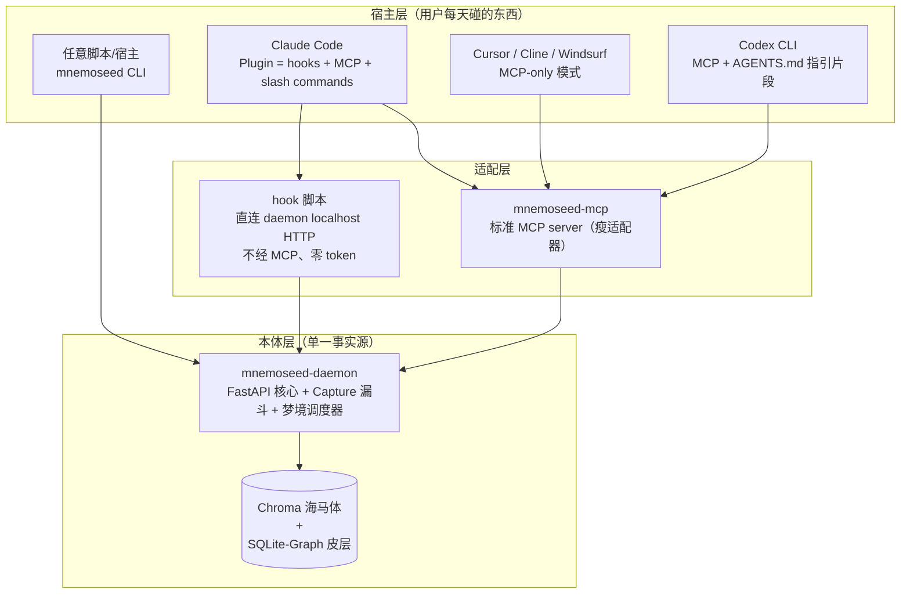
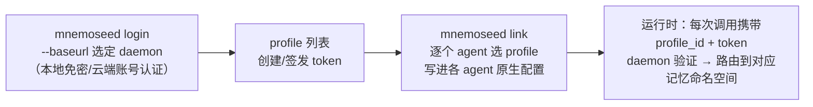
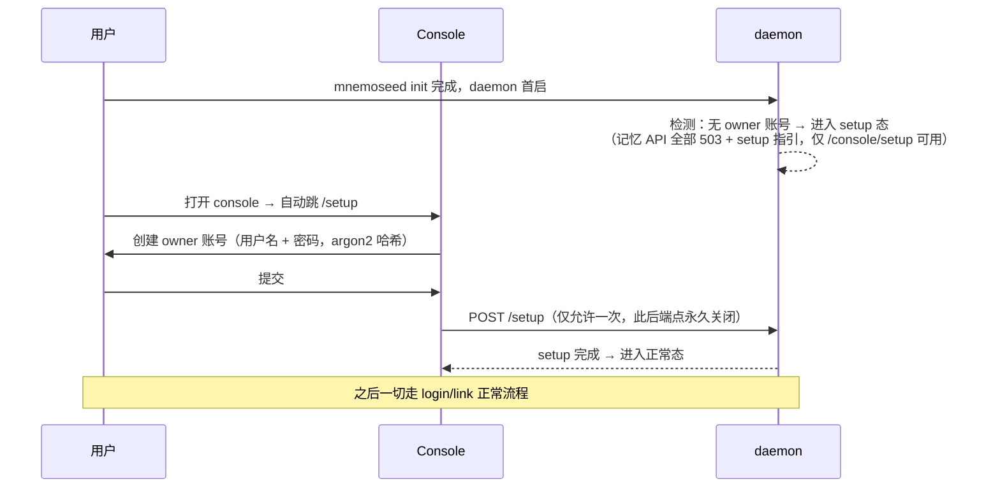
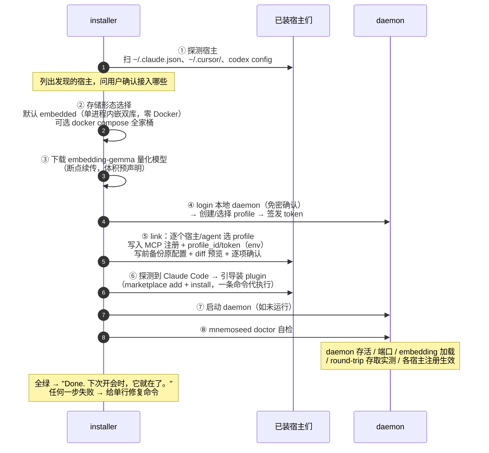
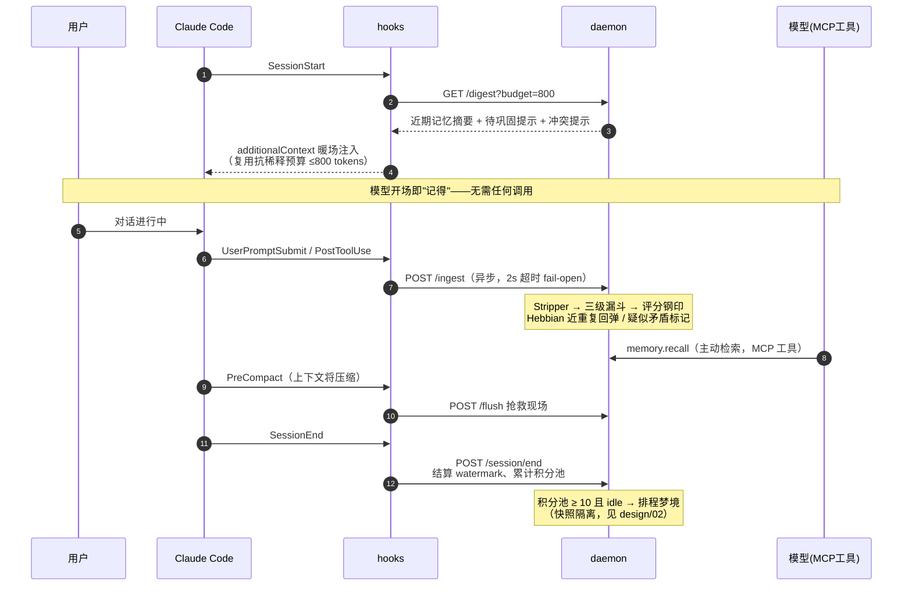

# 06 · 接入与安装体验（Adapter Architecture & Onboarding）

> 解决的问题：用户从"听说 MnemoSeed"到"agent 第一次记住我"之间的完整路径。
> 设计原则：**Time-to-First-Memory < 3 分钟**；单命令安装；零账号起步；卸载无残留。

---

## 1. 为什么既不是纯 MCP，也不是纯 Plugin

### 纯 MCP 的三个结构性短板

1. **捕获是被动的**——MCP 工具由模型主动调用。模型忘了调 `memory.store`，记忆就漏了。**记忆系统的可靠性不能建立在被服务对象的自觉上**（餐厅记账不该靠客人自己开口）。
2. **没有生命周期挂载点**——MCP 协议本身不知道 SessionStart / SessionEnd / 上下文压缩这些宿主事件。暖场注入、会话结算、压缩前抢救现场，全都无处安放。
3. **捕获路径烧 token**——每次 tool call 都经过模型上下文。高频捕获应该是零 token 的后台动作。

### 纯 Plugin 的短板

只有 Claude Code 有完整的 hook 系统（SessionStart / UserPromptSubmit / PostToolUse / Stop / SessionEnd / PreCompact）。Cursor、Cline、Codex CLI 没有等价物——plugin 路线无法通吃全宿主。

### 结论：三层架构



- **daemon 是本体**：数据、评分、梦境调度全在这一个进程里。宿主无论怎么换，记忆不动。
- **MCP 是通用接口**：任何 MCP Host 零改动接入，覆盖全生态。
- **plugin 是体验增强**：在有 hook 系统的宿主上把"被动等调用"升级为"宿主自动驱动"。**plugin 内部捆绑注册同一个 MCP server——二者不是二选一，是同一接口的两条驱动路径。**

**神经科学映射**：hook 是**反射弧**——宿主神经系统自动触发，不经意识（模型）；MCP 是**语言通路**——有意识地询问与陈述。记忆编码走反射弧（自动、高频、零成本），深度检索走语言通路（有意、低频、精确）。

---

## 2. 宿主能力矩阵与接入形态

| 宿主 | 生命周期 hook | 接入形态 | 捕获方式 | SessionStart 暖场 |
|---|---|---|---|---|
| Claude Code | ✅ 完整六件套 | **Plugin**（marketplace 分发，含 hooks + MCP + slash commands） | hook 自动捕获，零 token | ✅ additionalContext 自动注入 |
| Cursor | ❌（仅 rules） | MCP + `.cursor/rules` 指引片段 | 半自动（指引提示模型调 remember） | 规则常驻提示模型开场 recall |
| Cline / Windsurf | ❌ | MCP | 半自动 | 同上 |
| Codex CLI | ⚠️ 部分（notify） | MCP + `AGENTS.md` 指引片段 | 半自动 | 无 |
| 任意宿主/脚本 | — | `mnemoseed` CLI | 手动/脚本化 | 手动 |

### MCP-only 降级模式的关键设计

MCP 协议允许 server 在 initialize 响应中携带 **`instructions` 字段**——一段随连接自动下发给模型的行为指引。daemon 借此下发：

> "本会话已接入持久记忆。开场先 `memory.recall` 获取近期上下文；遇到用户陈述的偏好、决定、约束时调 `memory.remember`；不确定记忆时效时调 `memory.audit`。"

配合 `memory.remember` 服务端的**幂等去重**（Hebbian 近重复回弹，重复 remember 不产生新分片），把"模型过度自觉"和"模型不自觉"两个方向的失控都兜住。降级模式能力弱于 hook，但语义正确性不变——这是通用性的代价下限。

---

## 2.5 Profile 身份模型：凭证显式携带（锦豪定稿 2026-08-08）

**原则：显式凭证 > 运行时推断。daemon 只验证，不猜测。**



**解析优先级（三层，无注册表无猜测）**：
1. **请求级显式覆盖**（tool 参数 / `MNEMOSEED_PROFILE` 环境变量）——逃生舱，临时换身份用；
2. **Agent 自身配置里的 `profile_id + token`**——主路径，`link` 在安装/接入的当下写入；
3. **default profile**——兜底，daemon 记日志提示"该 agent 未配身份"。

**关键性质**：
- **宿主界面永远只有一条 `mnemoseed` MCP 条目**——profile 身份以 env 形式携带在该条目内（`MNEMOSEED_PROFILE_ID` + `MNEMOSEED_TOKEN`），5–10 个 profile 不会变成 5–10 个开关；
- **多 agent 平台逐 agent 注入**：OpenClaw/Hermes 每个 agent 有独立配置文件，各自携带各自的 profile_id——不同职能 agent 用不同记忆的落点；
- Claude Code：user scope 挂 personal、项目 repo 的 project scope 挂 work；subagent 继承父 session 连接 → 自动同身份（分身不分心）；隔离特例走优先级 ①；
- **本地与云端同一身份模型**：`login --baseurl` 决定身份对着哪台 daemon；云端踢 agent = revoke 它的 token，profile 数据完好；
- **可观测**：`mnemoseed whoami` 在任何 agent 环境自证身份（profile / daemon / token 有效性）；`mnemoseed status` 回读所有宿主配置生成绑定总表——管理视图永远等于实际状态，没有第二个真相源；
- 云端 token 后续可存 OS keychain（配置里放 `keychain:` 引用），M3 实现，先留接口。

**断开语义分层**（定稿）：disable（摘除条目）/ 换身份（link 重写 profile_id）/ 云端 revoke token / uninstall（全部回滚 + token 作废）——**全部不动数据**；删除是独立动词（`--purge` / `profile delete`，二次确认）。

---

## 2.6 账号层（User）与首次注册流程（锦豪定稿 2026-08-08）

身份模型的完整层级：**User（账号）→ Profiles → agent tokens**。

### 本地首次注册（n8n 式 setup wizard）



### 单用户 / 多用户的授权边界

| 形态 | 用户数 | 注册方式 |
|---|---|---|
| **开源本地版（AGPL）** | **硬限 1 个**（owner） | 本地 setup wizard（用户名+密码） |
| **官方云端（我们 host）** | 多用户原生支持 | 邮箱注册 + **Google sign-up**（OAuth 绑定官方域名） |
| **Commercial License（自部署）** | 按 license 席位 | 本地账号体系 + 可自配 Google OAuth client |

- **开源版硬限单用户**：console 用户管理页只显示 owner，"添加用户"按钮锁定并注明激活路径——这是 AGPL 双轨的商业闸门之一（见推广计划）；
- **License 激活**：`mnemoseed license activate <file>` 或 console 上传——license 是 Ed25519 签名的离线可验证文件，内含 entitlements（`multi_user: true`、`seats: N`、有效期），daemon 用内嵌公钥本地验签，**不需联网**；
- **License 到期行为**：宽限 30 天 → 之后多用户登录停用，但 **owner 与全部数据完好可用**——license 过期永远不得劫持用户数据；
- 本地 owner 忘密码：物理持有机器即最高权限，`mnemoseed auth reset`（CLI，需本机执行）重置。

---

## 3. 安装流程（Time-to-First-Memory < 3 分钟）

```bash
npx mnemoseed@latest init        # 或 curl -fsSL mnemoseed.ai/install | bash
```



**铁律**：
- **零账号起步**——本地完整可用；云同步是之后 `mnemoseed cloud login` 的显式动作；
- **改用户配置前必备份 + diff 预览 + 确认**——装记忆系统的人最怕工具乱动自己的环境；
- **embedded 模式默认**——不让 Docker 成为个人用户的门槛（docker compose 保留给开发者和企业）。

**卸载**：`mnemoseed uninstall` 逐宿主注销注册（从备份恢复或精确摘除）、停 daemon、数据目录默认保留并明示路径，`--purge` 才删数据。**卸载体验是信任的一部分。**

---

## 4. 一次 Session 的完整生命周期（Claude Code plugin 形态）



**用户侧 slash commands**（plugin 附带）：`/memory status`、`/dream once`、`/forget`、`/recall <query>`——机制暴露为显式动作，符合"先手动再自动"纪律（design/02 §8）。

---

## 5. CLI 一览（跨宿主的最低公分母）

| 命令 | 作用 |
|---|---|
| `mnemoseed init` | 安装向导（§3） |
| `mnemoseed doctor` | 自检清单 + round-trip 实测 |
| `mnemoseed status` | 记忆规模 / 积分池 / 待巩固数 / 冲突队列 |
| `mnemoseed login [--baseurl …]` | 身份入口：选定 daemon、认证、列 profile |
| `mnemoseed link` / `unlink` | 逐 agent 绑定/解绑 profile（写入 agent 原生配置） |
| `mnemoseed whoami` | 当前环境命中哪个 profile / daemon / token 状态 |
| `mnemoseed console` | 打开管理控制台（design/07） |
| `mnemoseed recall "<query>"` | 命令行检索（脚本/任意宿主可用） |
| `mnemoseed remember "<fact>"` | 命令行显式记忆 |
| `mnemoseed dream --once` | 手动巩固（M1 纪律） |
| `mnemoseed export` | 单文件自包含导出（含索引快照，可拷走） |
| `mnemoseed diff` | 记忆版本差异 |
| `mnemoseed forget "<target>"` | 显式删除 |
| `mnemoseed cloud login` | 显式开启云同步（PRD-05） |
| `mnemoseed uninstall` | 无残留卸载 |

---

## 6. 配置单一事实源

`~/.mnemoseed/config.toml` 是唯一配置文件（STORAGE_MODE、评分权重、衰减 λ、宿主清单、云账号）。宿主侧只持有**瘦注册**（MCP endpoint 一行 + hook 脚本路径），升级 daemon 不动宿主配置。改配置用 `mnemoseed config set`，禁止手改宿主侧文件。
