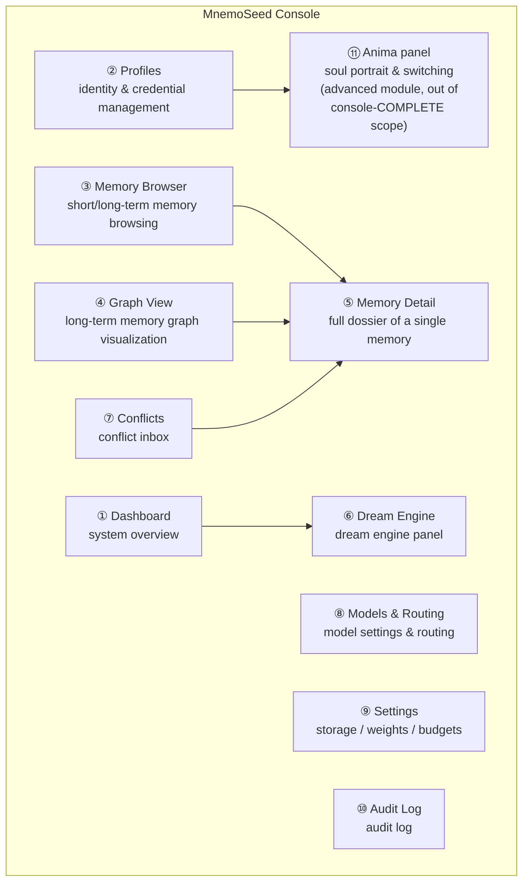
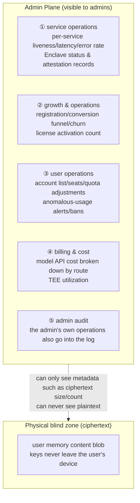

# 07 · Management Console (MnemoSeed Console)

> The local web management UI bundled with the daemon. The embodiment of the rights narrative: **you own, you control, you can forget** — all of it visible and tangible.
> It is also the review tool for the M1 "manual first, automate later" discipline: `dream --once` distillation quality should not be reviewed against JSON.

---

## 1. Positioning & Principles

- **Bundled with the daemon, zero extra install**: FastAPI directly hosts the static SPA (`http://localhost:7788/console`); just open it in a browser;
- **Local-first, no account**: listens on localhost only by default; remote access must be explicitly enabled + admin token;
- **The same frontend, direct-to-cloud in the future**: console is just a client of the daemon API — once cloud goes live, the same interface switches baseurl to manage cloud profiles, fully isomorphic with the login/baseurl identity model ([design/06](06-host-integration.md));
- **Read-oriented; every write leaves a trace**: browsing is free; modifying operations (delete memory, change weights, resolve conflicts, switch models) all go into the audit log.

## 2. Page Structure

### ① Dashboard — System Overview

- daemon health: storage driver, embedding status, current dream state-machine state (Idle/Accumulating/Dreaming…);
- real-time metrics: score pool level, watermark, pending-consolidation chunk count, needs_reconcile queue length, pending_consolidation count;
- token usage: today's / this week's dream tokens, embedding tokens, grouped by model, estimated cost;
- total registry of integrated contexts (host / agent → profile → token status — the graphical version of `mnemoseed status`).

### ② Profiles — Identity Management

- profile list (create / rename / archive);
- per profile: issued-token list (issue / revoke), bound agent manifest, memory-scale statistics (chunk count / node count / disk used);
- credential operations follow the layered disconnect semantics ([design/06](06-host-integration.md)): revoking a token ≠ deleting the profile; deletion is a separate confirm-twice verb;
- **Users sub-page**: account-layer management ([design/06 §2.7](06-host-integration.md)) — the open-source edition shows only the owner row, the "add user" button locked with the activation path noted (official cloud / commercial license); after license activation, multi-user management expands (invites / seats / disabling).

### ③ Memory Browser

- **Short-term memory (hippocampus)**: LanceDB chunk list, filterable by time / project / tool / emotion cue / entity; all stamp fields visible;
- **Long-term memory (cortex)**: triple/node list, filterable by node type (PREFERENCE/HABIT/EPISODE/SKILL_SEQUENCE/DECISION/ANIMA/INTENTION), Tier, decay_weight range;
- each row shows: content summary, decay_weight (with a decay-curve thumbnail), conflict/pending markers, recall hit count.

### ④ Graph View

- interactive graph rendering — **hand-rolled three.js instanced layer** (approved 2026-08-12): one `THREE.Points` with a custom shader for nodes (screen-space point size), one `InstancedMesh` of unit quads for edges (per-instance length/thickness/color), canvas-sprite labels for the **top-60 nodes by centrality**, `Raycaster` picking against a single geometry, **precomputed clustered layout** (no runtime force simulation);
- node color = type, size = graph centrality, opacity = decay_weight (**a memory in the process of being forgotten is visibly fading** — the best demo of decay);
- edges = relations + co-occurrence edges (thickness = edge weight);
- filters: profile / node type / time window / Tier;
- clicking a node → opens the ⑤ Memory Detail side panel.

**Decision record (three.js hand-rolled, approved 2026-08-12; benchmark evidence 2026-08-13 in [bench/graphview-three-results.md](../bench/graphview-three-results.md) (runnable artifact `.bench/graphview-three/`, local/gitignored))**: the layered alternative (three-forcegraph 1.43.4 on three.js 0.185.1) was benchmarked against the hand-rolled layer at 5,000 nodes / ~19k edges (RTX 3070, headed Chrome, real GPU, two runs stable):

| scenario | layered (three-forcegraph) | hand-rolled (instanced three.js) |
|---|---|---|
| S1 static render | 13.2 / 11.4 fps (fail) | 239.9 / 232.6 fps (pass) |
| S2 decay animation ~4 Hz | 8.1 / 4.2 fps (fail) | 239.6 / 232.6 fps (pass) |
| S3 hover sweep + clicks | 11.0 / 10.0 fps (fail) | 239.6 / 232.6 fps (pass) |
| S4 filter ~50% | 25.4 / 23.9 fps (fail) | 239.8 / 232.6 fps (pass) |
| decay tick update (avg / max) | 265.8 ms / 448.4 ms | 1.5 ms / 3.9 ms |
| filter update | 501.7 ms | 4.1 ms |
| pick latency (median / p95) | 1.8 ms / 2.4 ms | 0.2 ms / 0.5 ms |

**Verdict**: the layered library fails the ≥30 fps floor in every scenario (best case 25 fps post-filter; overall range ~6–28 fps including the headless lower bound), and its whole-graph style digest costs ~266 ms per 4 Hz decay tick — the flagship "memories visibly fading" showcase would hitch on every tick. The hand-rolled layer passes every scenario by ≥8× (vsync-saturated at the display cadence, so real headroom is larger than reported). Historical note: the earlier plan — a Cytoscape.js-class library — is superseded by this benchmark; a Cytoscape-class library is unsuitable at 5k nodes.

**Caveats**: measured at a 1280×720 viewport (headed Chrome clamps the window on the 1080p/125%-scaled demo machine) — larger viewports are untested, but the ≥8× margin leaves the direction unambiguous; headless (SwiftShader) numbers point the same direction (layered ~6 fps, hand-rolled ~240 fps) and are not the gate; **minimum hardware per NFR-7.2 v2 = WebGL2 + a discrete-GPU-class GPU; iGPUs are unmeasured**.

### ⑤ Memory Detail — Full Dossier of a Single Memory

Every memory has one "dossier page" exposing everything the system knows about it:

| Section | Content |
|---|---|
| Content | verbatim original / triple, dual-channel side-by-side (Fuzzy-Trace dual-track visualization) |
| Provenance | asserted_by / source / agent_id / session_id / asserted_at + **full history timeline** |
| Version chain | the version list from every Reconcile rewrite; **diff view** between any two versions |
| Full weights | current decay_weight + decay-curve projection (λ type), confidence, S-score breakdown (the three components arousal/novelty/causal), last_reinforced, reinforcement count |
| Usage | recall hit count, most recent hit time, co-occurrence neighbors top-N |
| Flags | conflict_flag / needs_reconcile / pending_consolidation / peripheral_gaps |
| Actions | forget_this / manual pin / manual decay adjustment (written to audit) |

### ⑥ Dream Engine Panel

- current state-machine state + score-pool level bar;
- **queue pending settlement**: the unconsolidated chunk list, the needs_reconcile flag list — the manual review entry point before `dream --once`;
- run history: each dream's turn_range, model used, tokens in/out, cost, number of triples written back (Tier 1 / Tier 3 split count), duration, whether it was interrupted;
- **distillation quality review**: the triples this dream produced, shown one by one in a diff view (raw chunk ↔ distillate), with one-click accept/reject/mark-as-hallucination;
- manual `dream --once` trigger button; automatic-trigger switch (off by default in M1);
- token usage trend chart + breakdown by model.

### ⑦ Conflicts — Conflict Inbox

- the flag_conflict queue: the contradictory pair shown side by side, each with its provenance, cues, decay_weight;
- in the UI, the user picks a Reconcile branch to handle: reinforce one / context-scoped coexistence (fill in cues to delimit) / invalidate one / keep pending;
- every resolution writes back to the version chain + the audit log — **reconciliation always leaves a trace**.

### ⑧ Models & Routing

- dream routing table covering both roles: `deep_reflection` (long-context deep-sleep reflection) / `short_increment` (short increments, dynamic budget ≤32k) → dropdown switching + live connectivity test button;
- **keys by env-var NAME only**: the UI shows and edits the environment-variable names (`MNEMOSEED_DEEP_REFLECTION_API_KEY` / `MNEMOSEED_SHORT_INCREMENT_API_KEY`, shared `FIREWORKS_API_KEY` fallback) — literal key values are never displayed or entered in the console;
- **connectivity test before persist**: a role's driver/model change is written to config only after the live connectivity self-check passes (the DreamLLM self-check port, [PRD-02 FR-2.14](../prd/PRD-02-dream-engine.md));
- role changes go through ConfigWriteService: validated, versioned, rollbackable, and audited (actor = console);
- embedding model settings & switching (switching triggers an index rebuild, with a cost warning);
- edge classifier (persistence judgment / contradiction judgment) model settings;
- per-model call volume & cost statistics.
- **Configuration permissions are system-scoped**: model routing and engine settings are owner/admin-level only — self-hosted = the owner account (the sole account in the open-source single-user build); commercial multi-user license = admin level, applies to all users; SaaS = the cloud Admin Plane (PRD-05), applies to all users; never a per-user setting.

### ⑨ Settings

- storage driver selection (presets: embedded / docker / custom + per-layer driver override; capability validation results shown); **switching the storage driver is disabled while data exists** (restart + explicit migration verb instead);
- scoring weights w₁/w₂/w₃, decay λ (per memory type), top-k and token budgets, score pool threshold;
- **every change goes through the daemon-owned ConfigWriteService** (the single config writer): registry lookup → validation → surgical toml patch → versioned meta-store record (the existing `set_config` / `rollback_config` ports) → audit entry (actor = console) → live-apply or restart-required flag. Changes are rollbackable via the versioned config history;
- `config.toml` is a **generated mirror** of the meta-store settings (registry keys): on upgrade with an empty store, a one-shot audited `config_import` from the file runs; a hand-edited file is detected by mtime/hash — the DB wins, the mirror is regenerated, and a `config_mirror_drift` warning + audit entry is written (supersedes the old `config_rebaseline` semantics); the console marks which keys are pending a restart;

| Key family | Live-apply | Restart-required |
|---|---|---|
| scoring weights w₁/w₂/w₃, decay λ (per type), top-k, token budget, pool threshold | ✅ | — |
| dream role routing (driver/model per role) | ✅ (after connectivity check) | — |
| embedding model / index | — | ✅ (index rebuild) |
| storage driver (embedded/docker/custom, per-layer override) | — | ✅ (restart; switch disabled while data exists) |
| port / host / auth (admin token) | — | ✅ (restart) |

### ⑩ Audit Log

- the full read/write event stream: which agent (agent_id + session_id) wrote what, read what, changed what config, at what time;
- filterable by agent / profile / time — **"who touched my memory" is always traceable**.

### ⑪ Anima Panel (advanced module, out of the console-COMPLETE scope)

The visualization and management UI for the soul model (for the model itself, see [09-anima-and-preferences](09-anima-and-preferences.md)):

- **trait radar chart**: a polygonal radar showing traits and weights — the number of axes is generated from the schema, not locked to six; vertices = trait mean, error bands/opacity = width (uncertainty must be visible, guarding against Barnum-style fabricated precision); manual fine-tuning supported (written to audit);
- **two-layer overlay display**: the core (immutable) solid line + the dye layer's current performance as a dashed line overlaid — the user sees at a glance how far "the born me" and "the me dyed by experience" differ;
- **plain-language creation**: a natural-language description ("a cautious but curious engineer") → the model quantifies it into a trait template, landed after user confirmation;
- **cross-profile management**: the anima list, linking/relinking to profiles; relinking clearly warns that it will trigger a dream-engine re-dye batch recomputation and requires confirmation;
- **drift_history timeline**: replay of personality & preference drift records ("the me of last year").

## 3. Technical Form

- the daemon's FastAPI mounts `/console` (static SPA build output) + `/api/v1/*` REST;
- frontend: a lightweight SPA (Svelte/Vue, to be decided after evaluation); graph rendering with a hand-rolled three.js instanced layer (see §④);
- auth: implicit trust on localhost; non-localhost access requires an admin token (reusing the login model);
- sequencing: **W1** (ConfigWriteService + console write ops + Audit + Settings + ⑧) and **W2** (CLI parity verbs) run **in parallel with PRD-04**; **W3** (GraphStore port extension + Graph View build + demo-seeding) starts **after PRD-04 lands**. The M1 read-only core (Dashboard / Memory Browser / Dream panel / Conflicts) ships first because M1's `dream --once` review discipline cannot wait for the write side;
- **console-COMPLETE (read + write, pages ①–⑩) is a hard pre-marketing gate**: no marketing demo-video production until console-COMPLETE + CLI parity + onboard all pass ([PRD-07 G-AC1..7](../prd/PRD-07-console.md)).

## 4. Cloud Admin Plane (finalized 2026-08-08)

The official cloud adds one more layer, the **system administrator** (the operator themselves), a fully separate interface from the user console (`admin.` subdomain + separate admin credentials, outside the user account system).

**Red line (architectural, not disciplinary)**: the admin sees **all operational data; memory content is invisible by default** — local/self-hosted users hold their own keys (encrypted at rest), and the cloud TEE tier enforces it in hardware. Operations work with metadata only, and no requirement may open a loophole in this.

| Visible (operational metadata) | Invisible (architecturally guaranteed) |
|---|---|
| accounts, profile count, quotas, usage counts, token consumption, cost, service health | memory content, conversation chunks, graph-node plaintext |
| ciphertext blob size/count/timestamps (needed for operations) | the blob content itself |

- customer-support scenario: when a user reports an issue, the admin can only look at metadata and logs; under no circumstance is there a "view the memory for the user" feature — if a user wants to show us, they must `memory.export` themselves and send it over proactively;
- admin accounts: separate strong authentication (hardware key / TOTP mandatory), every operation goes into an immutable audit log — **those who administer the system are themselves recorded by the system**.

---

## 5. CLI Parity Rule & Shared Onboarding Backend

**Capability parity**: every console action is scriptable through the `mnemoseed` CLI (`console` / `status` / `link` / `unlink` / `recall` / `remember` / `dream --once` / `export` / `diff` / `forget` / `config set|get|rollback` / `audit` / `onboard`), with JSON/table output; interactive visuals are console-only but every one has a CLI data-equivalent (e.g. `graph export --json`). Console and CLI must produce **identical state transitions** — the parity matrix is checked into docs and enforced in acceptance ([PRD-07 G-AC5](../prd/PRD-07-console.md)).

**CLI config is a REST client**: `mnemoseed config set|get|rollback` talk to the daemon's REST API and round-trip with the console Settings page; `--force` offline escape prints "not audited (daemon down)" and accepts a loopback baseurl only.

**Audit attribution**: every write carries an actor ∈ `console` | `cli` | `mcp`; the Audit Log (⑩) shows which surface changed what.

**Shared onboarding backend**: the console setup wizard and `mnemoseed onboard` are two frontends over **one backend service** (details land in PRD-06); the console never implements its own onboarding flow. Clean-machine sequence: owner → preset → LLM wizard (connectivity-tested) → host link (backup + diff + confirm) → autostart → doctor green; skipping the LLM step yields a capture-only daemon ([PRD-07 G-AC6](../prd/PRD-07-console.md)).
