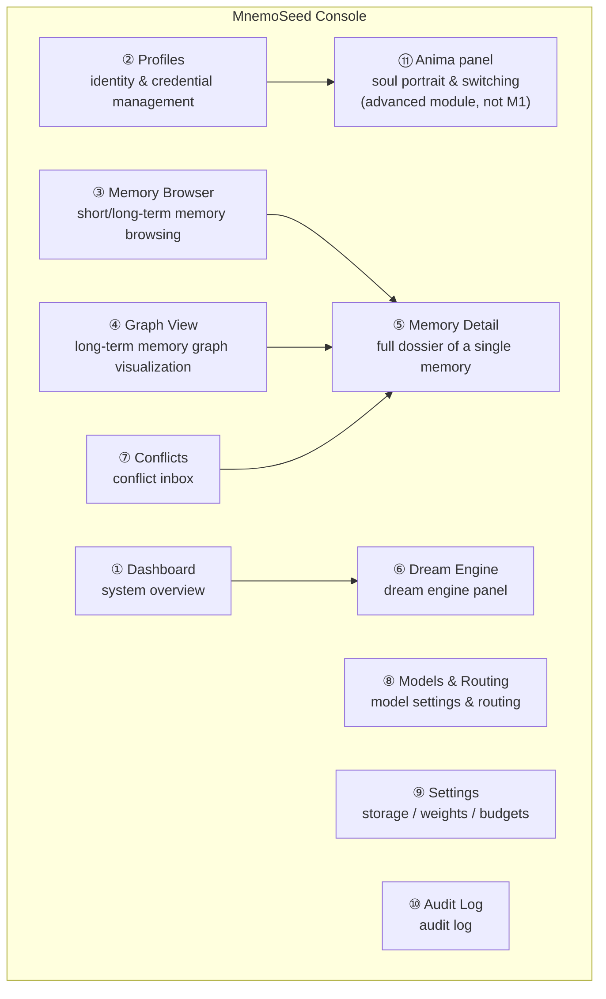
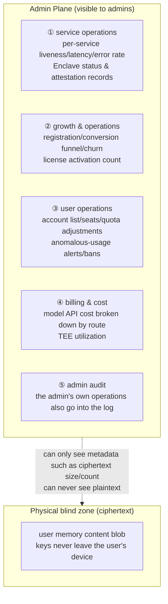

# 07 · Management Console (MnemoSeed Console)

> The local web management UI bundled with the daemon. The embodiment of the rights narrative: **you own, you control, you can forget** — all of it visible and tangible.
> It is also the review tool for the M1 "manual first, automate later" discipline: `dream --once` distillation quality should not be reviewed against JSON.

---

## 1. Positioning & Principles

- **Bundled with the daemon, zero extra install**: FastAPI directly hosts the static SPA (`http://localhost:7788/console`); `mnemoseed console` opens the browser with one click;
- **Local-first, no account**: listens on localhost only by default; remote access must be explicitly enabled + admin token;
- **The same frontend, direct-to-cloud in the future**: console is just a client of the daemon API — once cloud goes live, the same interface switches baseurl to manage cloud profiles, fully isomorphic with the login/baseurl identity model ([design/06](06-host-integration.md));
- **Read-oriented; every write leaves a trace**: browsing is free; modifying operations (delete memory, change weights, resolve conflicts, switch models) all go into the audit log.

## 2. Page Structure

### ① Dashboard — System Overview

- daemon health: storage driver, embedding status, current dream state-machine state (Idle/Accumulating/Dreaming…);
- real-time metrics: score pool level, watermark, pending-consolidation chunk count, needs_reconcile queue length, pending_consolidation count;
- token usage: today's / this week's dream tokens, embedding tokens, grouped by model, estimated cost;
- total registry of integrated contexts (host / agent → profile → token status — the graphical version of `mnemoseed status`).

### ② Profiles — Identity Management

- profile list (create / rename / archive);
- per profile: issued-token list (issue / revoke), bound agent manifest, memory-scale statistics (chunk count / node count / disk used);
- credential operations follow the layered disconnect semantics ([design/06](06-host-integration.md)): revoking a token ≠ deleting the profile; deletion is a separate confirm-twice verb;
- **Users sub-page**: account-layer management ([design/06 §2.6](06-host-integration.md)) — the open-source edition shows only the owner row, the "add user" button locked with the activation path noted (official cloud / commercial license); after license activation, multi-user management expands (invites / seats / disabling).

### ③ Memory Browser

- **Short-term memory (hippocampus)**: LanceDB chunk list, filterable by time / project / tool / emotion cue / entity; all stamp fields visible;
- **Long-term memory (cortex)**: triple/node list, filterable by node type (PREFERENCE/HABIT/EPISODE/SKILL_SEQUENCE/DECISION/ANIMA/INTENTION), Tier, decay_weight range;
- each row shows: content summary, decay_weight (with a decay-curve thumbnail), conflict/pending markers, recall hit count.

### ④ Graph View

- interactive graph rendering (Cytoscape.js or an equivalent library): node color = type, size = graph centrality, opacity = decay_weight (**a memory in the process of being forgotten is visibly fading** — the best demo of decay);
- edges = relations + co-occurrence edges (thickness = edge weight);
- filters: profile / node type / time window / Tier;
- clicking a node → opens the ⑤ Memory Detail side panel.

### ⑤ Memory Detail — Full Dossier of a Single Memory

Every memory has one "dossier page" exposing everything the system knows about it:

| Section | Content |
|---|---|
| Content | verbatim original / triple, dual-channel side-by-side (Fuzzy-Trace dual-track visualization) |
| Provenance | asserted_by / source / agent_id / session_id / asserted_at + **full history timeline** |
| Version chain | the version list from every Reconcile rewrite; **diff view** between any two versions |
| Full weights | current decay_weight + decay-curve projection (λ type), confidence, S-score breakdown (the three components arousal/novelty/causal), last_reinforced, reinforcement count |
| Usage | recall hit count, most recent hit time, co-occurrence neighbors top-N |
| Flags | conflict_flag / needs_reconcile / pending_consolidation / peripheral_gaps |
| Actions | forget_this / manual pin / manual decay adjustment (written to audit) |

### ⑥ Dream Engine Panel

- current state-machine state + score-pool level bar;
- **queue pending settlement**: the unconsolidated chunk list, the needs_reconcile flag list — the manual review entry point before `dream --once`;
- run history: each dream's turn_range, model used, tokens in/out, cost, number of triples written back (Tier 1 / Tier 3 split count), duration, whether it was interrupted;
- **distillation quality review**: the triples this dream produced, shown one by one in a diff view (raw chunk ↔ distillate), with one-click accept/reject/mark-as-hallucination;
- manual `dream --once` trigger button; automatic-trigger switch (off by default in M1);
- token usage trend chart + breakdown by model.

### ⑦ Conflicts — Conflict Inbox

- the flag_conflict queue: the contradictory pair shown side by side, each with its provenance, cues, decay_weight;
- in the UI, the user picks a Reconcile branch to handle: reinforce one / context-scoped coexistence (fill in cues to delimit) / invalidate one / keep pending;
- every resolution writes back to the version chain + the audit log — **reconciliation always leaves a trace**.

### ⑧ Models & Routing

- dream routing table: deep-sleep reflection model / short-increment model / offline track (Ollama, optional) → dropdown switching + live connectivity test button;
- embedding model settings & switching (switching triggers an index rebuild, with a cost warning);
- edge classifier (persistence judgment / contradiction judgment) model settings;
- per-model call volume & cost statistics.

### ⑨ Settings

- storage driver selection (presets: embedded / docker / custom + per-layer driver override; capability validation results shown);
- scoring weights w₁/w₂/w₃, decay λ (per memory type), top-k and token budgets, score pool threshold;
- every change takes effect immediately + goes to the audit log + is rollback-able (config versioned).

### ⑩ Audit Log

- the full read/write event stream: which agent (agent_id + session_id) wrote what, read what, changed what config, at what time;
- filterable by agent / profile / time — **"who touched my memory" is always traceable**.

### ⑪ Anima Panel (advanced module, not in the M1 launch)

The visualization and management UI for the soul model (for the model itself, see [09-anima-and-preferences](09-anima-and-preferences.md)):

- **trait radar chart**: a polygonal radar showing traits and weights — the number of axes is generated from the schema, not locked to six; vertices = trait mean, error bands/opacity = width (uncertainty must be visible, guarding against Barnum-style fabricated precision); manual fine-tuning supported (written to audit);
- **two-layer overlay display**: the core (immutable) solid line + the dye layer's current performance as a dashed line overlaid — the user sees at a glance how far "the born me" and "the me dyed by experience" differ;
- **plain-language creation**: a natural-language description ("a cautious but curious engineer") → the model quantifies it into a trait template, landed after user confirmation;
- **cross-profile management**: the anima list, linking/relinking to profiles; relinking clearly warns that it will trigger a dream-engine re-dye batch recomputation and requires confirmation;
- **drift_history timeline**: replay of personality & preference drift records ("the me of last year").

## 3. Technical Form

- the daemon's FastAPI mounts `/console` (static SPA build output) + `/api/v1/*` REST;
- frontend: a lightweight SPA (Svelte/Vue, to be decided after evaluation); graph rendering with a Cytoscape.js-class library;
- auth: implicit trust on localhost; non-localhost access requires an admin token (reusing the login model);
- M1 ships the read-only core first (Dashboard / Memory Browser / Dream panel / Conflicts); write operations and Graph View are completed in M2 — because M1's `dream --once` review discipline cannot wait for M2.

## 4. Cloud Admin Plane (finalized by Jinhao, 2026-08-08)

The official cloud adds one more layer, the **system administrator** (the operator themselves), a fully separate interface from the user console (`admin.` subdomain + separate admin credentials, outside the user account system).

**Red line (architectural, not disciplinary)**: the admin sees **all operational data; memory plaintext is physically invisible**. Cloud memory is a BYOK E2EE ciphertext blob — not "administrators are forbidden to look", but "the keys are on the user's device; the admin couldn't decrypt them even if they wanted to". This is the technical fulfillment of the "even our admins cannot see plaintext" promise, and no requirement may open a loophole in it.

| Visible (operational metadata) | Invisible (architecturally guaranteed) |
|---|---|
| accounts, profile count, quotas, usage counts, token consumption, cost, service health | memory content, conversation chunks, graph-node plaintext |
| ciphertext blob size/count/timestamps (needed for operations) | the blob content itself |

- customer-support scenario: when a user reports an issue, the admin can only look at metadata and logs; under no circumstance is there a "view the memory for the user" feature — if a user wants to show us, they must `memory.export` themselves and send it over proactively;
- admin accounts: separate strong authentication (hardware key / TOTP mandatory), every operation goes into an immutable audit log — **those who administer the system are themselves recorded by the system**.
