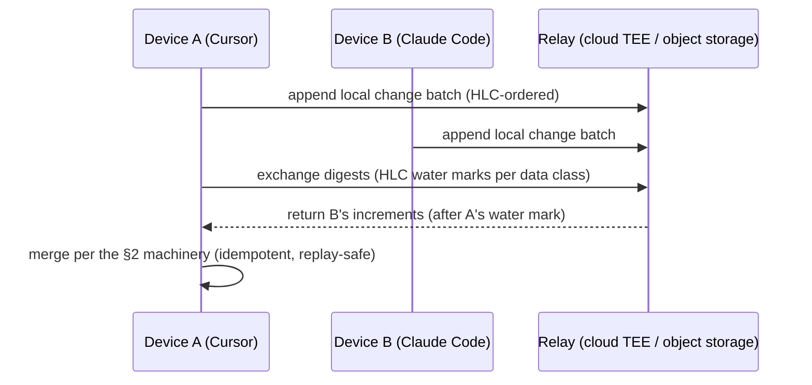

# 08 · Multi-Device Sync & Conflict Merge

> Corresponding PRD: the prerequisite theory layer of [PRD-05 (cloud sync)](../prd/PRD-05-cloud-tee.md).
> Premise: the user accepts that sync has latency (eventual consistency) and does not require second-level losslessness; but **conflict-merge semantics must be a first-class capability of the system**, not an after-the-fact patch.

---

## 1. Design Rationale

MnemoSeed's multi-device scenario (the same profile written to simultaneously from Cursor / Claude Code / CLI) is fundamentally a **multi-replica replication problem**. Two paths:

1. **Central coordination** (all writes serialized through the cloud): simple, but violates local-first — offline means crippled, and the cloud becomes a single point of trust;
2. **Eventual consistency + explicit merge**: each replica is writable, with convergence guaranteed by the data structure. More engineering, but consistent with the "local-first + zero-knowledge" architectural personality.

We choose the second. Fortunately, the entire database has been append-only since M0, which dissolves most of the merge problem automatically — the inventory in this document will show that only a small slice of data truly needs "merge semantics".

**Narrowing the concurrency surface**: multiple hosts on the same device (Claude Code / Codex / Cursor coexisting) do not produce concurrent writes — they are all serialized through the local daemon; cloud deployment merely moves the daemon to a cloud host, and writes stay serialized. True concurrent writes therefore happen only in the **multi-device / multi-daemon** scenario (each working offline, then reconnecting). This document's CRDT machinery exists precisely to back the worst case: in the common case (one daemon serving several hosts) the architecture is naturally serial and the merge logic degrades to a side-effect-free no-op; only when two devices have each accumulated offline history does the §2 machinery actually trigger.

**Theoretical foundation**:
- **CRDT** (Conflict-free Replicated Data Types, Shapiro 2011): a family of replicated data types that converge without coordination;
- **CALM theorem** (Consistency As Logical Monotonicity): **monotonic logic converges without coordination; only the non-monotonic parts need coordination or explicit conflict handling**. Every mechanism design in this document is one monotonicity inventory;
- **HLC** (Hybrid Logical Clock, Kulkarni 2014): a mixed timestamp of physical clock + logical counter, giving cross-device events a causal order — more space-efficient than a vector clock, more reliable than a bare wall clock.

---

## 2. Data Monotonicity Inventory: Four Data Classes, Four Mechanisms

| Data | Write characteristics | Merge mechanism | True conflict? |
|---|---|---|---|
| Conversation chunks (hippocampus chunks) | append-only, immutable, stamped | **G-Set union** + HLC ordering | None |
| Score pool balance / watermark | counter, monotonic water level | **PN-Counter summation** / **max merge** | None (slight over-accumulation allowed) |
| Graph triples (cortex) | version-chain append-only | **content-hash convergence** + Reconcile making it explicit | **Yes — semantic conflict** |
| Deletion (privacy erasure) | the only "non-monotonic" operation | **Tombstone OR-Set** | Yes — needs dedicated machinery |

### 2.1 Conversation Chunks: G-Set Union

Chunks only grow and never change; the merge is simply a union deduplicated by `chunk_id`. The HLC timestamp goes into the stamp (`asserted_at` upgraded to HLC), and retrieval and replay are causally ordered by HLC — "who came first" across devices has a deterministic answer, relying on no single device's clock being accurate.

### 2.2 Score Pool: PN-Counter

The balance is split into per-device components and merged by summation; the watermark monotonically increases, taking the max. The semantics allow "accumulating a few extra points" — the score pool is only a dream trigger and carries no facts, so one extra dream trigger is harmless (idempotence is guaranteed downstream).

### 2.3 Graph Triples: Content-Hash Convergence + Making Contradictions Explicit

Two cards already in hand:

1. **Deterministic node_id ([PRD-02 T4](../prd/PRD-02-dream-engine.md), already landed)**: a triple's node_id = `sha1(profile, subject, predicate, object, polarity)`. Two devices each dreaming out the same fact during consolidation → computing the same id → **automatically converging into one node, zero coordination**. This is a by-product of the idempotent design, and it happens to be exactly CRDT convergence.
2. **Real contradictions are not merged; they are made explicit**: device A learns "likes tabs", device B learns "likes spaces" — the sync layer **never silently picks a side**. Both are stored and go through Stage ④ Reconcile's established flow: first use cues to delimit scope (different projects/situations may both be right); if the scopes cannot be delimited, the pair coexists with `flag_conflict` and retrieval returns the pair together (see [01 §4](01-memory-pipeline.md)). **This is our differentiation, not a compromise: Mem0-style systems silently pick a side; we treat contradictions as first-class citizens.**

### 2.4 Deletion: Tombstone OR-Set (the only new infrastructure in this design)

The whole database only lets things in, never out (decay is a soft settling, not deletion), so the system has had no tombstone problem until now — **until the user exercises the deletion right** (privacy compliance). Machinery:

- deletion produces a tombstone record (OR-Set semantics: when add and remove are concurrent, the remove wins);
- a tombstone must **outlive the deleted data on every replica**, otherwise the data resurrects when an old replica resyncs;
- the tombstone itself carries HLC and provenance and participates in anti-entropy sync; once the replicas confirm the whole cluster has received it, it can be garbage-collected (the GC window is an operational parameter).

---

## 3. Sync Protocol: Anti-entropy

**Rules**:
1. The transport layer is an **append-only change log** — replay-safe; resuming after a disconnect is simply "keep reading from the water mark";
2. The merge is **idempotent throughout**: replaying the same batch N times yields the same result (G-Set union, content-hash dedup, and max water mark are naturally idempotent);
3. The cloud relay is just a **dumb pipe** — it neither holds merge logic nor decrypts content (the zero-knowledge commitment is unchanged, see [04](04-isolation-and-privacy.md));
4. Low-frequency sync (minute-level / event-triggered) suffices; no latency metric is promised to the user.

---

## 4. Consolidation Lease (Dream Lease) — a performance optimization, not a correctness dependency

Multiple devices may dream over the same batch of chunks repeatedly, wasting compute. Introduce a per-profile consolidation lease: only the lease-holding end runs the dream engine; the lease carries a TTL and can be renewed.

**Key property: a lease failure (split-brain, two masters) does not produce errors.** Both ends dreaming simultaneously → duplicate distillates are folded into the same node by content-hash; real contradictions go to `flag_conflict`. The lease only saves money; correctness is entirely guaranteed by §2. This is a direct payoff of CALM: **the coordination mechanism is removed from the correctness path and downgraded to a pure performance optimization.**

---

## 5. Threats & Boundaries

| Risk | Mitigation |
|---|---|
| A malicious replica injects forged memories | provenance confidence adjudication ([01 §6](01-memory-pipeline.md)): a low-confidence source cannot knock out a high-confidence fact, only trigger flag_conflict |
| Large-scale replay after reconnecting from weeks offline | idempotent merge + water-mark resume; during replay, the retrieval side down-weights unconsolidated chunks per [02 §9](02-dream-engine.md) Freshness Guard |
| Severe clock drift | HLC's tolerance for physical-clock skew is built in (the logical component covers the causal order) |
| Data resurrects from an old replica after the tombstone was GC'd | GC window ≫ maximum expected offline duration; resurrected data is discoverable through provenance audit and can be deleted again |

**Explicitly not done**: second-level real-time sync, strongly consistent reads/writes, cross-profile sync (a profile is an isolation boundary, D5).

---

## 6. Interface with the Existing Design

- **PRD-02** ([PRD-02-dream-engine](../prd/PRD-02-dream-engine.md)): the idempotence/content-hash of dream write-back is the implementation basis of §2.3 convergence (already landed);
- **PRD-04 (Reconcile/Decay)** ([PRD-04-decay-reconcile](../prd/PRD-04-decay-reconcile.md)): the explicit adjudication of cross-device contradictions happens at the reconciliation layer, not the sync layer;
- **PRD-05** ([PRD-05-cloud-tee](../prd/PRD-05-cloud-tee.md)): the relay's deployment form, billing, and key exchange; the sync protocol only defines semantics;
- **PRD-08 (M0)** ([PRD-08-m0-foundation](../prd/PRD-08-m0-foundation.md)): upgrading the stamp's `asserted_at` to HLC is a schema change and must be frozen before M2.
