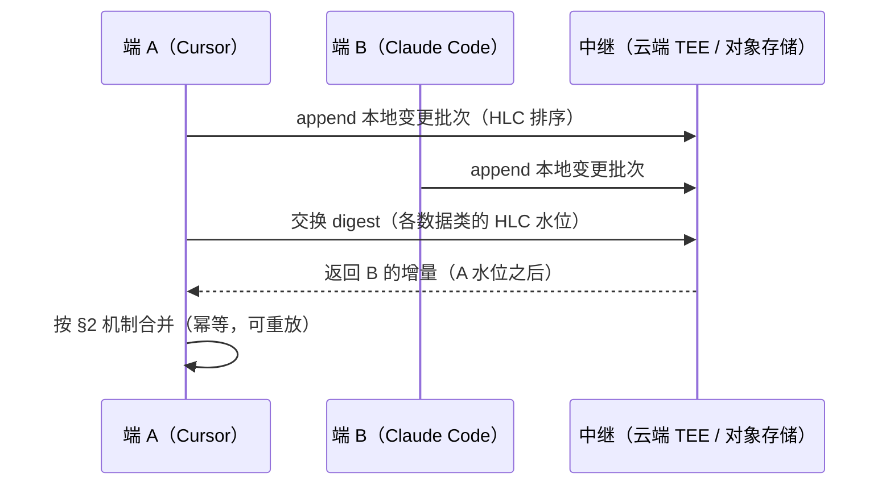

# 08 · 多端同步与冲突合并（Sync & Conflict Merge）

> 对应 PRD：PRD-05（云端同步）的前置理论层。
> 前提：用户接受同步有延迟（最终一致），不要求秒级无损；但**冲突合并语义必须是系统的一等能力**，不是事后补丁。

---

## 1. 设计原因

MnemoSeed 的多端场景（同一 profile 在 Cursor / Claude Code / CLI 同时写入）本质是**多副本复制问题**。两条路：

1. **中心协调**（所有写入经云端串行化）：简单，但违背 local-first——离线即残废，且云端成为单点信任；
2. **最终一致 + 显式合并**：副本各自可写，靠数据结构保证收敛。工程量大，但和"本地优先 + 零知识"的架构人格一致。

选第二条。幸运的是：M0 起全库就是 append-only，这让合并问题大部分自动消解——本文档的盘点会证明，真正需要"合并语义"的只有一小撮数据。

**理论基座**：
- **CRDT**（Conflict-free Replicated Data Types, Shapiro 2011）：无需协调即可收敛的复制数据类型族；
- **CALM 定理**（Consistency As Logical Monotonicity）：**单调逻辑无需协调即可收敛；只有非单调部分需要协调或显式冲突处理**。本文档的全部机制设计就是一次单调性盘点；
- **HLC**（Hybrid Logical Clock, Kulkarni 2014）：物理时钟 + 逻辑计数器的混合时间戳，给跨端事件定因果序，比 vector clock 省空间、比纯墙钟可靠。

---

## 2. 数据单调性盘点：四类数据，四种机制

| 数据 | 写入特征 | 合并机制 | 真冲突？ |
|---|---|---|---|
| 对话分片（海马体 chunks） | append-only、不可变、带钢印 | **G-Set 并集** + HLC 排序 | 无 |
| 积分池余额 / watermark | 计数器、单调水位 | **PN-Counter 求和** / **max 合并** | 无（允许轻微多积） |
| 图谱三元组（皮层） | 版本链 append-only | **content-hash 收敛** + Reconcile 显性化 | **有——语义冲突** |
| 删除（隐私擦除） | 唯一的"非单调"操作 | **Tombstone OR-Set** | 有——需要专门机制 |

### 2.1 对话分片：G-Set 并集

chunk 只增不改，合并就是按 `chunk_id` 去重的并集。HLC 时间戳进钢印（`asserted_at` 升级为 HLC），检索与回放按 HLC 定因果序——跨端"谁先谁后"有确定性答案，不依赖任何单端时钟准确。

### 2.2 积分池：PN-Counter

余额拆成 per-device 分量，合并求和；watermark 单调递增取 max。语义允许"稍微多积几分"——积分池只是梦境触发器，不承载事实，多触发一次梦境无害（幂等由下游保证）。

### 2.3 图谱三元组：content-hash 收敛 + 矛盾显性化

两张已在手里的牌：

1. **确定性 node_id（PRD-02 T4 已落地）**：三元组的 node_id = `sha1(profile, subject, predicate, object, polarity)`。两台设备各自做梦提炼出同一事实 → 算出同一 id → **自动收敛为一个节点，零协调**。这是幂等设计的副产品，恰好就是 CRDT 收敛性。
2. **真矛盾不合并，显性化**：A 端学到"喜欢 tabs"、B 端学到"喜欢 spaces"——同步层**绝不擅自选边**。两条都入库，走 Stage ④ Reconcile 的既定流程：先用 cues 划作用域（不同项目/场景可能都对），划不开则 `flag_conflict` 成对共存、检索成对返回（见 [01 §4](01-记忆管线五阶段.md)）。**这是我们的差异化而非妥协：Mem0 式系统沉默选边，我们把矛盾当一等公民。**

### 2.4 删除：Tombstone OR-Set（本方案唯一的新基建）

全库只进不出（衰减是软沉底，不是删除），所以系统迄今没有 tombstone 问题——**直到用户行使删除权**（隐私合规）。机制：

- 删除产生 tombstone 记录（OR-Set 语义：add 与 remove 并发时 remove 胜出）；
- tombstone 必须在所有副本上**比被删数据活得更久**，否则旧副本重新同步时数据复活；
- tombstone 本身携带 HLC 与 provenance，参与反熵同步；副本确认全集群收到后可垃圾回收（GC 窗口是运维参数）。

---

## 3. 同步协议：反熵（Anti-entropy）

**规则**：
1. 传输层是 **append-only 变更日志**——重放安全，断线续传就是"从水位继续读"；
2. 合并全程**幂等**：同一批次重放 N 次结果不变（G-Set 并集、content-hash 去重、max 水位天然幂等）；
3. 云端中继只是**哑管道**——不掌握合并逻辑，不解密内容（零知识承诺不变，见 [04](04-隔离解耦与隐私.md)）；
4. 低频同步（分钟级/事件触发）即可，不向用户承诺延迟指标。

---

## 4. 巩固租约（Dream Lease）——性能优化，非正确性依赖

多台设备可能对同一批 chunk 重复做梦，浪费算力。引入 per-profile 巩固租约：持约端才跑梦境引擎，租约带 TTL、可续约。

**关键性质：租约失效（脑裂双主）不出错。** 两端同时做梦 → 重复提炼物被 content-hash 折叠为同一节点；真矛盾进 `flag_conflict`。租约只是省钱，正确性完全由 §2 保证。这是 CALM 的直接收益：**协调机制从正确性路径上摘除，降级为纯性能优化。**

---

## 5. 威胁与边界

| 风险 | 缓解 |
|---|---|
| 恶意副本注入伪造记忆 | provenance 置信度裁决（[01 §6](01-记忆管线五阶段.md)）：低置信来源无法顶掉高置信事实，只能触发 flag_conflict |
| 离线数周后重连的大批量重放 | 合并幂等 + 水位续传；重放期间检索侧按 [02 §9](02-梦境引擎.md) Freshness Guard 降权未巩固分片 |
| 时钟严重漂移 | HLC 对物理钟偏差的容忍内建（逻辑分量兜底因果序） |
| tombstone 被 GC 后旧副本复活数据 | GC 窗口 ≫ 最大预期离线时长；复活的数据经 provenance 审计可被发现并再删除 |

**明确不做**：秒级实时同步、强一致读写、跨 profile 同步（profile 是隔离边界，D5）。

---

## 6. 与现有设计的接口

- **PRD-02**：梦境写回的幂等/content-hash 是 §2.3 收敛性的实现基础（已落地）；
- **PRD-04（Reconcile/Decay）**：跨端矛盾的显性化裁决发生在调和层，不在同步层；
- **PRD-05**：云端 TEE 中继的部署形态、计费与密钥交换，同步协议只定义语义；
- **PRD-08（M0）**：钢印 `asserted_at` 升级 HLC 是 schema 变更，需在 M2 前冻结。
