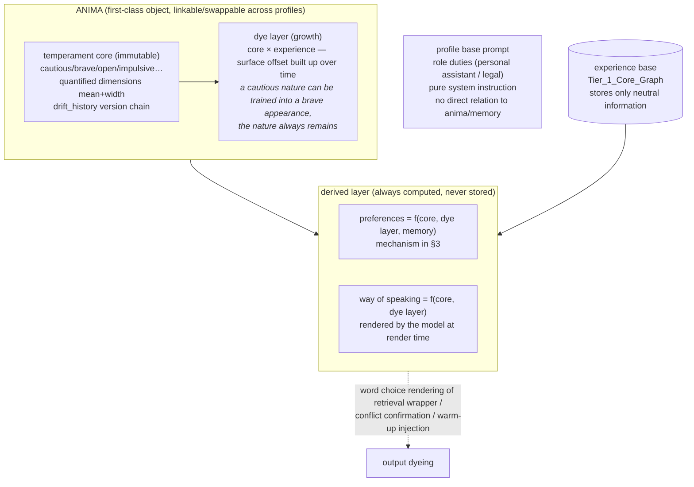

# 09 · Anima Soul Model & Preference Dynamics (Advanced Module)

> **Module positioning: an advanced feature, outside the M1 launch scope.** The base pipeline (the capture-neutrality red line, De-biasing stripping, the retrieval wrapper) runs without this module; when anima is absent the system degrades to a "neutral assistant without dyeing", and every interface is designed on the premise that anima is optional.
> The naming takes Jung's original meaning: persona is the "mask" (social shell); anima is the "inner soul". We want the latter.
> Theoretical skeleton: McAdams & Pals (2006) three-layer personality architecture + Cloninger's temperament/character two-component model + Markus & Wurf (1987) working self-concept.

---

## 1. Design Rationale

Users give different Agent bodies different System Prompts. If tone and persona phrasing settle into memory, switching souls pollutes it; and if "ways of speaking" and "inclinations for handling things" are written as preset templates, they turn stiff and distorted — real language style is the natural expression of character, not a set of clauses.

The core, clean-cut solution: **the memory base stores only neutral facts; anything "who it resembles" either belongs to the anima object or is a derivation at render time — it is never stored in the database.**

---

## 2. Anima Structure: Three Layers as One



- **The temperament core**: inborn, nearly unchanging. Plain-language creation ("a cautious but curious engineer") → the model understands it and quantifies it into trait dimensions (mean + width), producing an anima template; **the core cannot be rewritten by events** (Cloninger: temperament is invariant), with only a very slow life-stage drift record kept;
- **The dye layer**: acquired, pliable (Cloninger: character is pliable). Long-term accumulation of experience lets a cautious person display a brave **appearance**; the core does not move. The dye layer travels with the anima instance;
- **Preferences and way of speaking**: always derivations, never independently stored — this is the key to "switching anima without conflict" (see §4);
- **Role duties ≠ anima**: "you are now legal counsel" is the profile's base prompt, unrelated to the soul; the two never reference each other.

---

## 3. Preference Dynamics: Preference = Anima Core × Experience

> A preference is not a static string; it is a living structure that grows from a personality's base tones, is shaped by events, and drifts with one's life.

**Formalization**: a preference is a Bayesian posterior — the anima core traits are the prior (with width/uncertainty), each relevant event is the likelihood, and the current preference is the posterior. With zero memory, posterior ≈ prior, i.e. "at the start, preferences largely depend on the personality's base tones".

### Three Evidence Pathways (each with its weighted neuroscience basis)

| Pathway | Theory | Weight |
|---|---|---|
| **Behavioral evidence** (the user chooses pnpm for the 20th time) | Self-perception theory (Bem 1972): people infer preferences from their own behavior; vmPFC as a common value currency + dopamine reward prediction error (Schultz; Levy & Glimcher 2011) | Highest |
| **Emotional co-occurrence** (always pairing vim with late-night deadline crunches) | Evaluative conditioning (De Houwer 2007): neutral objects repeatedly paired with emotional events take on emotional coloring | Medium (multiplied by emotional intensity) |
| **Mere exposure** (repeated contact in itself) | Mere exposure (Zajonc 1968), inverting past a point | Low, with a saturation cap |
| **Stated evidence** ("I like pnpm") | Intentional encoding (Craik & Lockhart 1972 levels of processing: intentional encoding beats incidental) | High (but one-shot) |

### Update Rule

```text
Δvalence = learning_rate × evidence_strength × type_weight
learning_rate ∝ prior_width   (Kalman gain: the wider the uncertainty, the faster the learning)
```

**Pearce-Hall / Kalman-style associative learning**: a newly formed preference (wide prior) can be rewritten by a single strong event; a decade-old preference (narrow posterior) needs abundant counter-evidence before it loosens. This prevents old preferences from being knocked over by a single accident, and prevents new preferences from rigidly refusing to learn.

### Drift Semantics (preferences do not go through the contradiction dichotomy)

Facts use the four Reconcile branches; **"old vs new contradiction" does not apply to preferences** — "last year I liked remote work, now I don't" are both true; they are two time-points of a historical self. Old preferences are never deleted; they enter the version chain and become "the me then in effect" (`as_of` queries natively support "what did I like this time last year"). Macroscopic drift is anchored to life-stage events (changing jobs / moving — directional drift from social investment theory, Roberts 2005) and undergoes directional re-estimation by the dream engine.

### Interfaces with the Other Stages

- **Capture**: preferences do not participate in capture scoring (design/01 §1 red line); but captured events enter the preference-update queue as evidence;
- **Consolidate**: the dream engine batch-applies preference updates, rewrites `idiographic_notes`, and performs the anima re-dye (§4);
- **Retrieve**: when preference injection enters the retrieval wrapper, it carries `valence + width + pointer to the most recent updating event` — the model knows not only "what is liked" but also "how sure, and why it thinks so";
- **Decay**: `λ_preference` already exists; anima core traits use a λ approaching zero (nearly invariant, but the drift_history version chain is kept).

---

## 4. Multiple Selves & Lossless Switching

Humans naturally have multiple selves, activated by situation (working self-concept; frame switching, Hong et al. 2000) — "a brave salesperson moves to engineering and switches to a cautious soul" is an everyday human occurrence, not an anomaly.

**Switching semantics**:
1. Anima is a first-class object: core templates are reusable; instances can be linked/relinked across profiles;
2. **Switching anima does not touch memory** (switch the lens, not the film); the dye layer stays on the old anima instance and is still there when you switch back;
3. After a new anima takes office, the dream engine performs a **re-dye**: it re-digests the profile's existing memories with the new core and grows its own dye layer and preferences (Bartlett's reconstructive memory: someone who changes identity does not rewrite the past; they re-interpret the past with a new self-schema);
4. Every preference/dye-layer update records provenance: the anima then in office — "the taste I had back when I was a salesperson" is always queryable.

---

## 5. Two Iron Rules Against Self-Lock

1. **Anima does not participate in capture scoring** (design/01 §1 red line) — the soul does not audit its own experience;
2. **The dye layer accepts only the user's raw input** (design/02 §5) — output rendered by the agent is never taken as evidence; the agent's output has already been dyed by anima, so adopting it would let the soul vote on its own dyeing.

---

## 6. Graph Schema Interface (a subset of design/03 §3)

- **ANIMA node**: `core_traits` = quantified trait dimensions (per-dimension mean + width, immutable core, drift_history keeping the version chain); `dye_layer` = the acquired dye layer; `idiographic_notes` = a plaintext personality summary (periodically rewritten by the dream engine from dimensions + evidence, used by warm-up injection).
- **PREFERENCE extended fields**: `valence` (the liking↔disliking continuum), `prior_width` (uncertainty, which sets the learning rate), `trait_anchor` (source of the prior, anchoring to an ANIMA dimension), `evidence_chain` (update history: event pointer + type + the anima then in office). Preference drift goes through the version chain and is never deleted (historical selves).

---

## 7. Visualization & Management (Hexagonal Radar)

In the Console, anima is presented as a **trait radar chart**: each axis is one trait dimension, vertex position = mean, error bands on the axis = width (uncertainty). Rules:

- The axis count is determined by the schema; **the UI does not lock to six axes** (Big Five is five axes; adding a temperament dimension makes six; extensible);
- The model-generated quantification of a plain-language description is **interpretation, not psychometry** — width must be visible (guarding against Barnum-effect-style fabricated precision, Forer 1949), and manual user fine-tuning is allowed;
- Dye-layer offsets are shown as an overlay (solid core line + dashed current-performance line); drift history plays back on a timeline;
- Switching anima = switching the radar card; historical instances can be reviewed.

---

## 8. Landing Order

| Stage | Scope |
|---|---|
| M1 (not done) | anima-absent operation: De-biasing stripping proceeds as usual (an engine red line, existing independently of anima); retrieval wrapper is undyed |
| Advanced module launch | ANIMA/PREFERENCE extended fields enabled + plain-language creation + dye-layer growth + dyed warm-up injection |
| Later | re-dye batch processing, Console radar panel (PRD-07 FR-7.10), cross-profile relinking |
