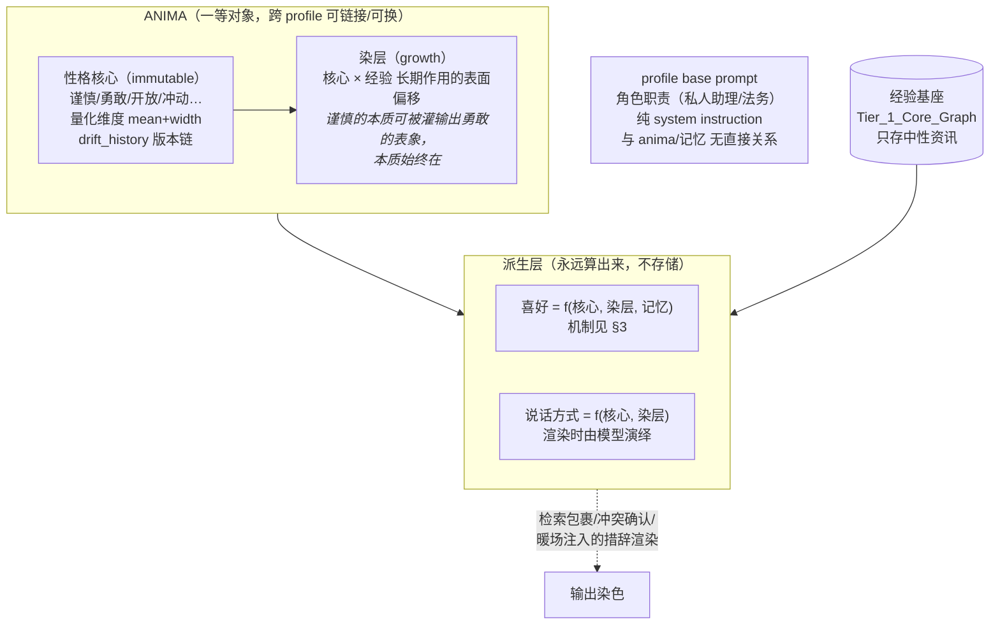

# 09 · Anima 灵魂模型与偏好动力学（进阶模块）

> **模块定位：进阶功能，不在 M1 首发范围。** 基础管线（捕获中性红线、De-biasing 剥除、检索包裹）不依赖本模块即可运转；anima 缺席时系统退化为"无染色的中性助手"，所有接口以 anima 可选为前提设计。
> 命名取荣格原义：persona 是"面具"（社交外壳），anima 才是"内在灵魂"。我们要的是后者。
> 理论骨架：McAdams & Pals (2006) 三层人格架构 + Cloninger 气质/性格双成分 + Markus & Wurf (1987) working self-concept。

---

## 1. 设计原因

用户给不同 Agent 躯体配不同 System Prompt。语气与人设词若沉淀进记忆，换灵魂即污染；而"说话方式""处事倾向"若写成预置模板，又僵硬失真——真实的语言风格是性格的自然流露，不是条文。

解法的核心一刀切法：**记忆基座只存中性事实；一切"像谁"的东西要么属于 anima 对象，要么是渲染时的派生物，永不入库。**

---

## 2. Anima 结构：三层一体



- **性格核心**：天生、几乎不变。白话创建（"一个谨慎但好奇心重的工程师"）→ 模型理解并量化为特质维度（mean + width），生成 anima 模板；**核心不可被事件改写**（Cloninger：temperament 不变），只保留极慢的人生阶段漂移记录；
- **染层**：后天可塑（Cloninger：character 可塑）。长期经验灌输让谨慎者表现出勇敢的**表象**，核心不动；染层跟着 anima 实例走；
- **喜好与说话方式**：永远是派生物，不独立存储——这是"换 anima 无冲突"的关键（见 §4）；
- **角色职责 ≠ anima**："你现在是法务"是 profile 的 base prompt，与灵魂无关，互不引用。

---

## 3. 偏好动力学：喜好 = anima 核心 × 经验

> 喜好不是静态字符串，是从人格底色长出、被事件塑形、随人生漂移的活体结构。

**形式化**：偏好 = 贝叶斯后验——anima 核心特质是先验（prior，含宽度/不确定性），每个相关事件是证据（likelihood），当前偏好是后验。零记忆时 posterior ≈ prior，即"刚开始喜好很大程度取决于人格底色"。

### 三条证据通路（各有权重的神经依据）

| 通路 | 理论 | 权重 |
|---|---|---|
| **行为证据**（用户第 20 次选择 pnpm） | 自我知觉理论（Bem 1972）：人从自己的行为反推偏好；vmPFC 共同价值货币 + 多巴胺奖赏预测误差（Schultz；Levy & Glimcher 2011） | 最高 |
| **情绪共现**（用 vim 总配深夜赶死线） | 评价性条件作用（De Houwer 2007）：与情绪事件反复配对的中性对象被染上情绪颜色 | 中（乘情绪强度） |
| **单纯曝光**（反复接触本身） | Mere exposure（Zajonc 1968），过度则反转 | 低，有饱和上限 |
| **陈述证据**（"我喜欢 pnpm"） | 明示意图（Craik & Lockhart 1972 加工层次：意向编码优于偶然编码） | 高（但一次性） |

### 更新规则

```text
Δvalence = learning_rate × evidence_strength × type_weight
learning_rate ∝ prior_width   （Kalman gain：不确定性越高学得越快）
```

**Pearce-Hall / Kalman 式联想学习**：新形成的偏好（宽 prior）一个强事件即可改写；十年陈的偏好（窄 posterior）需要大量反证才松动。防旧偏好被单次意外冲垮，防新偏好僵死不学。

### 漂移语义（偏好不走矛盾二分）

事实用 Reconcile 四分支；**偏好不适用"新旧矛盾"**——"我去年喜欢远程办公，现在不喜欢"两条都为真，是历史自我的两个时点。旧偏好永不删除，进版本链成为"当时生效的我"（`as_of` 查询天然支持"我去年这时候喜欢什么"）。宏观漂移锚在人生阶段事件（换工作/搬家——社会投资理论 Roberts 2005 的定向漂移）上由梦境引擎做定向重估。

### 与其他阶段的接口

- **Capture**：偏好不参与捕获评分（design/01 §1 红线）；但事件被捕获后作为证据进入偏好更新队列；
- **Consolidate**：梦境引擎批量应用偏好更新、重写 `idiographic_notes`、执行 anima 重染色（§4）；
- **Retrieve**：偏好注入检索包裹时携带 `valence + width + 最近更新事件指针`——模型不仅知道"喜欢什么"，还知道"多确定、为什么这么认为"；
- **Decay**：`λ_preference` 已有；anima 核心特质用趋零 λ（几乎不变，但保留 drift_history 版本链）。

---

## 4. 多自我与无损切换

人本来就有多个自我、按情境激活（working self-concept；frame switching, Hong et al. 2000）——"勇敢的销售转岗做工程师，换个谨慎的灵魂"是人的日常，不是异常。

**切换语义**：
1. anima 是一等对象：核心模板可复用，实例跨 profile 链接/换绑；
2. **换 anima 不动记忆**（换镜头不换胶片）；染层留在旧 anima 实例上，换回来还在；
3. 新 anima 上任后由梦境引擎**重染色**（re-dye）：用新核心重新消化 profile 既有记忆，长出它自己的染层与喜好（Bartlett 重构记忆：换身份的人不重写过去，用新自我图式重新解读过去）；
4. 每条偏好/染层更新记 provenance：当时在任的 anima——"我当销售那阵子的口味"永远可查。

---

## 5. 防自锁两条铁律

1. **anima 不参与捕获评分**（design/01 §1 红线）——灵魂不审查自己的经验；
2. **染层只认用户原始输入**（design/02 §5）——不采纳 agent 渲染过的输出当证据；agent 输出已被 anima 渲染过，采纳它等于让灵魂给自己的染色投票。

---

## 6. 图谱 Schema 接口（design/03 §3 的子集）

- **ANIMA 节点**：`core_traits` = 量化特质维度（每维 mean + width，immutable 核心，drift_history 记版本链）；`dye_layer` = 后天染层；`idiographic_notes` = 明文人格摘要（由梦境引擎定期从维度+证据重写，暖场注入用）。
- **PREFERENCE 扩展字段**：`valence`（喜欢↔厌恶连续值）、`prior_width`（不确定性，决定学习率）、`trait_anchor`（先验来源，挂到 ANIMA 维度）、`evidence_chain`（更新历史：事件指针 + 类型 + 当时在任的 anima）。偏好漂移走版本链，永不删除（历史自我）。

---

## 7. 可视化与管理（六边形雷达）

Console 中 anima 以**特质雷达图**呈现：每轴一个特质维度，顶点位置 = mean，轴上误差带 = width（不确定性）。规则：

- 轴数由 schema 决定，**UI 不锁死六轴**（Big Five 是五轴，加气质维度即六轴，可扩展）；
- 白话描述 → 模型生成的量化是**解读不是心理测量**——宽度必须可视（防 Barnum 效应式伪造精确，Forer 1949），允许用户手动微调；
- 染层偏移以叠加层显示（核心实线 + 当前表现虚线），漂移历史走时间轴回放；
- 换 anima = 切换雷达卡片，历史实例可回看。

---

## 8. 落地顺序

| 阶段 | 范围 |
|---|---|
| M1（不做） | anima 缺席运行：De-biasing 剥除照常（引擎红线，独立于 anima 存在），检索包裹无染色 |
| 进阶模块首发 | ANIMA/PREFERENCE 扩展字段启用 + 白话创建 + 染层生长 + 暖场注入染色 |
| 后续 | re-dye 批处理、Console 雷达面板（PRD-07 FR-7.10）、跨 profile 换绑 |
