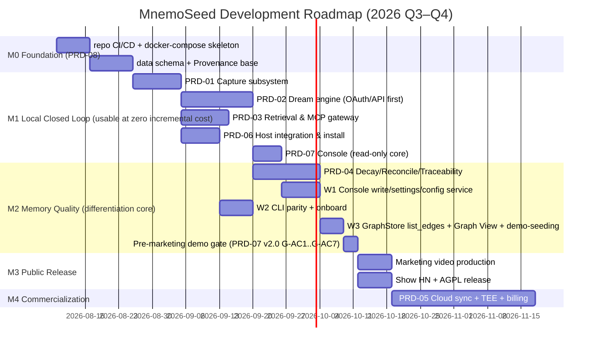

# PRD-00 · Roadmap & Milestones

> Version: v1.1 · 2026-08-13
> v1.1: adds the pre-marketing demo gate (console-complete PRD-07 v2.0 + CLI parity + onboard) and the W1/W2/W3 work streams to the gantt and milestone table.
> All PRDs follow a unified template: Goals / Scope / Functional Requirements (FR) / Non-Functional Requirements (NFR) / Acceptance Criteria (AC) / Task Breakdown / Dependencies.

## Milestone Overview

| Milestone | Exit Criteria |
|---|---|
| M0 | `docker compose up` brings up the full stack with one command, all health checks green; **the four storage interfaces (VectorStore/GraphStore/MetaStore/Embedder) fully defined, each with an embedded default + a Postgres-family second driver** (proving interface portability; capability-flag validation in effect); embedded single-process mode runs. embedded default stack (decided 2026-08-08): **LanceDB vector + SQLite-Graph/SQLite-Meta + bge-m3 ONNX embeddings + uv distribution** (gemma_local and chroma_embedded kept as fallback drivers) |
| M1 | One-command install (TTFM < 3 min) wired into Tier 1 hosts: Claude Code + Cursor (P0) / Codex CLI + Gemini CLI (P1); per-turn deterministic capture and injection active on hook-based hosts (PRD-06 AC-6/7); profile credential model active (login/link/whoami); after switching models, a new session can recall last week's preferences; dreaming at zero incremental cost (OAuth reuses an existing subscription or bring-your-own API key; no local hardware barrier); read-only console core shipped to support dream --once review |
| M2 | After a fact changes, retrieval returns the current version; unused memories automatically sink after 30 days; any memory can answer "who, when, where from" |
| Demo Gate | **Pre-marketing demo gate** (PRD-07 v2.0 gate ACs G-AC1..G-AC7): console-complete (read+write pages ①–⑩) + CLI parity + `mnemoseed onboard` all-green. **No marketing video production starts until this gate passes.** |
| M3 | GitHub ≥ 1000 stars (week-one target) |
| M4 | Cloud launches, with 3 Profiles + E2EE sync + dream allowance |

## Pre-Marketing Demo Gate & Sequencing (v1.1)

**Gate statement**: console-complete ([PRD-07 v2.0](PRD-07-console.md), read+write pages ①–⑩) + CLI parity (console-equivalent read/write operations available from the CLI) + `mnemoseed onboard` together form the **pre-marketing demo gate**. The gate's acceptance criteria are PRD-07 v2.0's `G-AC1..G-AC7` (defined in PRD-07; not restated here). Marketing video production is blocked until the gate's ACs pass — the demo the video shows must be a real, AC-verified product.

**Sequencing**:
- **W1** (console write/settings/config service) and **W2** (CLI parity + onboard) run **in parallel** with PRD-04 (decay/reconcile);
- **W3** (GraphStore `list_edges` + three.js Graph View + demo-seeding) starts **after PRD-04 lands** (it depends on the PRD-08 v1.1 `list_edges` method and PRD-04's decay state to render a live graph);
- the gate closes **before** M3 marketing work begins.

## Priority Principles

1. **Build the gate first, then capacity** — Capture/Reconcile/Decay are the differentiation moat, prioritized over any "store more" feature.
2. **Local track before cloud track** — free-tier geek-trust assets (GitHub stars) are all the leverage of the PLG first phase.
3. **Every PRD is independently acceptable** — never ship half-finished pipelines.
