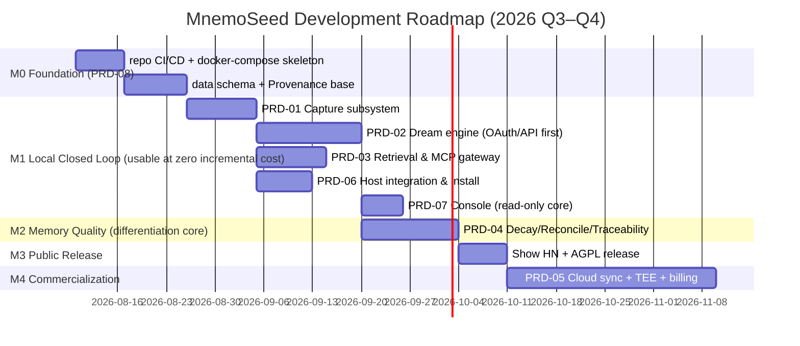

# PRD-00 · Roadmap & Milestones

> Version: v1.0 · 2026-08-08
> All PRDs follow a unified template: Goals / Scope / Functional Requirements (FR) / Non-Functional Requirements (NFR) / Acceptance Criteria (AC) / Task Breakdown / Dependencies.

## Milestone Overview

| Milestone | Exit Criteria |
|---|---|
| M0 | `docker compose up` brings up the full stack with one command, all health checks green; **the four storage interfaces (VectorStore/GraphStore/MetaStore/Embedder) fully defined, each with an embedded default + a Postgres-family second driver** (proving interface portability; capability-flag validation in effect); embedded single-process mode runs. embedded default stack (decided by Jinhao on 2026-08-08): **LanceDB vector + SQLite-Graph/SQLite-Meta + bge-m3 ONNX embeddings + uv distribution** (gemma_local and chroma_embedded kept as fallback drivers) |
| M1 | One-command install (TTFM < 3 min) wired into Tier 1 hosts: Claude Code + Cursor (P0) / Codex CLI + Gemini CLI (P1); per-turn deterministic capture and injection active on hook-based hosts (PRD-06 AC-6/7); profile credential model active (login/link/whoami); after switching models, a new session can recall last week's preferences; dreaming at zero incremental cost (OAuth reuses an existing subscription or bring-your-own API key; no local hardware barrier); read-only console core shipped to support dream --once review |
| M2 | After a fact changes, retrieval returns the current version; unused memories automatically sink after 30 days; any memory can answer "who, when, where from" |
| M3 | GitHub ≥ 1000 stars (week-one target) |
| M4 | $9/month Cloud launches, with 3 Profiles + E2EE sync + 500k dream allowance |

## Priority Principles

1. **Build the gate first, then capacity** — Capture/Reconcile/Decay are the differentiation moat, prioritized over any "store more" feature.
2. **Local track before cloud track** — free-tier geek-trust assets (GitHub stars) are all the leverage of the PLG first phase.
3. **Every PRD is independently acceptable** — never ship half-finished pipelines.
