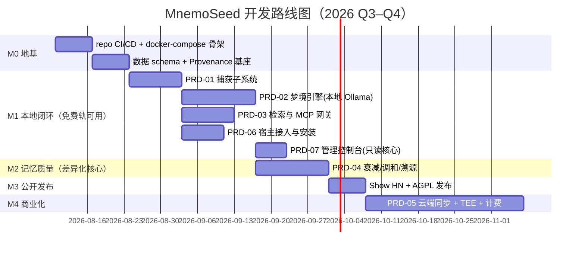

# PRD-00 · 路线图与里程碑

> 版本：v1.0 · 2026-08-08
> 所有 PRD 遵循统一模板：目标 / 范围 / 功能需求(FR) / 非功能需求(NFR) / 验收标准(AC) / 任务拆分 / 依赖。

## 里程碑总览

| 里程碑 | 出口标准（Exit Criteria） |
|---|---|
| M0 | `docker compose up` 一键起全栈，健康检查全绿；**四个存储接口（VectorStore/GraphStore/MetaStore/Embedder）定义完成，各实现内嵌默认 + Postgres 系双驱动**（接口可移植性实证；能力声明 capability flags 校验生效）；embedded 单进程模式可跑。embedded 默认栈（2026-08-08 锦豪拍板）：**LanceDB 向量 + SQLite-Graph/SQLite-Meta + bge-m3 ONNX 嵌入 + uv 分发**（gemma_local 与 chroma_embedded 保留为备选驱动） |
| M1 | 单命令安装（TTFM < 3min）接入 Cursor + Claude Code；profile 凭证模型生效（login/link/whoami）；换模型后新 session 能召回上周偏好；本地做梦全免费；console 只读核心上线支撑 dream --once 审查 |
| M2 | 事实变更后检索返回当前版本；30 天未用记忆自动沉底；任意记忆可回答"谁、何时、从哪来" |
| M3 | GitHub ≥ 1000 star（首周目标） |
| M4 | $9/月 Cloud 上线，3 Profile + E2EE 同步 + 500k 梦境额度 |

## 优先级原则

1. **先做闸门，再做容量**——Capture/Reconcile/Decay 是差异化护城河，优先于一切"存得更多"的功能。
2. **本地轨先于云端轨**——免费极客信任资产（GitHub star）是 PLG 第一阶段的全部筹码。
3. **每个 PRD 独立可验收**——不交付半成品管线。
