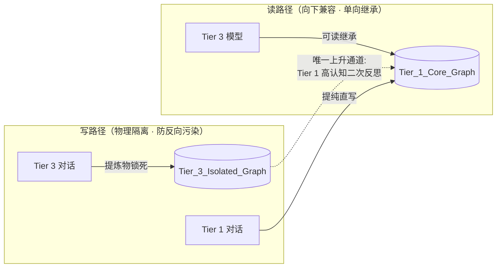
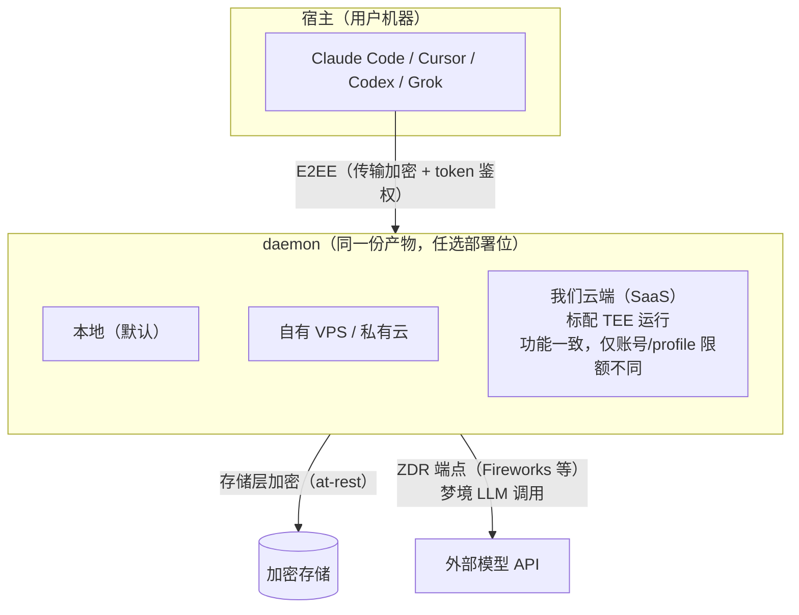

# 04 · 认知分级隔离与隐私

---

## 1. 认知分级隔离（Cognitive Grading Isolation）

**问题**：多模型混用时代，"笨模型"的幻觉会污染"聪明模型"积累的经验资产。

**模型分层**（示例，可在 `.env` 配置）：

| Tier | 代表 | 权限 |
|---|---|---|
| Tier 1 | Claude 5 Sonnet、GPT-5.6、本地开源模型（离线轨） | 读全库；提炼物写主基座 |
| Tier 2 | 中端模型 | 读全库；提炼物进待复核队列 |
| Tier 3 | 轻量端侧模型（GPT-mini 类、本地小模型） | 读全库；提炼物**只写**隔离图谱 |

**钢印是隔离的前提**：每条写入必须在捕获入口（daemon `/ingest`）打上 `cognitive_tier` + `model_id`，事后不可篡改（进入 provenance.history）。

---

## 2. Anima 模型（已拆分为进阶模块，见 design/09）

> Anima 灵魂模型与偏好动力学已独立成篇：[09-anima与偏好动力学](09-anima与偏好动力学.md)——**进阶功能，不在 M1 首发范围**。
> 本节保留与本文其余部分的唯一耦合点：加密存储与隔离机制对 ANIMA/PREFERENCE 节点同样生效（ANIMA 节点的 `idiographic_notes` 明文摘要、PREFERENCE 的 `evidence_chain` 均属于"落盘即密文"的覆盖范围）。

---

## 3. 隐私架构

**问题**：记忆包含用户最深度的偏好、商业机密、情感资产。云端记忆若无物理级隔离，B 端与高净值用户无法建立信任。

**部署拓扑（核心认知）**：daemon 是同一份产物。**自部署（免费版）**：个人用户自行选择部署环境（本地 / 自有 VPS）并自行管理。**官方 SaaS**：daemon 由我们托管，**标配在 TEE（Nitro Enclave）中运行**。两种形态下 **E2EE 传输 + 加密存储都是 app 内建功能**，与运行环境是否 TEE 无关。**客户端（宿主侧）只装 MCP/hook 等瘦调用工具。**

**信任边界规则**：
1. **E2EE 传输**：宿主工具 ↔ daemon 之间全程加密 + token 鉴权（design/06 身份模型），与部署位置无关；
2. **加密存储**：daemon 的持久层（分片/图谱/provenance）落盘即密文，密钥在 daemon 侧派生管理；
3. **环境隔离分两层说**：自部署用户自行安排运行环境（要不要 TEE 是他们的事，app 的 E2EE/加密存储不受影响）；**官方 SaaS 标配 TEE** 运行——这不是可选档，是我们服务的基线承诺；
4. **梦境 LLM 出口**：巩固必须调外部 API，明文出 daemon 不可避免——所以只走 **ZDR（Zero-Data-Retention）端点**。官方 SaaS 使用 TEE + ZDR 的 API 服务（具体服务商属运营细节，非架构承诺）；自部署用户自选模型端点，文档建议 ZDR。

---

## 4. 合规基线

- 官方企业渠道接入（AWS Bedrock / Google Vertex AI），拒绝无 DPA 承诺的 API 中介（如 OpenRouter）——杜绝中间人泄露面；
- 仅选用支持 **ZDR（Zero-Data-Retention）** 的模型端点；
- 目标合规：GDPR / CCPA / 马来西亚 PDPA。
