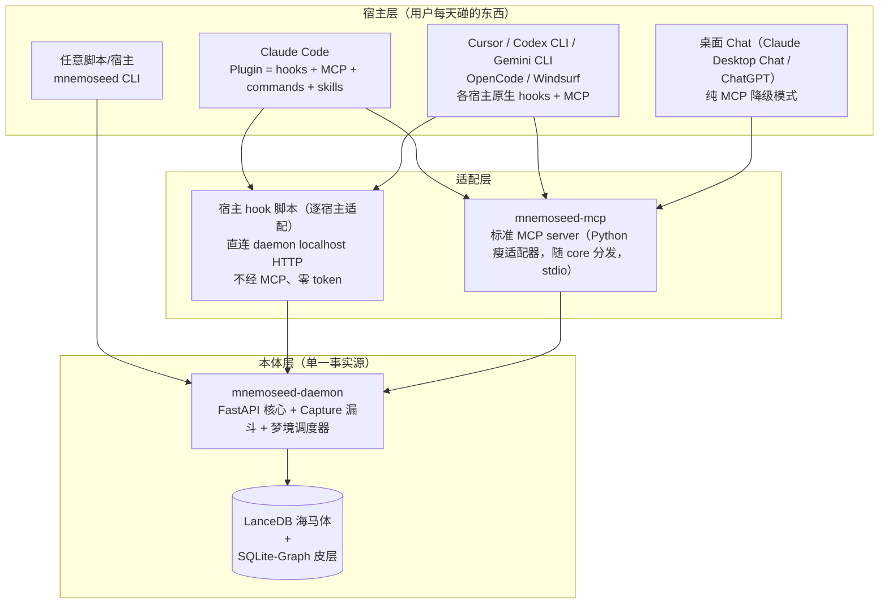
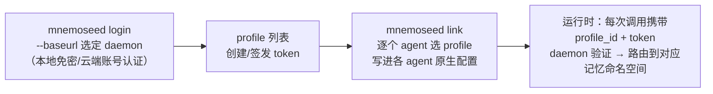
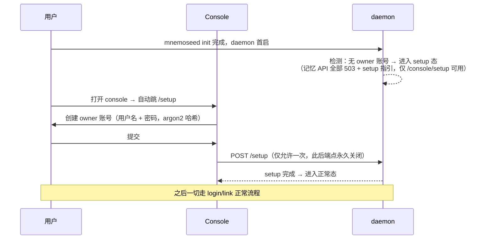
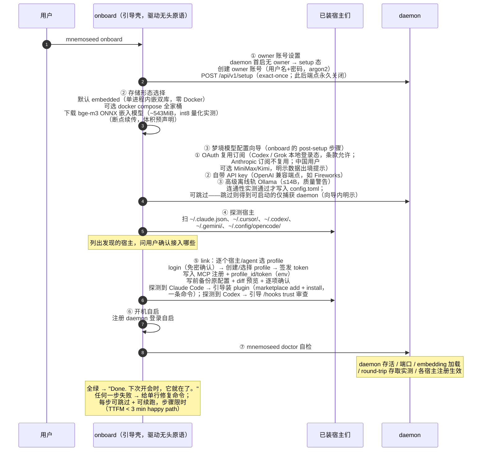
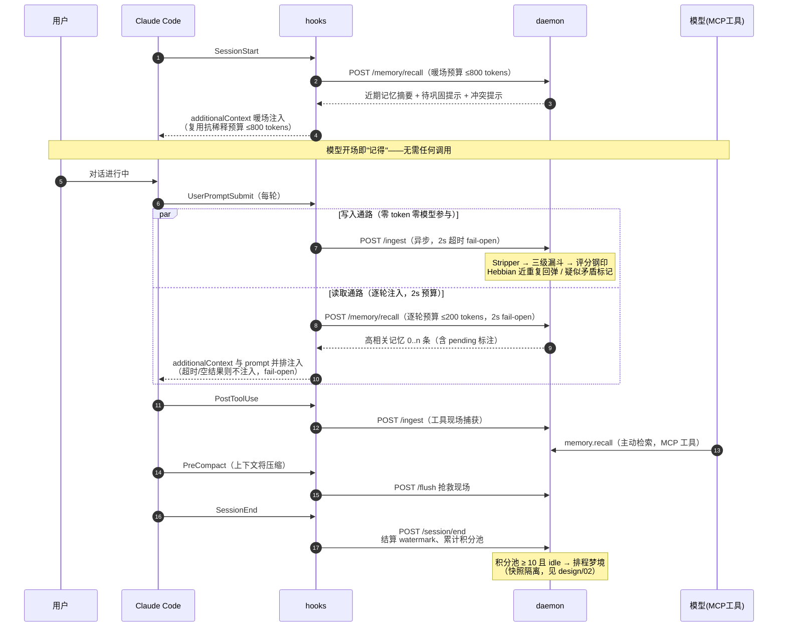

# 06 · 接入与安装体验（Adapter Architecture & Onboarding）

> 解决的问题：用户从"听说 MnemoSeed"到"agent 第一次记住我"之间的完整路径。
> 设计原则：**Time-to-First-Memory < 3 分钟**；单命令安装；零账号起步；卸载无残留。

---

## 1. 为什么既不是纯 MCP，也不是纯 Plugin

### 纯 MCP 的三个结构性短板

1. **捕获是被动的**——MCP 工具由模型主动调用。模型忘了调 `memory.store`，记忆就漏了。**记忆系统的可靠性不能建立在被服务对象的自觉上**（餐厅记账不该靠客人自己开口）。
2. **没有生命周期挂载点**——MCP 协议本身不知道 SessionStart / SessionEnd / 上下文压缩这些宿主事件。暖场注入、会话结算、压缩前抢救现场，全都无处安放。
3. **捕获路径烧 token**——每次 tool call 都经过模型上下文。高频捕获应该是零 token 的后台动作。

### 纯 Plugin 的短板

2026 年的现实是 hook 系统已经在开发者工具里普及——Claude Code（33 事件）、Cursor（原生全套 + Claude Code hooks 兼容层）、Codex CLI（v0.124 起 stable，事件命名对齐 Claude Code 生态）、Gemini CLI（11 事件 + extension 打包）、OpenCode（JS/TS plugin 事件）、Windsurf Cascade（12 hooks）全都有。但**各宿主的事件语义、注入能力、配置格式互不相同**（详见 §2），plugin 路线需要逐宿主适配，且对桌面 Chat 类无 hook 宿主（Claude Desktop Chat、ChatGPT）依然无解——plugin 无法通吃全宿主。

### 结论：三层架构



- **daemon 是本体**：数据、评分、梦境调度全在这一个进程里。宿主无论怎么换，记忆不动。
- **MCP 是通用接口**：任何 MCP Host 零改动接入，覆盖全生态。
- **plugin 是体验增强**：在有 hook 系统的宿主上把"被动等调用"升级为"宿主自动驱动"。**plugin 内部捆绑注册同一个 MCP server——二者不是二选一，是同一接口的两条驱动路径。**

**神经科学映射**：hook 是**反射弧**——宿主神经系统自动触发，不经意识（模型）；MCP 是**语言通路**——有意识地询问与陈述。记忆编码走反射弧（自动、高频、零成本），深度检索走语言通路（有意、低频、精确）。

---

## 2. 宿主能力矩阵与接入形态（2026-08 官方文档实测版）

> 调研方法：逐宿主读取官方文档原文（非第三方转述）。来源登记见本节末。
> 分档：**Tier 1 满血**（有 hooks，确定性捕获 + 自动注入，M1 验收对象）/ **Tier 2 尽力而为**（纯 MCP，模型自觉驱动，不进 M1 验收）。

### 2.1 Tier 1 宿主矩阵

| 宿主 | hook 事件 | 逐轮注入 | 捕获挂钩点 | 分发形态 |
|---|---|---|---|---|
| **Claude Code** | 33 事件全集（SessionStart/UserPromptSubmit/PreToolUse/PostToolUse/PreCompact/PostCompact/Stop/SessionEnd/SubagentStart/Stop…） | ✅ UserPromptSubmit `additionalContext`（与 prompt 并排，system-reminder 形式）；SessionStart 上限 10,000 字符，超出落盘传路径 | UserPromptSubmit（30s timeout，我们用 2s fail-open）+ PostToolUse + Stop（`last_assistant_message` 直接给全文，连续 block 上限 8 次） | **Plugin**：单包同时携带 hooks + MCP server + commands + skills，marketplace 两步安装（`marketplace add` → `plugin install`） |
| **Cursor** | 原生全套：sessionStart/sessionEnd/preToolUse（可 `updated_input` 改写入参）/postToolUse（可 `additional_context` 注入工具结果后）/afterAgentResponse（**直接给 assistant 全文**）/stop/preCompact/subagentStart/Stop/beforeShellExecution/beforeMCPExecution… | ⚠️ 部分：sessionStart 可注入 `additional_context`（fire-and-forget，官方未写字符上限）；**beforeSubmitPrompt 只能 block 不能改写/追加 prompt**——逐轮注入不可用 | afterAgentResponse（全文确定性捕获）+ postToolUse；**原生兼容 Claude Code hooks 配置**（直接读 `.claude/settings.json`，事件名自动映射）——我们的 CC plugin 在 Cursor 白嫖一部分 | `.cursor/hooks.json`（项目级可入库）+ `.cursor/rules/*.mdc`（`alwaysApply: true` 每 session 常驻）+ MCP |
| **Codex CLI** | SessionStart（source: startup/resume/clear/compact）/SessionEnd/UserPromptSubmit/PreToolUse（permissionDecision + updatedInput）/PostToolUse/PreCompact/PostCompact/Stop/SubagentStart/Stop（事件命名对齐 Claude Code 生态） | ✅ additionalContext（默认 2,500 token 上限，超出 spill 落盘） | UserPromptSubmit + PostToolUse；SessionEnd 读 `transcript_path`（rollout.jsonl）结算 | `~/.codex/hooks.json` 或 config.toml 内联 + AGENTS.md（三级合并，32KiB 上限，always-in-context）+ MCP（**instructions 字段官方确认注入**）。**注意：非 managed hooks 需用户 `/hooks` 审查 trust（按 hash）——installer 必须引导这一步** |
| **Gemini CLI** | 11 事件：SessionStart（additionalContext 作为首个 history turn）/**BeforeAgent（每轮注入 context）**/BeforeTool（可改写 tool_input）/AfterTool（可替换结果）… | ✅ **BeforeAgent 每轮注入**——与 Claude Code 并列最强逐轮读取通路 | BeforeAgent/AfterTool/SessionEnd | **Extension**：单包携带 MCP server + GEMINI.md context + hooks + commands + skills——与 CC plugin 同构的分发银弹 |
| **OpenCode** | session.created/idle/compacted/error、tool.execute.before/after（可改写工具参数）、experimental.session.compacting（可注入 context） | ⚠️ 无逐轮 prompt 注入原语；靠 session.created 暖场 + compacting 注入 | tool.execute.after（确定性捕获）+ session.idle（结算触发） | JS/TS plugin（`.opencode/plugins/` 或 `~/.config/opencode/plugins/`）+ AGENTS.md（原生支持，CLAUDE.md 兜底）+ MCP |
| **Windsurf（→Devin Desktop）** | 12 Cascade hooks：pre_user_prompt/post_cascade_response_with_transcript（**给完整 transcript**）/pre/post_mcp_tool_use…，exit code 2 可 block | ⚠️ 注入靠 rules（always_on 触发器）；hooks 偏拦截与观察 | post_cascade_response_with_transcript（transcript 级捕获） | hooks 配置三层合并 + rules + MCP（mcp_config.json，100 工具上限）。⚠️ **产品处于 Cognition 收购后过渡期**：新默认 agent（Devin Local）是独立的 hook/MCP 配置体系，文档已迁 docs.devin.ai——接入做但标注"API 稳定性风险" |

### 2.2 Tier 2 宿主矩阵（纯 MCP，桌面 Chat 场景）

| 宿主 | 能力边界 | 接入形态 | 壁垒 |
|---|---|---|---|
| **Claude Desktop Chat** | 无 hooks、无自定义 system prompt；只有 MCP tools/resources/prompts | **`.mcpb` 桌面扩展**（官方主推：zip+manifest 一键安装，内置 Node 运行时，stdio 本地常驻，per-user） | ①记忆读写 100% 靠模型自觉调工具；②MCP `instructions` 字段在 Chat 界面是否消费**官方无明文，待实测**；③企业可 allowlist 强制删除扩展、`isLocalDevMcpEnabled` 整关本地 MCP；④必须与 Claude 原生 Memory 双轨共存 |
| **Claude Desktop Code tab** | = 完整 Claude Code 引擎（hooks/plugin/MCP 全有） | 同 Tier 1 Claude Code | 无——桌面写代码场景满血 |
| **ChatGPT（产品面）** | **只支持远端 MCP（streamable HTTP），本地 stdio 不行**；write 类工具每次调用需用户手动确认 | hosted HTTP 端点或官方 Secure MCP Tunnel（本地只出站 443） | ①数据必须出机器（与"你拥有你的记忆"叙事有张力）；②write 人工确认 = 自动写入是残的；③Plus/Pro 权限口径官方文档不一致；④与 ChatGPT Memory 双轨共存且官方 Memory 会吸收 connector 数据 |
| **Codex（桌面 app 内模式/IDE）** | 与 Codex CLI 共享 `~/.codex/config.toml`，**支持本地 stdio** | 同 Tier 1 Codex CLI | 无——开发者场景满血 |

### 2.3 桌面 Chat 降级模式的可用杠杆（全做，但都是"软"的）

1. **Tool description 工程**——模型每次都读工具描述，把 `memory.recall` 描述写成强引导（"回答涉及用户偏好/项目背景前必须先调用"），显著提高触发率（mem0 在桌面端的主打法）；
2. **MCP `instructions` 字段**——server 级行为指令（Claude Code 与 Codex 确认消费，Claude Desktop Chat 待实测，列入 backlog 验证项）；
3. **MCP Resources**——记忆暴露为 `memory://` resource（官方 memory server 先例，带更新通知），用户可 @ 引用；
4. **MCP Apps**——渲染记忆可视化 UI（"刚才存了什么"），提升信任与手动触发意愿；
5. **`.mcpb` 打包**——解决安装体验（不解决使用自动化）。

**天花板是硬的**：无 hooks 的 Chat 界面没有任何确定性机制保证"每条对话被捕获"，上述杠杆全部只能提高概率、永远到不了 100%。**因此 Tier 2 不进 M1 验收标准**，只做 MCP server 的顺手附带（`.mcpb` 打包 + description 工程）。

### 2.4 MCP-only 降级模式的关键设计（通用地板）

MCP 协议允许 server 在 initialize 响应中携带 **`instructions` 字段**——一段随连接自动下发给模型的行为指引（Claude Code 截断 2KB、Codex 建议前 512 字符自包含——**指引文案按 512 字符硬上限写**）。daemon 借此下发：

> "本会话已接入持久记忆。开场先 `memory.recall` 获取近期上下文；遇到用户陈述的偏好、决定、约束时调 `memory.remember`；不确定记忆时效时调 `memory.audit`。"

配合 `memory.remember` 服务端的**幂等去重**（Hebbian 近重复回弹，重复 remember 不产生新分片），把"模型过度自觉"和"模型不自觉"两个方向的失控都兜住。降级模式能力弱于 hook，但语义正确性不变——这是通用性的代价下限。

### 2.5 逐宿主记忆模式对照（写入路径 / 读取路径）

| 宿主 | 写入（捕获） | 读取（注入） |
|---|---|---|
| Claude Code | UserPromptSubmit + PostToolUse → daemon `/ingest`（零 token）；Stop 补尾 | SessionStart 暖场 ≤800 tokens；**UserPromptSubmit 逐轮注入**（daemon 2s 内返回高相关记忆，超时则无注入 fail-open）；MCP `memory.recall` 主动检索兜底 |
| Cursor | afterAgentResponse（全文）+ postToolUse → `/ingest` | sessionStart 暖场注入；**逐轮注入不可用**（beforeSubmitPrompt 不能改写）→ 读取靠暖场 + rules 常驻提示 + MCP recall |
| Codex CLI | UserPromptSubmit + PostToolUse → `/ingest`；SessionEnd 读 transcript 结算 | SessionStart 暖场；UserPromptSubmit additionalContext 逐轮注入（2,500 token 上限内）；AGENTS.md 常驻指引 |
| Gemini CLI | AfterTool + Stop → `/ingest` | SessionStart 暖场 + **BeforeAgent 逐轮注入**；GEMINI.md 常驻指引 |
| OpenCode | tool.execute.after → `/ingest`；session.idle 触发结算 | session.created 暖场；逐轮注入无原语 → AGENTS.md + MCP recall |
| Windsurf | post_cascade_response_with_transcript → `/ingest` | rules always_on 常驻提示 + MCP recall |
| Tier 2 桌面 | 模型自觉调 `memory.remember`（幂等去重兜底） | 模型自觉调 `memory.recall` + instructions/description 引导 |

**设计要点**：逐轮注入（per-turn injection）是"整个 session 过程中持续用记忆"的确定性答案，目前只有 Claude Code（UserPromptSubmit）、Codex CLI（UserPromptSubmit）、Gemini CLI（BeforeAgent）三家支持——这三家给"丝滑"的上限，其余宿主靠暖场 + 常驻指引 + MCP 主动检索组合逼近。

> **调研来源**：code.claude.com/docs/en/hooks、/en/plugins-reference、/en/mcp、/en/settings、/en/sub-agents；cursor.com/docs/hooks、/docs/reference/third-party-hooks、/docs/rules、/docs/mcp、/docs/cloud-agent；learn.chatgpt.com/docs/hooks.md、/docs/extend/mcp、/docs/config-file/config-reference.md、/docs/agent-configuration/agents-md.md；Gemini CLI / OpenCode / Windsurf(Devin) 官方文档；桌面部分：modelcontextprotocol.io、anthropic.com/engineering/desktop-extensions、support.claude.com、developers.openai.com、help.openai.com（2026-08-08 实读）。

---

## 2.6 Profile 身份模型：凭证显式携带（锦豪定稿 2026-08-08）

**原则：显式凭证 > 运行时推断。daemon 只验证，不猜测。**



**解析优先级（三层，无注册表无猜测）**：
1. **请求级显式覆盖**（tool 参数 / `MNEMOSEED_PROFILE` 环境变量）——逃生舱，临时换身份用；
2. **Agent 自身配置里的 `profile_id + token`**——主路径，`link` 在安装/接入的当下写入；
3. **default profile**——兜底，daemon 记日志提示"该 agent 未配身份"。

**关键性质**：
- **宿主界面永远只有一条 `mnemoseed` MCP 条目**——profile 身份以 env 形式携带在该条目内（`MNEMOSEED_PROFILE_ID` + `MNEMOSEED_TOKEN`），5–10 个 profile 不会变成 5–10 个开关；
- **多 agent 平台逐 agent 注入**：OpenClaw/Hermes 每个 agent 有独立配置文件，各自携带各自的 profile_id——不同职能 agent 用不同记忆的落点；
- Claude Code：user scope 挂 personal、项目 repo 的 project scope 挂 work；subagent 继承父 session 连接 → 自动同身份（分身不分心）；隔离特例走优先级 ①；
- **本地与云端同一身份模型**：`login --baseurl` 决定身份对着哪台 daemon；云端踢 agent = revoke 它的 token，profile 数据完好；
- **可观测**：`mnemoseed whoami` 在任何 agent 环境自证身份（profile / daemon / token 有效性）；`mnemoseed status` 回读所有宿主配置生成绑定总表——管理视图永远等于实际状态，没有第二个真相源；
- 云端 token 后续可存 OS keychain（配置里放 `keychain:` 引用），M3 实现，先留接口。

**断开语义分层**（定稿）：disable（摘除条目）/ 换身份（link 重写 profile_id）/ 云端 revoke token / uninstall（全部回滚 + token 作废）——**全部不动数据**；删除是独立动词（`--purge` / `profile delete`，二次确认）。

---

## 2.7 账号层（User）与首次注册流程（锦豪定稿 2026-08-08）

身份模型的完整层级：**User（账号）→ Profiles → agent tokens**。

### 本地首次注册（n8n 式 setup wizard）



### 单用户 / 多用户的授权边界

| 形态 | 用户数 | Profile 数 | 注册方式 |
|---|---|---|---|
| **开源本地版（AGPL）** | **硬限 1 个**（owner） | **硬限 1 个** | 本地 setup wizard（用户名+密码） |
| **官方云端（我们 host）** | 多用户原生支持 | 单账号 ≤3 个 | 邮箱注册 + **Google sign-up**（OAuth 绑定官方域名） |
| **Commercial License（自部署）** | 按 license 席位 | 按 license | 本地账号体系 + 可自配 Google OAuth client |

- **开源版硬限单用户单 profile**：console 用户管理页只显示 owner，"添加用户"锁定并注明激活路径；profile 创建入口同样锁定在 1 个——这是 AGPL 双轨的商业闸门之一；
- **License 激活**：`mnemoseed license activate <file>` 或 console 上传——license 是 Ed25519 签名的离线可验证文件，内含 entitlements（`multi_user: true`、`seats: N`、有效期），daemon 用内嵌公钥本地验签，**不需联网**；
- **License 到期行为**：宽限 30 天 → 之后多用户登录停用，但 **owner 与全部数据完好可用**——license 过期永远不得劫持用户数据；
- 本地 owner 忘密码：物理持有机器即最高权限，`mnemoseed auth reset`（CLI，需本机执行）重置。

---

## 3. 安装流程（Time-to-First-Memory < 3 分钟）

```bash
uv tool install mnemoseed && mnemoseed onboard   # pipx install mnemoseed 亦可
```

`mnemoseed onboard` 是**引导壳**：一个交互式、逐步驱动既有原语的聚合器。`mnemoseed init` / `mnemoseed install` 保持**无头、可脚本化的原语**，onboard 一步步驱动它们——onboard 绝不对任何步骤做平行实现，每个 onboard 步骤与原语一一对应（setup / storage / wizard / link / autostart / doctor）。



**铁律**：
- **零账号起步**——本地完整可用；云同步是之后 `mnemoseed cloud login` 的显式动作；
- **改用户配置前必备份 + diff 预览 + 确认**——装记忆系统的人最怕工具乱动自己的环境；
- **embedded 模式默认**——不让 Docker 成为个人用户的门槛；
- **docker 按目的分配置**：默认 docker 路径 = 单容器跑同一 embedded 栈（与本地体验零差别）；云端/VPS 部署用单独配置（见 [10](10-云端部署与远程接入.md)）；PG 全家桶保留为开发者/企业 profile；
- **跨平台一键**：Windows / Linux / macOS 均为一条命令安装（uv tool install）；开机自启 `mnemoseed startup enable/disable/status` 三平台各自落地（Windows Run 注册表 / macOS launchd / Linux systemd user unit）。

### 3.1 `mnemoseed onboard` —— 引导壳

`mnemoseed onboard` 是一个引导式、逐步聚合既有原语的聚合器——它存在的意义只是让首次用户完整走一遍全程，仅此而已。console 设置向导驱动**同一个**后端 onboard 服务（`/api/v1/setup`）：实现只有一份，两个界面共用——**无并行逻辑**。规则：

1. **一个后端 onboard 服务**与 console 设置向导共享；`/api/v1/setup` 端点保持 exact-once；
2. **LLM 向导是 post-setup 步骤**——在 owner 账号就绪后运行，保持"连通性实测通过才写入 config.toml"的行为，且受 FR-6.9 顺序约束（OAuth 复用 → BYOK → 离线轨）；
3. **每步可跳过 + 可续跑**——onboard 状态在运行间持久化；**跳过 LLM 步骤得到可启动的仅捕获 daemon**（捕获可用，配置好模型前梦境禁用——向导内明示，而非事后才发现）；
4. **宿主链接步骤原样复用安装的纪律**——碰任何用户配置前必备份 + diff 预览 + 逐项确认；
5. **TTFM < 3 分钟仍是 happy-path 目标**；每步限时，单个慢步骤不能拖爆整个预算；
6. **配置操作仅限 loopback**——非 loopback baseurl 直接报清晰错误（§6）。

**卸载**：`mnemoseed uninstall` 逐宿主注销注册（从备份恢复或精确摘除）、停 daemon、数据目录默认保留并明示路径，`--purge` 才删数据。**卸载体验是信任的一部分。**

---

## 4. 一次 Session 的完整生命周期（Claude Code plugin 形态）



**用户侧 slash commands**（plugin 附带）：`/memory status`、`/dream once`、`/forget`、`/recall <query>`——机制暴露为显式动作，符合"先手动再自动"纪律（design/02 §8）。

---

## 5. CLI 一览（跨宿主的最低公分母）

| 命令 | 作用 |
|---|---|
| `mnemoseed init` | 无头安装原语（由 `mnemoseed onboard` 逐步驱动；可脚本化） |
| `mnemoseed onboard` | 引导壳（§3.1）：owner 设置 → 存储 → LLM 向导 → 宿主链接 → 开机自启 → doctor 全绿；每步可跳过 + 可续跑 |
| `mnemoseed doctor` | 自检清单 + round-trip 实测 |
| `mnemoseed status` | 记忆规模 / 积分池 / 待巩固数 / 冲突队列 |
| `mnemoseed login [--baseurl …]` | 身份入口：选定 daemon、认证、列 profile |
| `mnemoseed link` / `unlink` | 逐 agent 绑定/解绑 profile（写入 agent 原生配置） |
| `mnemoseed whoami` | 当前环境命中哪个 profile / daemon / token 状态 |
| `mnemoseed console` | 打开管理控制台（design/07） |
| `mnemoseed config set|get|rollback` | 版本化配置读写/回滚（走 daemon REST，§6）；仅限 loopback |
| `mnemoseed audit` | 审计日志检索——跨写入界面的 who/what/when（actor 归因：cli/console/mcp；design/07 §5） |
| `mnemoseed recall "<query>"` | 命令行检索（脚本/任意宿主可用） |
| `mnemoseed remember "<fact>"` | 命令行显式记忆 |
| `mnemoseed dream --once` | 手动巩固（M1 纪律） |
| `mnemoseed export` | 单文件自包含导出（含索引快照，可拷走） |
| `mnemoseed diff` | 记忆版本差异 |
| `mnemoseed forget "<target>"` | 显式删除 |
| `mnemoseed cloud login` | 显式开启云同步（PRD-05） |
| `mnemoseed uninstall` | 无残留卸载 |

---

## 6. 配置单一事实源

`~/.mnemoseed/config.toml` 是唯一配置文件（STORAGE_MODE、评分权重、衰减 λ、宿主清单、云账号）。宿主侧只持有**瘦注册**（MCP endpoint 一行 + hook 脚本路径），升级 daemon 不动宿主配置。改配置用 `mnemoseed config set|get|rollback`——CLI 配置操作走 daemon REST API（`config set|get|rollback` 动词），与 console Settings 页共用同一后端；每次变更带 actor 归属（`cli` / `console` / `mcp`）、落版本化配置、记入审计日志。**配置操作仅限 loopback**：非 loopback baseurl 直接报清晰错误，而不是去改远端实例的配置。禁止手改宿主侧文件。
