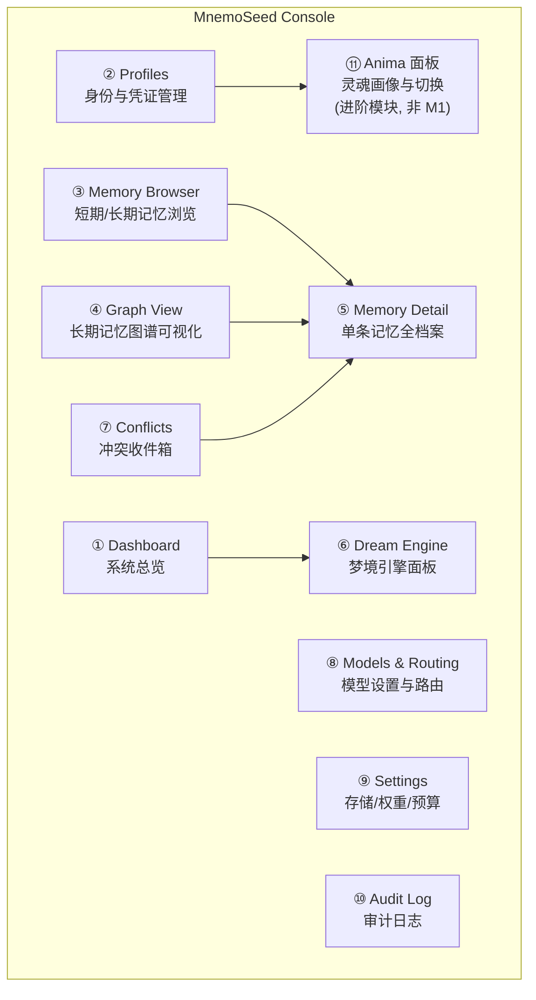
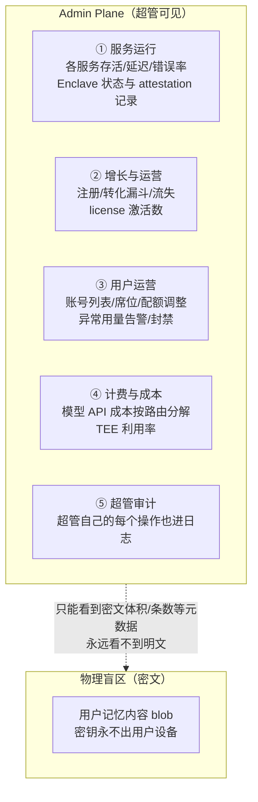

# 07 · 管理控制台（MnemoSeed Console）

> daemon 自带的本地 Web 管理界面。权利叙事的实体化：**你拥有、你控制、你能忘**——全都看得见摸得着。
> 同时是 M1"先手动再自动"纪律的审查工具：`dream --once` 的提炼质量不该对着 JSON 审。

---

## 1. 定位与原则

- **daemon 自带，零额外安装**：FastAPI 直接托管静态 SPA（`http://localhost:7788/console`），`mnemoseed console` 一键打开浏览器；
- **本地优先，无账号**：默认仅监听 localhost；远程访问必须显式开启 + admin token；
- **同一套前端，未来直通云端**：console 只是 daemon API 的一个客户端——cloud 上线后同一个界面切 baseurl 管理云端 profile，与 login/baseurl 身份模型（design/06）完全同构；
- **读为主，写皆有痕**：浏览全免费；修改类操作（删记忆、改权重、解冲突、切模型）全部进审计日志。

## 2. 页面结构

### ① Dashboard 系统总览

- daemon 健康：存储驱动、embedding 状态、梦境状态机当前态（Idle/Accumulating/Dreaming…）；
- 实时指标：积分池水位、watermark、待巩固分片数、needs_reconcile 队列长度、pending_consolidation 计数；
- token 使用：今日/本周 dream tokens、embedding tokens、按模型分组、估算成本；
- 已接入上下文总表（host / agent → profile → token 状态，`mnemoseed status` 的图形版）。

### ② Profiles 身份管理

- profile 列表（创建/重命名/归档）；
- 每个 profile：已签发 token 列表（签发/吊销）、绑定的 agent 清单、记忆规模统计（分片数/节点数/占用磁盘）；
- 凭证操作遵循断开语义分层（design/06）：吊销 token ≠ 删除 profile，删除是独立的二次确认动词；
- **Users 子页**：账号层管理（design/06 §2.6）——开源版仅 owner 一行，"添加用户"锁定并注明激活路径（官方云端 / commercial license）；license 激活后展开多用户管理（邀请/席位/停用）。

### ③ Memory Browser 记忆浏览

- **短期记忆（海马体）**：LanceDB 分片列表，按时间/项目/工具/情绪 cue/实体过滤，钢印全字段可见；
- **长期记忆（皮层）**：三元组/节点列表，按节点类型（PREFERENCE/HABIT/EPISODE/SKILL_SEQUENCE/DECISION/ANIMA/INTENTION）、Tier、decay_weight 区间过滤；
- 每行显示：内容摘要、decay_weight（带衰减曲线缩略）、conflict/pending 标记、召回命中次数。

### ④ Graph View 图谱可视化

- 交互式图谱渲染（Cytoscape.js 或等价库）：节点颜色 = 类型，大小 = 图谱中心性，透明度 = decay_weight（**正在遗忘的记忆肉眼可见地变淡**——衰减最好的演示）；
- 边 = 关系 + 共现边（粗细 = 边权）；
- 过滤：profile / 节点类型 / 时间窗 / Tier；
- 点节点 → 打开 ⑤ Memory Detail 侧栏。

### ⑤ Memory Detail 单条记忆全档案

每条记忆一个"档案页"，暴露系统对它知道的一切：

| 区块 | 内容 |
|---|---|
| 内容 | verbatim 原文 / 三元组，双通道对照（Fuzzy-Trace 双轨可视化） |
| 溯源 provenance | asserted_by / source / agent_id / session_id / asserted_at + **完整 history 时间线** |
| 版本链 | 每次 Reconcile 改写的版本列表，任意两版 **diff 视图** |
| 权重全量 | decay_weight 当前值 + 衰减曲线投影（λ 类型）、confidence、S 评分拆解（arousal/novelty/causal 三分量）、last_reinforced、强化次数 |
| 使用情况 | 召回命中次数、最近命中时间、共现邻居 top-N |
| 标记 | conflict_flag / needs_reconcile / pending_consolidation / peripheral_gaps |
| 操作 | forget_this / 手动 pin / 手动调整 decay（写入审计） |

### ⑥ Dream Engine 面板

- 当前状态机状态 + 积分池水位条；
- **待清算队列**：未巩固分片列表、needs_reconcile 旗标清单——`dream --once` 前的人工审查入口；
- 运行历史：每次梦境的 turn_range、所用模型、tokens 入/出、成本、写回三元组数（Tier 1 / Tier 3 分流计数）、耗时、是否被中断；
- **提炼质量审查**：本次梦境产出的三元组逐条 diff 式展示（原始分片 ↔ 提炼物），一键接受/拒绝/标记幻觉；
- 手动触发 `dream --once` 按钮；自动触发器开关（M1 默认关）；
- token 用量趋势图 + 按模型分解。

### ⑦ Conflicts 冲突收件箱

- flag_conflict 队列：矛盾双方成对展示，各自 provenance、cues、decay_weight；
- 用户在 UI 选择 Reconcile 分支处理：强化其一 / 情境作用域共存（填写 cues 划界）/ 作废其一 / 保持挂起；
- 每次处理写回版本链 + 审计日志——**调和永远有痕**。

### ⑧ Models & Routing 模型设置

- 梦境路由表：深睡眠反思模型 / 短增量模型 / 离线轨（Ollama，可选）→ 下拉切换 + 连通性实测按钮；
- embedding 模型设置与切换（切换触发重建索引导引，警告成本）；
- 边缘分类器（持久性判断/矛盾判定）模型设置；
- 各模型的调用量与成本统计。

### ⑨ Settings

- 存储驱动选择（preset：embedded / docker / custom + 逐层驱动覆盖，capability 校验结果展示）；
- 评分权重 w₁/w₂/w₃、衰减 λ（按记忆类型）、top-k 与 token 预算、积分池阈值；
- 所有修改即时生效 + 写审计日志 + 可回滚（配置版本化）。

### ⑩ Audit Log

- 全量读写事件流：哪个 agent（agent_id + session_id）在什么时间写了什么、读了什么、改了什么配置；
- 按 agent / profile / 时间过滤——**"谁动了我的记忆"永远可查**。

### ⑪ Anima 面板（进阶模块，不在 M1 首发）

灵魂模型的可视化与管理界面（模型本体见 [09-anima与偏好动力学](09-anima与偏好动力学.md)）：

- **特质雷达图**：多边形雷达展示特质及权重——轴数随 schema 生成，不锁死六轴；顶点 = 特质 mean，误差带/透明度 = width（不确定性必须可见，防 Barnum 伪造精确感）；支持手动微调（写审计）；
- **双层叠加显示**：核心（immutable）实线 + 染层当前表现虚线叠加——用户一眼看到"天生的我"与"被经验染出来的我"差多少；
- **白话创建**：自然语言描述（"一个谨慎但好奇心重的工程师"）→ 模型量化生成特质模板，用户确认后落地；
- **跨 profile 管理**：anima 列表、与 profile 的链接/换绑；换绑时明确提示将触发梦境引擎 re-dye 批量重算，需确认；
- **drift_history 时间轴**：人格与偏好的漂移记录回放（"去年的我"）。

## 3. 技术形态

- daemon FastAPI 挂 `/console`（静态 SPA 构建产物）+ `/api/v1/*` REST；
- 前端：轻量 SPA（Svelte/Vue 评估后定），图谱渲染用 Cytoscape.js 级库；
- 认证：localhost 隐式信任；非 localhost 访问需 admin token（login 模型复用）；
- M1 先上只读核心（Dashboard / Memory Browser / Dream 面板 / Conflicts），写操作与 Graph View 在 M2 补全——因为 M1 的 dream --once 审查纪律等不了 M2。

## 4. 云端超管平面（Admin Plane，锦豪定稿 2026-08-08）

官方云端多一层 **系统管理员**（运营者本人），与用户 console 完全分离的独立界面（`admin.` 子域 + 独立 admin 凭证，不进用户账号体系）。

**红线（架构级，非纪律级）**：超管**运营数据全可见，记忆明文物理不可见**。云端记忆是 BYOK E2EE 密文 blob——不是"规定管理员不许看"，而是"密钥在用户设备上，管理员想看也解不开"。这条是"连我们的管理员都看不到明文"承诺的技术兑现，任何需求不得开口子。

| 可见（运营元数据） | 不可见（架构保证） |
|---|---|
| 账号、profile 数量、配额、用量计数、token 消耗、成本、服务健康 | 记忆内容、对话分片、图谱节点明文 |
| 密文 blob 的体积/条数/时间戳（运维必需） | blob 内容本身 |

- 客服场景：用户报障时超管只能看元数据与日志；任何情况下无"代看记忆"功能——用户要给我们看，只能自己 `memory.export` 后主动发来；
- 超管账号：独立强认证（硬件密钥/TOTP 强制），所有操作进不可变审计日志——**管系统的人也被系统记录**。
