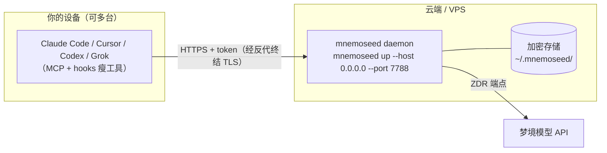

# 10 · 云端部署与远程接入指南

> 适用对象：想把 daemon 部署到云端/VPS、宿主（笔记本等）远程连接的用户。
> 架构前提见 [04 §3](04-隔离解耦与隐私.md)：daemon 是同一份产物，部署位置任选；宿主侧只装瘦工具（MCP / hooks）。

---

## 1. 拓扑



---

## 2. 云端部署 daemon

```bash
# 云端机器上
uv tool install mnemoseed
mnemoseed up --host 0.0.0.0 --port 7788
```

- 数据与配置全部在 `~/.mnemoseed/`（可用 `MNEMOSEED_HOME` 改址）；
- 嵌入式默认栈零外部依赖（LanceDB + SQLite 进程内）；数据量大了或要多 daemon 共享再换 docker preset（Postgres/pgvector，即 `docker compose --profile pg up`）；
- 生产部署建议：systemd unit 或 **`docker compose -f docker-compose.cloud.yml up -d`**（issue #5 云专配：单容器 embedded daemon + 持久卷到 `~/.mnemoseed/` 等价物 `/data`，见 §3 的反代 TLS 接线）；挂持久卷到 `~/.mnemoseed/`；
- 梦境模型路由照常用 config.toml（`[dream.llm.<role>]`），云端跑也遵守同一套动态预算 + 月度账本。

## 3. 暴露与安全（必读）

daemon 本身是明文 HTTP，**不要直接把 7788 裸暴露到公网**。正确姿势：

1. **TLS 终结**：前面挂反向代理（Caddy/nginx/Cloudflare Tunnel），daemon 只 bind 内网或 localhost；
2. **鉴权**：非 localhost 请求必须带 admin token——配置环境变量 `MNEMOSEED_CONSOLE_ADMIN_TOKEN`，未配置时远程请求全拒（这是设计好的 fail-closed）；
3. **传输加密**：E2EE 由反代 TLS + token 完成；落盘加密在 daemon 侧；
4. 更保守的选项：不开公网，用 Tailscale/WireGuard 组网，daemon 只 bind 内网地址。

## 4. 宿主连接云端 daemon

宿主侧所有瘦工具通过**同一个环境变量**指向云端：

```bash
# 各宿主环境里设置（installer 会写，也可手动）
MNEMOSEED_BASE_URL="https://memory.your-domain.com"
MNEMOSEED_PROFILE_ID="<你的 profile>"
MNEMOSEED_TOKEN="<profile token>"
```

- **MCP 宿主**（Claude Code / Cursor / Codex / Gemini）：MCP server 条目里的 `mnemoseed mcp` 进程读这三个环境变量，自动连远端；
- **hooks**：同样读 `MNEMOSEED_BASE_URL`，fail-open 语义不变（远端不可达时 hook 静默不注入，宿主不受阻塞）；
- 控制台：`https://memory.your-domain.com/console`，非 localhost 访问会要求 admin token。

## 5. 验证清单

```bash
# 宿主侧
mnemoseed doctor        # 会实测与远端的连通、round-trip 存取、宿主注册
```

doctor 全绿即接入完成；任何一项失败会给单行修复命令。

## 6. 多端同步说明

多台宿主连同一云端 daemon 即天然共享记忆（同一 profile）。本指南拓扑是"中心 daemon"模式；design/08 的去中心 CRDT 同步是另一套（多 daemon 副本互相同步），M4 才落地，二者不冲突。

## 7. 与官方 SaaS 的区别

本指南是**你自己 host** 的路径（免费版功能全量，限单账号单 profile）。官方 MnemoSeed Cloud（M4）由我们托管 daemon、TEE 标配运行、账号/profile 限额放宽——功能面一致，差别只在运维责任与限额（design/06 §2.6）。
