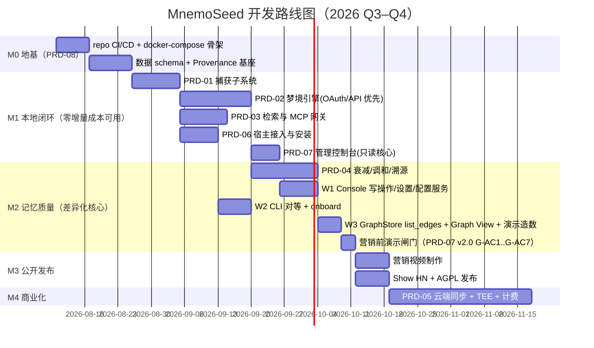

# PRD-00 · 路线图与里程碑

> 版本：v1.1 · 2026-08-13
> v1.1：新增营销前演示闸门（console 完备 PRD-07 v2.0 + CLI 对等 + onboard）及 W1/W2/W3 工作流，并入 gantt 与里程碑表。
> 所有 PRD 遵循统一模板：目标 / 范围 / 功能需求(FR) / 非功能需求(NFR) / 验收标准(AC) / 任务拆分 / 依赖。

## 里程碑总览

| 里程碑 | 出口标准（Exit Criteria） |
|---|---|
| M0 | `docker compose up` 一键起全栈，健康检查全绿；**四个存储接口（VectorStore/GraphStore/MetaStore/Embedder）定义完成，各实现内嵌默认 + Postgres 系双驱动**（接口可移植性实证；能力声明 capability flags 校验生效）；embedded 单进程模式可跑。embedded 默认栈（2026-08-08 定稿）：**LanceDB 向量 + SQLite-Graph/SQLite-Meta + bge-m3 ONNX 嵌入 + uv 分发**（gemma_local 与 chroma_embedded 保留为备选驱动） |
| M1 | 单命令安装（TTFM < 3min）接入 Tier 1 宿主：Claude Code + Cursor（P0）/ Codex CLI + Gemini CLI（P1）；逐轮确定性捕获与注入在 hook 宿主生效（PRD-06 AC-6/7）；profile 凭证模型生效（login/link/whoami）；换模型后新 session 能召回上周偏好；做梦零增量成本（OAuth 复用已有订阅或自带 API key，无本地硬件门槛）；console 只读核心上线支撑 dream --once 审查 |
| M2 | 事实变更后检索返回当前版本；30 天未用记忆自动沉底；任意记忆可回答"谁、何时、从哪来" |
| Demo Gate | **营销前演示闸门**（PRD-07 v2.0 闸门 AC G-AC1..G-AC7）：console 完备（读写页面 ①–⑩）+ CLI 对等 + `mnemoseed onboard` 全绿。**此闸门通过前不得启动营销视频制作。** |
| M3 | GitHub ≥ 1000 star（首周目标） |
| M4 | Cloud 上线，3 Profile + E2EE 同步 + 梦境额度 |

## 营销前演示闸门与排程（v1.1）

**闸门声明**：console 完备（[PRD-07 v2.0](PRD-07-管理控制台.md)，读写页面 ①–⑩）+ CLI 对等（CLI 可用与 console 等效的读写操作）+ `mnemoseed onboard` 共同构成**营销前演示闸门**。闸门验收标准即 PRD-07 v2.0 的 `G-AC1..G-AC7`（定义在 PRD-07，不在此复述）。闸门 AC 通过前营销视频制作被阻塞——视频里演示的产品必须是真实、AC 验证过的产品。

**排程**：
- **W1**（console 写操作/设置/配置服务）与 **W2**（CLI 对等 + onboard）与 PRD-04（衰减/调和）**并行**；
- **W3**（GraphStore `list_edges` + three.js Graph View + 演示造数）在 **PRD-04 落地后**启动（依赖 PRD-08 v1.1 的 `list_edges` 方法与 PRD-04 的衰减状态才能渲染实时图谱）；
- 闸门在 **M3 营销工作开始之前**关闭。

## 优先级原则

1. **先做闸门，再做容量**——Capture/Reconcile/Decay 是差异化护城河，优先于一切"存得更多"的功能。
2. **本地轨先于云端轨**——免费极客信任资产（GitHub star）是 PLG 第一阶段的全部筹码。
3. **每个 PRD 独立可验收**——不交付半成品管线。
